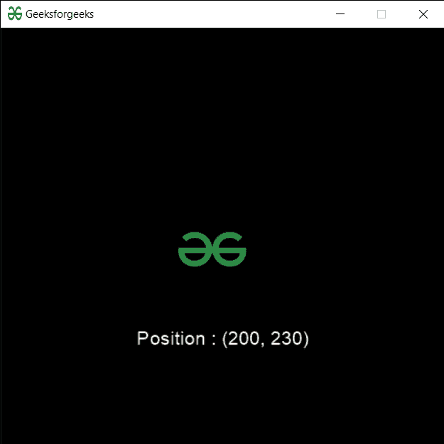

# PYGLET–雪碧位置

> 原文:[https://www.geeksforgeeks.org/pyglet-sprite-position/](https://www.geeksforgeeks.org/pyglet-sprite-position/)

在本文中，我们将看到如何在 python 的 PYGLET 模块中访问 sprite 的位置。Pyglet 是一个易于使用但功能强大的库，用于开发视觉上丰富的图形用户界面应用程序，如游戏、多媒体等。窗口是占用操作系统资源的“重量级”对象。窗口可能显示为浮动区域，或者可以设置为充满整个屏幕(全屏)。精灵是屏幕上显示的图像的实例。多个子画面可以在屏幕的不同位置显示相同的图像。子画面也可以放大或缩小，以任何角度旋转，并以部分不透明度绘制。图像是借助 pyglet 的图像模块加载的。属性以像素距离 x 轴和 y 轴的形式告诉精灵在窗口内的位置。
我们可以借助下面给出的命令创建一个窗口和精灵对象

```py
# creating a window
window = pyglet.window.Window(width, height, title)

# creating a sprite object
sprite = pyglet.sprite.Sprite(img, x, y)
```

> 为了创建窗口，我们使用带有 sprite 对象的位置属性
> **语法:** sprite.position
> **参数:**它不接受参数
> **返回:**它返回元组

下面是实现

## 蟒蛇 3

```py
# importing pyglet module
import pyglet
import pyglet.window.key as key

# width of window
width = 500

# height of window
height = 500

# caption i.e title of the window
title = "Geeksforgeeks"

# creating a window
window = pyglet.window.Window(width, height, title)

# text 
text = "Welcome to GeeksforGeeks"

# creating label with following properties
# font = cooper
# position = 250, 150
# anchor position = center
label = pyglet.text.Label(text,
                          font_name ='Cooper',
                          font_size = 16,
                          x = 250, 
                          y = 150,
                          anchor_x ='center', 
                          anchor_y ='center')

# creating a batch
batch = pyglet.graphics.Batch()

# loading geeksforgeeks image
image = pyglet.image.load('gfg.png')

# creating sprite object
# it is instance of an image displayed on-screen
sprite = pyglet.sprite.Sprite(image, x = 200, y = 230)

# on draw event
@window.event
def on_draw():

    # clear the window
    window.clear()

    # draw the label
    label.draw()

    # draw the image on screen
    sprite.draw()

# key press event    
@window.event
def on_key_press(symbol, modifier):

    # key "C" get press
    if symbol == key.C:

        # printing the message
        print("Key : C is pressed")

# image for icon
img = image = pyglet.resource.image("gfg.png")

# setting image as icon
window.set_icon(img)

# accessing position of the sprite
value = sprite.position

# creating text from sprite
text = "Position : " + str(value)

# setting text to the label
label.text = text

# start running the application
pyglet.app.run()
```

**输出:**

