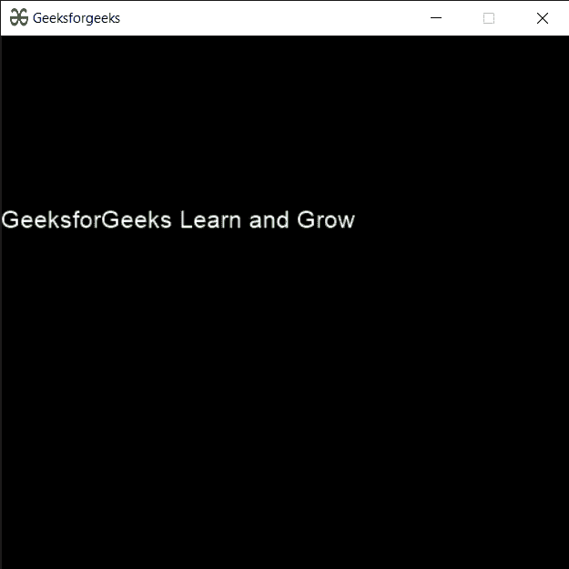

# PYGLET–未格式化文档

> 原文:[https://www.geeksforgeeks.org/pyglet-unformatted-document/](https://www.geeksforgeeks.org/pyglet-unformatted-document/)

在本文中，我们将看到如何在 python 的 PYGLET 模块中创建一个未格式化的文档。Pyglet 是一个易于使用但功能强大的库，用于开发视觉上丰富的图形用户界面应用程序，如游戏、多媒体等。窗口是占用操作系统资源的“重量级”对象。窗口可能显示为浮动区域，或者可以设置为充满整个屏幕(全屏)。无格式文档的布局通常是为了使复制粘贴变得容易，而不增加结构，如标题、缩进和字体变化。按照顺序，我们可以说这份文件包含纯文本。

我们可以在下面命令的帮助下创建一个窗口

```
# creating a window
window = pyglet.window.Window(width, height, title)

```

> 为了创建窗口，我们使用 pyglet . text . document . UnformattedDocument(方法
> **语法:**pyglet . text . document . UnformattedDocument(文本)
> **参数:**它以字符串作为参数
> **返回:**它返回 UnformattedDocument 对象

下面是实现

## 蟒蛇 3

```
# importing pyglet module
import pyglet
import pyglet.window.key

# width of window
width = 500

# height of window
height = 500

# caption i.e title of the window
title = "Geeksforgeeks"

# creating a window
window = pyglet.window.Window(width, height, title)

# text
text = "GeeksforGeeks Learn and Grow"

# batch object
batch = pyglet.graphics.Batch()

# creating a unformatted document
# unlike formatted document it is just plain text
document = pyglet.text.document.UnformattedDocument(text)

# setting style to the document
document.set_style(0, len(document.text), dict(font_name ='Arial', font_size = 16, color =(255, 255, 255, 255)))

# creating a incremental text layout
layout = pyglet.text.layout.IncrementalTextLayout(document, 400, 350, batch = batch)

# creating a caret
caret = pyglet.text.caret.Caret(layout, color =(150, 255, 150))

# caret to window push handlers
window.push_handlers(caret)

# setting caret style
caret.set_style(dict(font_name ="Arial"))

# on draw event
@window.event
def on_draw():

    # clear the window
    window.clear()

    # draw the batch
    batch.draw()

    # caret to window push handlers
    window.push_handlers(caret)

# key press event   
@window.event
def on_key_press(symbol, modifier):

    # key "C" get press
    if symbol == pyglet.window.key.C:

        # closing the window
        # window.close()
        pass

# image for icon
img = pyglet.resource.image("gfg.png")

# setting image as icon
window.set_icon(img)

# start running the application
pyglet.app.run()
```

**输出:**

