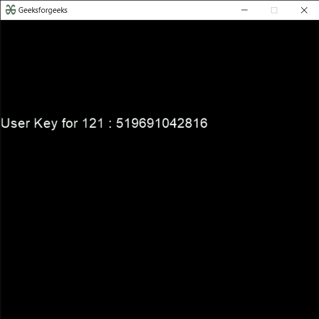

# PYGLET–用户键

> 原文:[https://www.geeksforgeeks.org/pyglet-user-key/](https://www.geeksforgeeks.org/pyglet-user-key/)

在本文中，我们将看到如何在 python 的 PYGLET 模块中获取用户密钥。Pyglet 是一个易于使用但功能强大的库，用于开发视觉上丰富的图形用户界面应用程序，如游戏、多媒体等。窗口是占用操作系统资源的“重量级”对象。窗口可能显示为浮动区域，或者可以设置为充满整个屏幕(全屏)。按键状态处理程序类是一个简单的处理程序，它跟踪键盘上按键的状态。如果一个键被按下，那么这个处理程序为它保存一个真值。用户密钥是 pyglet 不支持的密钥的密钥符号。这可用于将虚拟按键或扫描代码从不受支持的键盘布局映射到特定于机器的符号。该符号在任何其他机器上或在不同的键盘布局下都没有意义。
我们可以借助下面给出的命令
创建一个窗口

```py
# creating a window
window = pyglet.window.Window(width, height, title)
```

> 为了创建窗口，我们将 user_key 方法与 pyglet.window.key 一起使用
> **语法:** key.user_key(扫描代码)
> **参数:**它以整数作为参数
> **返回:**它返回整数

下面是实现

## 蟒蛇 3

```py
# importing pyglet module
import pyglet
import pyglet.window.key as key

# width of window
width = 500

# height of window
height = 500

# caption i.e title of the window
title = "Geeksforgeeks"

# creating a window
window = pyglet.window.Window(width, height, title)

# text 
text = "Welcome to GeeksforGeeks Have a nice day"

# batch object
batch = pyglet.graphics.Batch()

# creating document
document = pyglet.text.document.FormattedDocument(text)

# setting style to the document
document.set_style(0, len(document.text), dict(
                         font_name ='Arial', font_size = 16, 
                         color =(255, 255, 255, 255)))

# creating a incremental text layout
layout = pyglet.text.layout.IncrementalTextLayout(
               document, 400, 350, batch = batch)

# making layout to display multiline
layout.multiline = True

# creating a caret
caret = pyglet.text.caret.Caret(layout, color =(255, 255, 255))

# caret to window push handlers
window.push_handlers(caret)

# setting caret style
caret.set_style(dict(font_name ="Arial"))

# on draw event
@window.event
def on_draw():

    # clear the window
    window.clear()

    # draw the batch
    batch.draw()

    # caret to window push handlers
    window.push_handlers(caret)

# creating a key state handler
key_handler = pyglet.window.key.KeyStateHandler()

# key press event    
@window.event
def on_key_press(symbol, modifier):

    # key "C" get press
    if symbol == key.C:

        # printing the message
        print("Key : C is pressed")

# image for icon
img = image = pyglet.resource.image("gfg.png")

# getting user key
value = key.user_key(121)

# creating text from the value
text = "User Key for 121 : " + str(value)

# setting this text to the document
document.text = text

# setting image as icon
window.set_icon(img)

# start running the application
pyglet.app.run()
```

**输出:**

