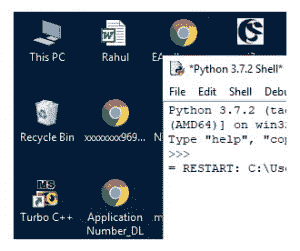

# Python PIL | ImageGrab.grab()方法

> 原文:[https://www . geesforgeks . org/pyhton-pil-image grab-grab-method/](https://www.geeksforgeeks.org/pyhton-pil-imagegrab-grab-method/)

PIL 是 python 图像库，它为 Python 解释器提供图像编辑
功能。ImageGrab 模块可用于将屏幕或剪贴板的内容复制到 PIL 图像存储器中。
**PIL。ImageGrab.grab()** 方法拍摄屏幕快照。边界框内的像素在 Windows 上以“RGB”图像返回，在 macOS 上以“RGBA”图像返回。如果省略边界框，将复制整个屏幕。

```
Syntax: PIL.ImageGrab.grab(bbox=None)

parameters: 
bbox: What region to copy. Default is the entire screen.

Returns: An image
```

## 蟒蛇 3

```
# Importing Image and ImageGrab module from PIL package
from PIL import Image, ImageGrab

# creating an image object
im1 = Image.open(r"C:\Users\sadow984\Desktop\download2.JPG")

# using the grab method
im2 = ImageGrab.grab(bbox = None)

im2.show()
```

**输出:**


## 蟒蛇 3

```
# Importing Image and ImageGrab module from PIL package
from PIL import Image, ImageGrab

# creating an image object
im1 = Image.open(r"C:\Users\sadow984\Desktop\download2.JPG")

# using the grab method
im2 = ImageGrab.grab(bbox =(0, 0, 300, 300))

im2.show()
```

**输出:**



不同的 bbox 值可以用于不同的屏幕尺寸。