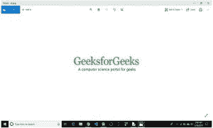
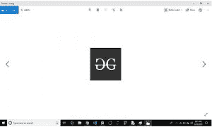

# Python PIL | imagegrab . grabclipboard()方法

> 原文:[https://www . geeksforgeeks . org/pyhton-pil-image grab-grabclipboard-method/](https://www.geeksforgeeks.org/pyhton-pil-imagegrab-grabclipboard-method/)

PIL is the Python Imaging Library which provides the python interpreter with image editingcapabilities. The ImageGrab module can be used to copy the contents of the screen or the clipboard to a PIL image memory.

`**PIL.ImageGrab.grabclipboard()**`方法获取剪贴板图像的快照(如果有)。

> **语法:**pil . imagegrave . gravclipboard()
> 
> **参数:**无参数
> 
> **返回:**在窗口中，图像、文件名列表，如果剪贴板不包含图像数据或文件名，则返回“无”。

**注意:**本模块仅适用于 Windows 和 Mac OS。

```
# Importing Image and ImageGrab module from PIL package 
from PIL import Image, ImageGrab

# using the grabclipboard method
im = ImageGrab.grabclipboard()

im.show()
```

**输出:**


**更改剪贴板上的图像后**

```
# Importing Image and ImageGrab module from PIL package 
from PIL import Image, ImageGrab

# using the grabclipboard method
im = ImageGrab.grabclipboard()

im.show()
```

**输出:**
