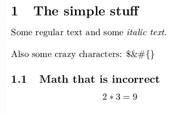
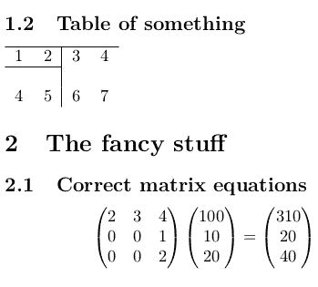
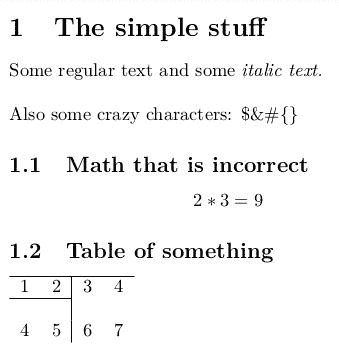
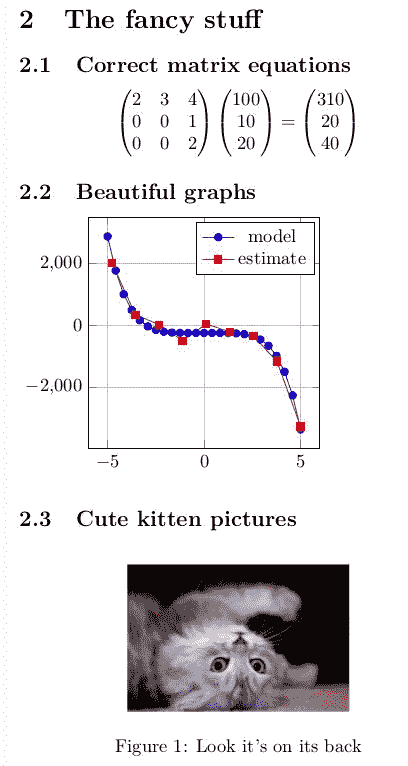

# python 中的 Pylatex 模块

> 原文:[https://www.geeksforgeeks.org/pylatex-module-in-python/](https://www.geeksforgeeks.org/pylatex-module-in-python/)

**乳胶:**

Latex 发音为“Lay-tech”，是一个高质量文档的文档制作系统。它主要用于技术或科学文件的准备，但它可以用于几乎所有形式的出版。Latex 不像 MS Word 或 LibreOffice Writer 那样是文字处理器。相反，Latex 鼓励作者不要担心文档的外观，而是专注于获得正确的内容。例如，考虑以下文档:

```
This article explains the use of pylatex module
GeeksforGeeks
October 2018

```

为了在大多数文字处理器中实现这一点，作者必须决定使用什么布局，因此会选择(假设)`18pt Helvetica`作为标题，`12pt Times Roman`作为名称，依此类推。这导致作者浪费时间设计文档。Latex 基于让作者继续编写文档并将文档的设计留给文档设计者的想法。因此，在 Latex 中，您可以将上述文档输入为:

```
\documentclass{article}
\title{This article explains use of pylatex module}
\author{GeeksforGeeks}
\date{October 2018}
\begin{document}
   \maketitle
   Continue reading
\end{document}

```

**乳胶文档的布局:**
乳胶文档有两个主要部分:
**序言:**

*   前言是乳胶文件的第一部分。
*   它包含文档的详细信息，如文档类别、作者姓名、标题等

**车身:**

*   在 latex 文档的正文部分，可以包括章节、表格、数学方程、图表等
*   文档的所有内容都在“\begin{document}”和“\end{document}”中

**Latex 的一些特点是:**

1.  准备期刊文章、技术报告、技术或非技术书籍，以及幻灯片演示。
2.  它可以更好地控制包含切片、参考文献、表格和图形的大型文档。
3.  它对于准备包含复杂数学公式的文档也很有用。
4.  在 LaTeX 中，书目和索引的生成是自动的。
5.  它还提供多语言排版支持。
6.  在 latex 文档中，我们还可以添加图形、图稿和混色或专色。
7.  在 LaTeX 中也可以使用 PostScript 或 metafont 字体。

**一个 latex 文档的例子:**
**例子 1:** 在这个例子中我们形成了一个简单的 latex 为了从 latex 中，我们使用了简单的输入格式就像我们在 LaTeX 中使用的一样。

```
\documentclass{article}%
\usepackage[T1]{fontenc}%
\usepackage[utf8]{inputenc}%
\usepackage{lmodern}%
\usepackage{textcomp}%
\usepackage{lastpage}%
\usepackage[tmargin=1cm, lmargin=10cm]{geometry}%
\usepackage{amsmath}%
\usepackage{tikz}%
\usepackage{pgfplots}%
\pgfplotsset{compat=newest}%
\usepackage{graphicx}%
%
%
%
\begin{document}%
\normalsize%
\section{The regular stuff}%
\label{sec:The regular stuff}%
Some text and some%
\textit{italic text. }%
\newline%
Also some crazy symbols: \$\&\#\{\}%
\subsection{Incorrect math}%
\label{subsec:Incorrect math}%
\[%
2*3 = 22%
\]

%
\end{document}
```

**输出:**


**例 2:** 在本例中我们使用了，标签，分段的顺序来形成乳胶。

```
\documentclass{article}%
\usepackage[T1]{fontenc}%
\usepackage[utf8]{inputenc}%
\usepackage{lmodern}%
\usepackage{textcomp}%
\usepackage{lastpage}%
\usepackage[tmargin=1cm, lmargin=10cm]{geometry}%
\usepackage{amsmath}%
\usepackage{tikz}%
\usepackage{pgfplots}%
\pgfplotsset{compat=newest}%
\usepackage{graphicx}%
%
%
%
%
\subsection{Table}%
\label{subsec:Table}%
\begin{tabular}{rc|cl}%
\hline%
a&b&c&d\\%
\cline{1%
-%
2}%
&&&\\%
e&f&g&7h\\%
\end{tabular}

%
\section{Special features}%
\label{sec:Special features}%
\subsection{Correct matrix equations}%
\label{subsec:Correct matrix equations}%
\[%
\begin{pmatrix}%
1&4&4\\%
2&3&4\\%
2&2&5%
\end{pmatrix} \begin{pmatrix}%
800\\%
30\\%
30%
\end{pmatrix} = \begin{pmatrix}%
810\\%
60\\%
50%
\end{pmatrix}%
\]

%
\end{document}
```

**输出:**


**什么是 Pylatex :**
PyLaTeX 是一个用于创建和编译 latex 文档的 Python 库。这个库的目标是简单，但也是在 Python 和 latex 之间提供一个可扩展的接口。

pylatex 的一些特点是:

*   我们可以使用这个模块访问 python 中 LaTeX 的所有特性
*   我们可以用更少的代码来制作文档
*   由于 python 是一种高级语言，所以与 latex 相比，用 python 为 pylatex 编写代码更容易
*   在上面的 LaTeX 代码中，您一定已经看到，为了给出方程，我们必须计算值，然后在 LaTeX 文档中输入，但是使用 python 执行算术运算的附加功能，准备文档要容易得多

**创建皮拉泰文档:**

*   Install MikTeX and pylatex module in your system and import it into python code.
    For installing MikTeX on your system, go to :

    ```
    https://miktex.org/download

    ```

    要在基于 windows 的操作系统上安装 pylatex，请在命令提示符下输入以下命令:

    ```
    python -m pip install pylatex

    ```

*   从 pylatex 模块创建文档导入文档类。乳胶中有不同的文件类型:文章、报告、信件等。要创建文章类型的文档，请创建 latex 的 document 类的对象，并将“文章”

    ```
    doc=Document(documentclass='article')

    ```

    作为参数传递
*   要在文档中添加必要的更改，如样式或格式，请从 pylatex 导入 python 代码中所需的类。使用 pylatex 在 latex 文档中添加不同的实用程序，以下方法是可行的

    ```
    from pylatex import Document, Section, Subsection
    from pylatex.utils import italic, bold

    ```

*   要生成文档的 pdf 文件，使用 document 类的对象调用 Document 类的 generate_pdf 方法，并确保以这种方式在其参数中传递 PDF 文档的名称

    ```
    doc.generate_pdf("Demo_article")

    ```

**皮拉泰示例:**
**代码 1:**

```
# Python program creating a
# small document using pylatex

import numpy as np

# importing from a pylatex module
from pylatex import Document, Section, Subsection, Tabular
from pylatex import Math, TikZ, Axis, Plot, Figure, Matrix, Alignat
from pylatex.utils import italic
import os

if __name__ == '__main__':
    image_filename = os.path.join(os.path.dirname(__file__), 'kitten.jpg')

    geometry_options = {"tmargin": "1cm", "lmargin": "10cm"}
    doc = Document(geometry_options=geometry_options)

    # creating a pdf with title "the simple stuff"
    with doc.create(Section('The simple stuff')):
        doc.append('Some regular text and some')
        doc.append(italic('italic text. '))
        doc.append('\nAlso some crazy characters: $&#{}')
        with doc.create(Subsection('Math that is incorrect')):
            doc.append(Math(data=['2*3', '=', 9]))

        # creating subsection of a pdf
        with doc.create(Subsection('Table of something')):
            with doc.create(Tabular('rc|cl')) as table:
                table.add_hline()
                table.add_row((1, 2, 3, 4))
                table.add_hline(1, 2)
                table.add_empty_row()
                table.add_row((4, 5, 6, 7))

     # making a pdf using .generate_pdf
    doc.generate_pdf('full', clean_tex=False)
```

**输出:**


**代码 2:**

```
import numpy as np

from pylatex import Document, Section, Subsection, Tabular
from pylatex import Math, TikZ, Axis, Plot, Figure, Matrix, Alignat
from pylatex.utils import italic
import os

if __name__ == '__main__':
    image_filename = os.path.join(os.path.dirname(__file__), 'kitten.jpg')

    geometry_options = {"tmargin": "1cm", "lmargin": "10cm"}
    doc = Document(geometry_options=geometry_options)

    # making a matrix using numpy module
    a = np.array([[100, 10, 20]]).T
    M = np.matrix([[2, 3, 4],
                   [0, 0, 1],
                   [0, 0, 2]])

    # creating a title using "the fancy stuff"
    with doc.create(Section('The fancy stuff')):
        with doc.create(Subsection('Correct matrix equations')):
            doc.append(Math(data=[Matrix(M), Matrix(a), '=', Matrix(M * a)]))

        # creating a subsection of pdf
        with doc.create(Subsection('Alignat math environment')):
            with doc.create(Alignat(numbering=False, escape=False)) as agn:
                agn.append(r'\frac{a}{b} &= 0 \\')
                agn.extend([Matrix(M), Matrix(a), '&=', Matrix(M * a)])

        with doc.create(Subsection('Beautiful graphs')):
            with doc.create(TikZ()):
                plot_options = 'height=4cm, width=6cm, grid=major'
                with doc.create(Axis(options=plot_options)) as plot:
                    plot.append(Plot(name='model', func='-x^5 - 242'))

                    coordinates = [
                        (-4.77778, 2027.60977),
                        (-3.55556, 347.84069),
                        (-2.33333, 22.58953),
                        (-1.11111, -493.50066),
                        (0.11111, 46.66082),
                        (1.33333, -205.56286),
                        (2.55556, -341.40638),
                        (3.77778, -1169.24780),
                        (5.00000, -3269.56775),
                    ]

                    plot.append(Plot(name='estimate', coordinates=coordinates))

        with doc.create(Subsection('Cute kitten pictures')):
            with doc.create(Figure(position='h!')) as kitten_pic:
                kitten_pic.add_image(image_filename, width='120px')
                kitten_pic.add_caption('Look it\'s on its back')

    # Creating a pdf
    doc.generate_pdf('full', clean_tex=False)
```

**输出:**
