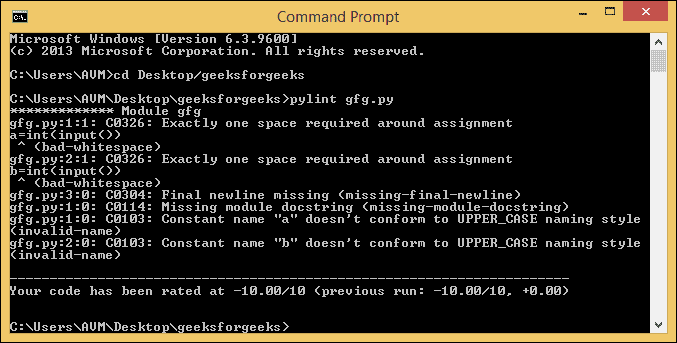
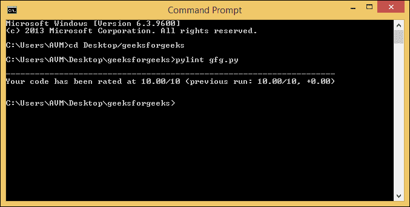

# Python 中的 Pylint 模块

> 原文:[https://www.geeksforgeeks.org/pylint-module-in-python/](https://www.geeksforgeeks.org/pylint-module-in-python/)

我们在编写/运行一些程序时，经常会被卡在中间或遇到错误。我们通常上网寻求帮助，并运行我们的代码。但是我们如何理解互联网上发布的代码呢？这个问题的一些典型答案是文档字符串，即在该代码之上编写的文章..,

这个时代最大的问题之一就是理解对方的程序。如果代码中没有注释、文档字符串等解释性的东西，情况会更糟。作为一名程序员，我们应该让我们的代码可读且易懂。

为了解决这个问题，Python 提供了一个模块 **pylint** 。本文简要介绍了 **pylint** 模块，并提供了在我的代码中获得高分的技巧。我们开始吧。

Pylint 是一个工具

*   列出执行 Python 代码后出现的错误
*   强制执行编码标准并寻找代码气味
*   建议如何更新特定的块
*   提供关于代码复杂性的细节

Pylint 工具类似于 **pychecker** 、 **pyflakes** 、 **flake8** 和 **mypy** 。

### 装置

要安装 pylint，请确保您的电脑上安装了 Python。在您的电脑上打开命令提示符(Windows) /终端(Linux)，然后键入以下命令

```py
pip install pylint 
```

要验证 pylint 安装，请键入以下命令

```py
pylint --version
```

您应该会看到 py lint“2 . 4 . 4”版本。我们也可以通过重新安装 pylint 来验证安装。在这种情况下，如果 pylint 已经安装，您应该会在屏幕上看到**要求已经满足**。

### 与皮灵一起工作

考虑下面的程序，它接受两个数字并打印它们的总和。

```py
a = 1
b = 2
print(a + b)
```

现在将上述程序保存在文件**中**打开你的命令提示符/终端，输入以下命令

```py
pylint gfg.py
```

在 pylint 2.4.4 版本中，您将获得如下所示的报告。消息可能会因版本而异。


**上述代码的评分**为-10.0/10.0(极低)。如果我们得了低分，并不意味着我们的代码是错误的。分数代表你的代码有多好/多坏可以被其他程序员理解。我们需要通过考虑报告中给出的建议来改进我们的代码。

报告中的每个消息建议/点都有一个消息格式，该格式由一个标识及其含义组成。每个 ID 都以一个字母开头，其余的将被编号。每个字母表示消息对象的类型。一些消息对象是

| S.No | 消息对象 | 膨胀 | 说明 |
| --- | --- | --- | --- |
| 1. | C | 惯例 | 当程序不遵循标准规则时，它会显示出来。 |
| 2. | 稀有 | 重构 | 显示它是因为代码有异味 |
| 3. | W | 警告 | 它是针对 python 特定问题显示的 |
| 4. | E | 错误 | 当特定的行执行导致一些错误时，它就会显示出来 |
| 5. | F | 致命的 | 当 pylint 无法进一步处理该行时，会显示该信息。 |

让我们讨论一些提高分数的技巧。

*   ID **C0326** 提示一个错误-空格错误意味着我们需要在 **a** 和**之间给出一个空格=** 符号。此规则适用于在标识符后立即使用运算符的所有声明。
*   ID **C0304** 属于缺失新行建议，这意味着我们在完成代码时必须添加一个空行。
*   ID **C0114** 属于缺失模块-文档字符串建议，这意味着我们需要在顶部添加一个文档字符串，这是指使用下面编写的程序。
*   ID **C0103** 属于无效名称建议，可以通过将标识符以大写字母开头来避免。但是，我们通常认为类名使用 CamelCasing，即类名以大写字母开头。为了避免这种建议，我们将向 pylint 添加一个正则表达式，它实际上接受所有小写字母的变量。我们将在后面的例子中进一步讨论这个问题。

代码的修改版本是:

```py
'''
This program adds two numbers and displays their results
'''
A = 1
B = 2
print('Sum of Numbers:', A + B)

```

如果我们使用 pylint 运行上述代码，我们将得到以下结果


在这里，我们将分数从-10.0 提高到 10.0。太好了。但是，我的代码可以理解吗？答案是**否**。还有一些变化，我们需要指定 pylint 模块来为我们的代码评分。

### 更改无效名称建议

如前所述，默认情况下，pylint 模块将使用大写命名约定。用来标识大写约定的正则表达式是`(([A-Z_][A-Z1-9_]*)|(__.*__))$`。我们需要添加我们的建议作为一个正则表达式，接受以小写字母开头的标识符。为此，请打开命令提示符并执行以下语句。

```py
pylint --const-rgx='[a-z\_][a-z0-9\_]{2, 30}{content}apos; filename.py
```

。
这将避免使用大写约定。我们可以通过改变**py lint-generate-rcfile**中的规则来永久地修改它，我们将在以后的文章中讨论。