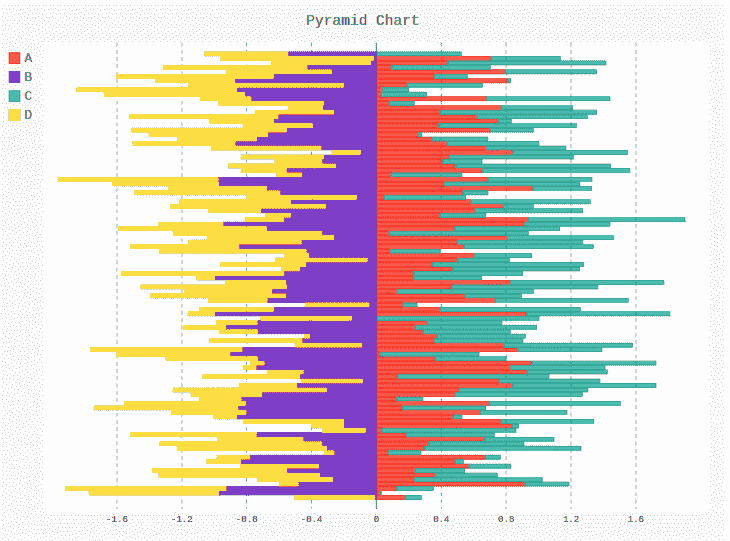
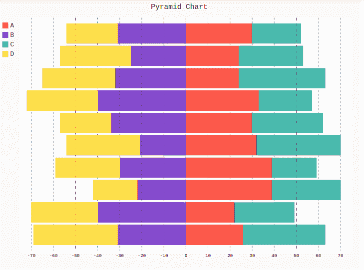

# pygal 的金字塔图

> 原文:[https://www.geeksforgeeks.org/pyramid-chart-in-pygal/](https://www.geeksforgeeks.org/pyramid-chart-in-pygal/)

Pygal 是一个 Python 模块，主要用于构建 SVG(标量矢量图形)图形和图表。SVG 是一种基于矢量的 XML 格式的图形，可以在任何编辑器中编辑。Pygal 可以用最少的代码行创建图表，这些代码行易于理解和编写。

## 金字塔图

金字塔图是一种形状为三角形或金字塔形的图表。当数据以某种仪器方式组织时，这些图表在使用中是有益的。金字塔的增加或减少表明某种从重要到不重要的递进顺序。它可以使用金字塔方法创建。

**语法:**

```py
pyramid_chart = pygal.Pyramid()
```

**例 1:**

```py
import pygal
import random

# Random Data
data = [numpy.random.rand(100), numpy.random.rand(100),
        numpy.random.rand(100), numpy.random.rand(100)]

types = ['A', 'B',
         'C', 'D', ]

pyramid_chart = pygal.Pyramid()

# Naming the title
pyramid_chart.title = 'Pyramid Chart'

for type, dat in zip(types, data):
    pyramid_chart.add(type, dat)

pyramid_chart
```

**输出:**



**例 2:**

```py
import pygal
import random

# Random Data
data = [[26, 22, 39, 39, 32, 30, 33, 24, 24, 30], 
        [31, 40, 22, 30, 21, 34, 40, 32, 25, 31], 
        [37, 27, 31, 20, 38, 32, 24, 39, 29, 22], 
        [38, 30, 20, 29, 33, 23, 32, 33, 32, 23]]

types = ['A', 'B',
         'C', 'D', ]

pyramid_chart = pygal.Pyramid()

# Naming the title
pyramid_chart.title = 'Pyramid Chart'

for type, dat in zip(types, data):
    pyramid_chart.add(type, dat)

pyramid_chart
```

**输出:**

