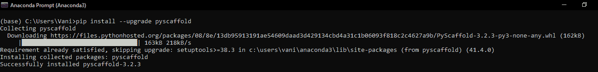
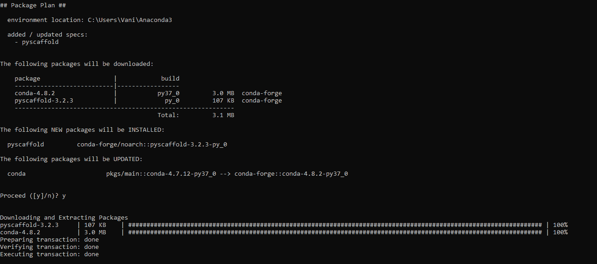

# Python 中的 Pyscaffold 模块

> 原文:[https://www.geeksforgeeks.org/pyscaffold-module-in-python/](https://www.geeksforgeeks.org/pyscaffold-module-in-python/)

从 Python 项目开始通常非常复杂，因为它涉及到设置和配置一些文件。这就是 **Pyscaffold** 的用武之地。它是一个设置新的 python 项目的工具，非常容易使用，并且在不到 10 秒的时间内设置好您的项目！要使用 Pyscaffold， **Git 是必须的**，尤其是 Windows 用户应该安装“Git Bash”。此外，PyScaffold 的安装还需要最新版本的“安装工具”。
每个 Python 包项目在内部都由 PyScaffold 表示为一个树形数据结构，该结构与文件系统中的一个目录条目直接相关。该树被实现为一个简单的字典，其中键指示将生成文件的路径，而值指示其内容。

#### 装置

要使用 pip 安装 Pyscaffold，请执行以下命令，安装最新的 Pyscaffold 版本:

```py
pip install --upgrade pyscaffold
```



如果您没有安装 pip，请参考本文:[如何安装 pip 命令](https://www.geeksforgeeks.org/how-to-install-pip-on-windows/)
PyScaffold 也可以通过在 Anaconda 命令提示符下执行以下操作来安装 conda:

```py
conda install -c conda-forge pyscaffold
```




如果你看到这样的东西，那么这意味着 Pyscaffold 已经安装成功了！

#### 设置新项目

PyScaffold 附带了许多特性和配置默认值，使开发、维护和分发您自己的 Python 包的频繁任务变得尽可能容易。
要设置新的 python 项目，请使用 putup 命令:

```py
putup Your_Project
```

这将使用 Python 项目的项目布局创建一个文件夹 Your_Project，它有一个 Your_Project 包文件夹，以及文档和测试文件夹以及文件 setup.py、setup.cfg、AUTHORS.txt、README.txt 和 LICENSE.txt。所有配置都在“setup.cfg”中完成，而不是 setup.py。在这里，您可以更改与包相关的所有设置(即作者、URL、许可证等)。).另外，要添加额外的数据文件，我们可以在 setup.cfg 中添加它们的名称，它们将被自动添加。
PyScaffold 旨在涵盖编写和分发 Python 包的基本要素。大多数情况下，设置安装选项足以确保项目的正确配置。PyScaffold 可以在运行时被其他 Python 包扩展。也可以编写嵌入 PyScaffold 的外部脚本或程序，并使用它来执行一些用户定义的操作。
**例:**

## 蟒蛇 3

```py
# Temporarily adjust padding
# while executing a context.
from pyscaffold.log import logger

logger.report('invoke', 'custom_action')
with logger.indent():
    logger.report('create', 'some / file / path')

# Expected logs:
# --------------------------------------
# invoke  custom_action
# create    some / file / path
# --------------------------------------
# Note how the spacing between activity and
# subject in the
# second entry is greater than the equivalent
# in the first one.
```

**更新:**

*   每当 PyScaffold 的新更新发布时，您可以使用此命令更新项目的
    结构/脚手架:

```py
output --update my_project
```

*   一次更新只会更新用户不常使用或修改的文件，因此，要
    更新所有文件，使用强制更新:

```py
--update --force
```

*   **注:**
    *   如果要从 2.0 之前的 PyScaffold 版本进行更新，必须手动删除 versioneer.py 和 MANIFEST.in 文件。
    *   如果要从 2.2 之前的版本进行更新，必须删除${PACKAGE}/_version.py。

#### 如何迁移到 PyScaffold

最初，项目(比如 my_project)必须在一个 Git 存储库中，并且包含一个包(比如 my_package)和您的 python 模块。
**注意:**你的工作树并不脏，也就是所有的修改都是提交的，所有重要的文件都在版本控制之下。

*   首先，进入 my_project 的父文件夹，键入以下命令，以便在存储库中部署新的项目结构。

```py
putup my_project --force --no-skeleton -p my_package
```

*   使用此命令切换到 my_project 并将旧的包文件夹移动到 src 中，如果项目有一个不是 tests 的测试文件夹或一个不是 docs 的文档文件夹，则使用相同的方法。

```py
git mv my_package/* src/my_package/
```

*   使用 git 状态检查未跟踪的文件，并用 git add 添加它们。
*   。最后，使用 git difftool 检查所有被覆盖的文件是否有需要传输的更改。您在 setup.py 中完成的所有配置都需要移动到 setup.cfg。在大多数情况下，您不需要对 PyScaffold 提供的新 setup.py 文件进行更改。
*   运行以下命令来检查所有工作:

```py
run python setup.py install and python setup.pysdist
```

*   还要运行 python setup.py 文档和 python setup.py 测试，以检查 Sphinx 和 py test 是否正确运行。