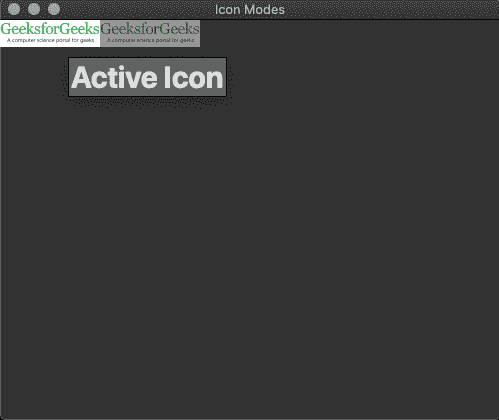
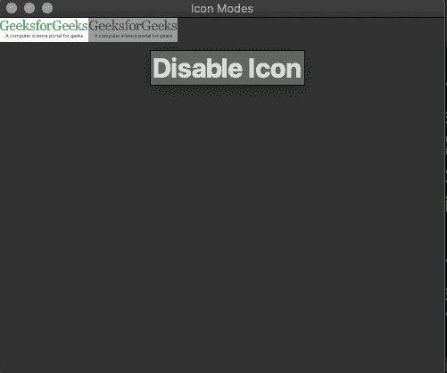

# pyside 2–创建工具提示

> 原文:[https://www.geeksforgeeks.org/pyside2-create-tooltip/](https://www.geeksforgeeks.org/pyside2-create-tooltip/)

在本文中，我们将学习如何创建工具提示。当用户将鼠标指针移动到某个元素上时，工具提示通常用于指定关于该元素的额外信息。为了做到这一点，我们使用了在 PySide2.QtWidgets 中定义的 setToolTip()函数。

**创建工具提示的步骤:**

1.在代码中导入 PySide2 小部件和 Gui 模块
2。创建带有标题和字体设置的窗口
3。将工具提示“我们的主窗口”设置为整个窗口
4。将图标设置为激活和禁用两种状态，工具提示分别为“激活图标”和“禁用图标”。

**输入图像:**


## 蟒蛇 3

```
# import system module
import sys

# import QtWidget Modules
from PySide2.QtWidgets import QApplication, QWidget, QLabel, QToolTip

# import QtGui modules
from PySide2.QtGui import QIcon, QPixmap, QFont

class Window(QWidget):
    def __init__(self):
        super().__init__()

        # set window title
        self.setWindowTitle("GeeksforGeeks - ToolTip")

        # set window geometry 
        self.setGeometry(300, 300, 500, 400)

        # set tooltip font and font type
        QToolTip.setFont(QFont("Decorative", 30, QFont.Bold))

        # set tooltip
        self.setToolTip('Our Main Window')

    def setIconModes(self):
        # set icon 
        icon1 = QIcon("geeksforgeeks.png")
        # set label 
        label1 = QLabel('Sample', self)
        # set image in Active state
        pixmap1 = icon1.pixmap(100, 100, QIcon.Active, QIcon.On)
        # set Pixmap
        label1.setPixmap(pixmap1)
        # set tooltip text
        label1.setToolTip("Active Icon")

        # set icon 
        icon2 = QIcon("geeksforgeeks.png")
        # set label
        label2 = QLabel('Sample', self)
        # set image in Disabled state
        pixmap2 = icon2.pixmap(100, 100, QIcon.Disabled, QIcon.Off)
        # set P
        label2.setPixmap(pixmap2)
        label2.move(100, 0)
        label2.setToolTip("Disable Icon")

myApp = QApplication(sys.argv)
window = Window()
window.setIconModes()
window.show()

myApp.exec_()
sys.exit(0)
```

**输出图像:**

**活动状态:**



**禁用状态:**

