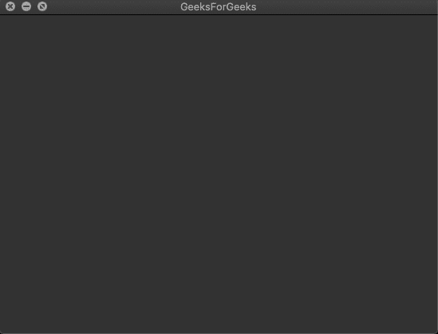

# pyside 2–如何创建窗口？

> 原文:[https://www.geeksforgeeks.org/pyside2-how-to-create-window/](https://www.geeksforgeeks.org/pyside2-how-to-create-window/)

PySide2 是 python 中最著名的构建 GUI 应用程序的库之一。在本文中，我们将使用 PySide2 库构建一个空窗口。

```
Steps to create empty window :

1\. Import PySide2 in your code
2\. Create QApplication object
3\. Create object for QWidget
4\. Increase the size of the window.
4\. Show window using show() function
```

## 蟒蛇 3

```
# import system module
import sys

# import PySide2 modules
from PySide2.QtWidgets import QApplication, QWidget

# create new app
app = QApplication(sys.argv)

# create main window
mainwindow = QWidget()

# resize window to 550 * 400
mainwindow.resize(550, 400)

# set title to the window frame
mainwindow.setWindowTitle('GeeksForGeeks')

# invoke show function
mainwindow.show()

# to kee in loop invoke exec_() function
app.exec_()
```

当我们执行这个程序时，一个大小为 550*400 的新的空窗口会出现在你的屏幕上，标签为“极客”。

**输出:**

