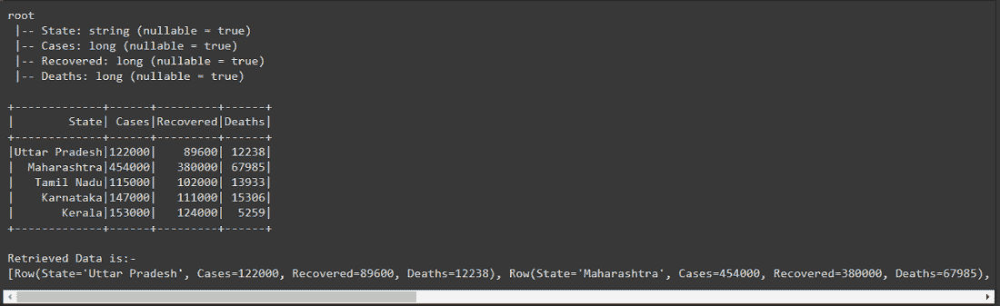
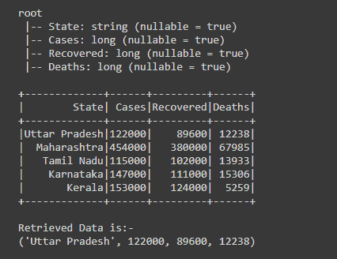
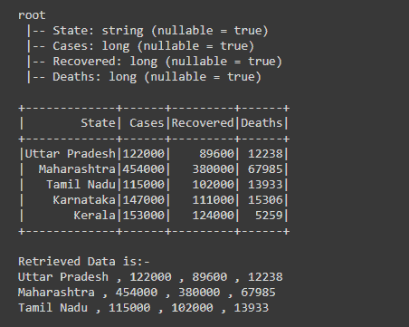
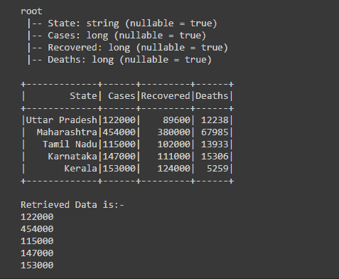
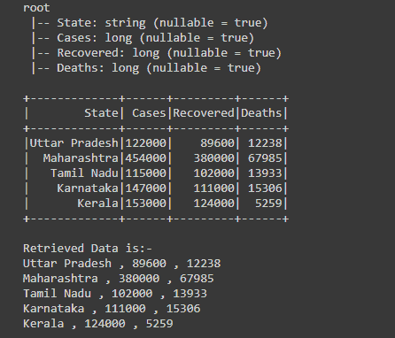

# PySpark Collect()–从数据框中检索数据

> 原文:[https://www . geesforgeks . org/py spark-collect-retrieve-data-from-data frame/](https://www.geeksforgeeks.org/pyspark-collect-retrieve-data-from-dataframe/)

Collect()是 RDD 或数据框的函数、操作，用于从数据框中检索数据。它用于从 RDD 中的每个分区检索该行的所有元素，并将其带到驱动程序节点/程序。

因此，在本文中，我们将学习如何使用 collect()操作从 Dataframe 中检索数据。

> **语法:** df.collect()
> 
> 其中 df 是数据帧

**示例 1:使用 collect()从数据框中检索所有数据。**

创建数据帧后，为了从数据帧中检索所有数据，我们使用了收集()操作，方法是写入 *df.collect()，*这将返回行类型的数组，在下面的输出中显示了数据帧的模式和实际创建的数据帧。

## 计算机编程语言

```
# importing necessary libraries
from pyspark.sql import SparkSession

# function to create new SparkSession
def create_session():
  spk = SparkSession.builder \
      .appName("Corona_cases_statewise.com") \
      .getOrCreate()
  return spk

# function to create RDD
def create_RDD(sc_obj,data):
  df = sc.parallelize(data)
  return df

if __name__ == "__main__":

  input_data = [("Uttar Pradesh",122000,89600,12238),
          ("Maharashtra",454000,380000,67985),
          ("Tamil Nadu",115000,102000,13933),
          ("Karnataka",147000,111000,15306),
          ("Kerala",153000,124000,5259)]

  # calling function to create SparkSession
  spark = create_session()

  # creating spark context object
  sc = spark.sparkContext

  # calling function to create RDD
  rd_df = create_RDD(sc,input_data)

  schema_lst = ["State","Cases","Recovered","Deaths"]

  # creating the dataframe using createDataFrame function
  df = spark.createDataFrame(rd_df,schema_lst)
  # printing schema of the dataframe and showing the dataframe
  df.printSchema()
  df.show()

  # retrieving the data from the dataframe using collect() 
  df2= df.collect()
  print("Retrieved Data is:-")
  print(df2)  
```

**输出:**



**示例 2:使用 collect()检索特定行的数据。**

在创建了 Dataframe 之后，我们使用 collect()操作，通过分别写入*print(df . collect()[0][0:])*来检索第 0 行 Dataframe 的数据。在这种情况下，我们在 collect()之后传递行和列，在第一个 print 语句中，我们将行和列作为[0][0:]传递。这里，第一个[0]表示我们传递了 0 的行，第二个[0:]表示列，冒号(:)用于检索所有列，简而言之，我们检索了包含所有列元素的第 0 行。

## 计算机编程语言

```
# importing necessary libraries
from pyspark.sql import SparkSession

# function to create new SparkSession
def create_session():
  spk = SparkSession.builder \
      .appName("Corona_cases_statewise.com") \
      .getOrCreate()
  return spk

# function to create RDD
def create_RDD(sc_obj,data):
  df = sc.parallelize(data)
  return df

if __name__ == "__main__":

  input_data = [("Uttar Pradesh",122000,89600,12238),
          ("Maharashtra",454000,380000,67985),
          ("Tamil Nadu",115000,102000,13933),
          ("Karnataka",147000,111000,15306),
          ("Kerala",153000,124000,5259)]

  # calling function to create SparkSession
  spark = create_session()

  # creating spark context object
  sc = spark.sparkContext

  # calling function to create RDD
  rd_df = create_RDD(sc,input_data)

  schema_lst = ["State","Cases","Recovered","Deaths"]

  # creating the dataframe using createDataFrame function
  df = spark.createDataFrame(rd_df,schema_lst)

  # printing schema of the dataframe and showing the dataframe
  df.printSchema()
  df.show()

  print("Retrieved Data is:-")

  # Retrieving data from 0th row 
  print(df.collect()[0][0:])
```

**输出:**



**示例 3:使用 collect()检索多行数据。**

创建数据框后，我们使用带有 for 循环的 collect()操作检索数据框前三行的数据，通过在 df . collect()[0:3]【T1]中为行写入*，在写入 collect()操作后，我们传递我们想要的行数[0:3]，首先[0]表示起始行，使用“:”分号和[3]表示结束行，直到我们想要多行的数据。*

这是我们从中检索数据的行数，是 0，1 和 2。最后一个索引总是被排除，即 3。

## 计算机编程语言

```
# importing necessary libraries
from pyspark.sql import SparkSession
from pyspark.sql.functions import col

# function to create new SparkSession
def create_session():
  spk = SparkSession.builder \
      .appName("Corona_cases_statewise.com") \
      .getOrCreate()
  return spk

# function to create RDD
def create_RDD(sc_obj,data):
  df = sc.parallelize(data)
  return df

if __name__ == "__main__":

  input_data = [("Uttar Pradesh",122000,89600,12238),
          ("Maharashtra",454000,380000,67985),
          ("Tamil Nadu",115000,102000,13933),
          ("Karnataka",147000,111000,15306),
          ("Kerala",153000,124000,5259)]

  # calling function to create SparkSession
  spark = create_session()

  # creating spark context object
  sc = spark.sparkContext

  # calling function to create RDD
  rd_df = create_RDD(sc,input_data)

  schema_lst = ["State","Cases","Recovered","Deaths"]

  # creating the dataframe using createDataFrame function
  df = spark.createDataFrame(rd_df,schema_lst)

  # showing the dataframe and schema
  df.printSchema()
  df.show()

  print("Retrieved Data is:-")

  # Retrieving multiple rows using collect() and for loop
  for row in df.collect()[0:3]:
    print((row["State"]),",",str(row["Cases"]),",",
          str(row["Recovered"]),",",str(row["Deaths"]))
```

**输出:**



**示例 4:使用 collect()从特定列中检索数据。**

创建数据框后，我们使用 for 循环的 collect()操作检索“案例”列的数据。通过迭代到 df.collect()的循环，它给出了我们正在检索的行的行数组，并通过写入*print(col[“Cases”])来打印“Cases”列的数据；*

由于我们是通过对行数组进行循环迭代来获取一行，因此我们只从该行中检索“案例”列的数据。通过编写*print(col[“Cases”])*在每行中，我们通过在 col 中传递“Cases”来检索“Cases”列的数据

## 计算机编程语言

```
# importing necessary libraries
from pyspark.sql import SparkSession
from pyspark.sql.functions import col

# function to create new SparkSession
def create_session():
  spk = SparkSession.builder \
      .appName("Corona_cases_statewise.com") \
      .getOrCreate()
  return spk

# function to create RDD
def create_RDD(sc_obj,data):
  df = sc.parallelize(data)
  return df

if __name__ == "__main__":

  input_data = [("Uttar Pradesh",122000,89600,12238),
          ("Maharashtra",454000,380000,67985),
          ("Tamil Nadu",115000,102000,13933),
          ("Karnataka",147000,111000,15306),
          ("Kerala",153000,124000,5259)]

  # calling function to create SparkSession
  spark = create_session()

  # creating spark context object
  sc = spark.sparkContext

  # calling function to create RDD
  rd_df = create_RDD(sc,input_data)

  schema_lst = ["State","Cases","Recovered","Deaths"]

  # creating the dataframe using createDataFrame function
  df = spark.createDataFrame(rd_df,schema_lst)

  # showing the dataframe and schema
  df.printSchema()
  df.show()

  print("Retrieved Data is:-")

  # Retrieving data from the "Cases" column
  for col in df.collect():
    print(col["Cases"])
```

**输出:**



**示例 5:使用 collect()从多个列中检索数据。**

创建数据框后，我们将检索多个列的数据，包括“状态”、“已恢复”和“死亡”。

为了检索多列的数据，首先我们必须获得我们使用 *df.collect()* 动作获得的行的数组，现在迭代数组的每一行的 For 循环，因为通过迭代我们一个接一个地获得行，所以从该行我们从每一列中检索“状态”、“已恢复”和“死亡”列的数据，并通过写、 *print(col[“状态”]、“、”、“”、”col[“已恢复”、“、”、“”、”col[“死亡”])* 来打印数据

## 计算机编程语言

```
# importing necessary libraries
from pyspark.sql import SparkSession
from pyspark.sql.functions import col

# function to create new SparkSession
def create_session():
  spk = SparkSession.builder \
      .appName("Corona_cases_statewise.com") \
      .getOrCreate()
  return spk

# function to create RDD
def create_RDD(sc_obj,data):
  df = sc.parallelize(data)
  return df

if __name__ == "__main__":

  input_data = [("Uttar Pradesh",122000,89600,12238),
          ("Maharashtra",454000,380000,67985),
          ("Tamil Nadu",115000,102000,13933),
          ("Karnataka",147000,111000,15306),
          ("Kerala",153000,124000,5259)]

  # calling function to create SparkSession
  spark = create_session()

  # creating spark context object
  sc = spark.sparkContext

  # calling function to create RDD
  rd_df = create_RDD(sc,input_data)

  schema_lst = ["State","Cases","Recovered","Deaths"]

  # creating the dataframe using createDataFrame function
  df = spark.createDataFrame(rd_df,schema_lst)

  # showing the dataframe and schema
  df.printSchema()
  df.show()

  print("Retrieved Data is:-")

  # Retrieving data of the "State",
  # "Recovered" and "Deaths" column
  for col in df.collect():
    print(col["State"],",",col["Recovered"],",
          ",col["Deaths"])
```

**输出:**

