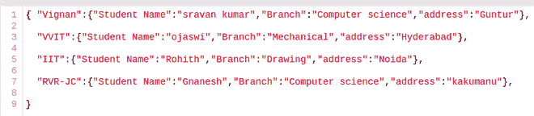
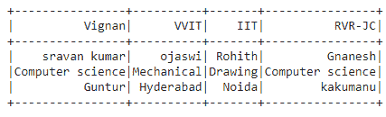
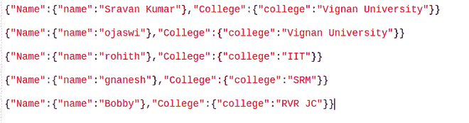
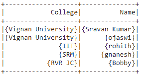

# Pyspark–将 JSON 转换为数据帧

> 原文:[https://www . geesforgeks . org/py spark-converting-JSON-to-data frame/](https://www.geeksforgeeks.org/pyspark-converting-json-to-dataframe/)

在本文中，我们将在 Pyspark 中将 JSON 字符串转换为 DataFrame。

**方法 1:使用 read_json()**

我们可以使用 pandas.read_json 读取 JSON 文件。这个方法基本上是用来通过熊猫读取 JSON 文件的。

> **语法:**pandas . read _ JSON(“file _ name . JSON”)

在这里，我们将使用这个 JSON 文件进行演示:



**代码:**

## 蟒蛇 3

```py
# import pandas to read json file
import pandas as pd

# importing module
import pyspark

# importing sparksession from pyspark.sql module
from pyspark.sql import SparkSession

# creating sparksession and giving an app name
spark = SparkSession.builder.appName('sparkdf').getOrCreate()

# creating a dataframe from the json file named student
dataframe = spark.createDataFrame(pd.read_json('student.json'))

# display the dataframe (Pyspark dataframe)
dataframe.show()
```

**输出:**



**方法二:使用 spark.read.json()**

这用于从文件中读取 json 数据，并以数据帧的形式显示数据

> **语法:**spark . read . JSON(' file _ name . JSON ')

**演示用 JSON 文件:**



**代码:**

## 蟒蛇 3

```py
# importing module
import pyspark

# importing sparksession from pyspark.sql module
from pyspark.sql import SparkSession

# creating sparksession and giving an app name
spark = SparkSession.builder.appName('sparkdf').getOrCreate()

# read json file
data = spark.read.json('college.json')

# display json data
data.show()
```

**输出:**

