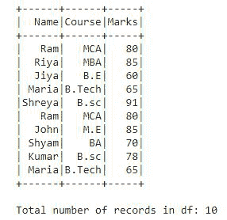
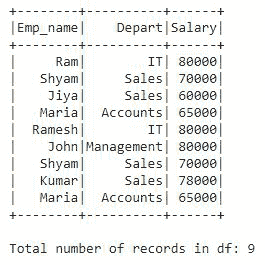
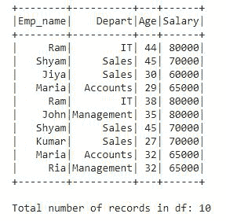

# 不同于数据帧的火花计数

> 原文:[https://www . geesforgeks . org/pyspark-count-distinct-from-data frame/](https://www.geeksforgeeks.org/pyspark-count-distinct-from-dataframe/)

在本文中，我们将讨论如何计算 Pyspark 数据帧中存在的不同值。

在 Pyspark 中，有两种方法可以获得不同值的计数。我们可以使用数据帧的 **distinct()** 和 **count()** 函数来获得 PySpark 数据帧的 count distinct。另一种方法是使用 SQL **countDistinct()** 函数，该函数将提供所有选定列的 Distinct 值计数。让我们通过例子来理解区别于数据帧的两种计数方式。

### 方法 1: distinct()。计数():

distinct 和 count 是可以应用于数据帧的两个不同的函数。distinct()将通过检查数据框中一行的所有列来消除所有重复的值或记录，count()将返回数据框中的记录数。通过一个接一个地链接这两个函数，我们可以得到 PySpark 数据帧的不同计数。

**示例 1:使用 Distinct()将 Pyspark 计数与 DataFrame 区分开来。count()**

在本例中，我们将创建一个包含学生详细信息(如姓名、课程和分数)的数据框。数据框也包含一些重复的值。我们将应用 distinct()。count()找出 DataFrame df 中存在的所有不同的 count 值。

## 蟒蛇 3

```py
# importing module
import pyspark

# importing sparksession from 
# pyspark.sql mudule
from pyspark.sql import SparkSession

# creating sparksession and giving
# app name
spark = SparkSession.builder.appName('sparkdf').getOrCreate()

# giving rows value for dataframe
data = [("Ram", "MCA", 80),
        ("Riya", "MBA", 85),
        ("Jiya", "B.E", 60),
        ("Maria", "B.Tech", 65),
        ("Shreya", "B.sc", 91),
        ("Ram", "MCA", 80),
        ("John", "M.E", 85),
        ("Shyam", "BA", 70),
        ("Kumar", "B.sc", 78),
        ("Maria", "B.Tech", 65)]

# giving column names of dataframe
columns = ["Name", "Course", "Marks"]

# creating a dataframe df
df = spark.createDataFrame(data, columns)

# show df
df.show()

# counting the total number of values 
# in df
print("Total number of records in df:", df.count())
```

**输出:**



这是我们创建的 DataFrame df，它总共包含 10 条记录。现在，我们应用 distinct()。count()找出数据帧 df 中存在的不同值的总数。

## 蟒蛇 3

```py
# applying distinct().count() on df
print('Distinct count in DataFrame df is :', df.distinct().count())
```

**输出:**

```py
Distinct count in DataFrame df is : 8
```

在这个输出中，我们可以看到数据帧 df 中有 8 个不同的值。

### 方法 2: countDistinct():

此函数提供一组选定列中不同元素的计数。countDistinct()是一个 SQL 函数，它将提供所有选定列的不同值计数。

**示例 1:使用 Count Distinct()将 Pyspark 计数与数据框区分开来。**

在本例中，我们将创建一个包含员工详细信息(如 Emp_name、部门和薪资)的数据框 df。数据框也包含一些重复的值。我们将应用 countDistinct()来找出数据帧 df 中存在的所有不同值的计数。

## 蟒蛇 3

```py
# importing sparksession from 
# pyspark.sql mudule
from pyspark.sql import SparkSession

# creating sparksession and giving 
# app name
spark = SparkSession.builder.appName('sparkdf').getOrCreate()

# giving rows value for dataframe
data = [("Ram", "IT", 80000),
        ("Shyam", "Sales", 70000),
        ("Jiya", "Sales", 60000),
        ("Maria", "Accounts", 65000),
        ("Ramesh", "IT", 80000),
        ("John", "Management", 80000),
        ("Shyam", "Sales", 70000),
        ("Kumar", "Sales", 78000),
        ("Maria", "Accounts", 65000)]

# giving column names of dataframe
columns = ["Emp_name", "Depart", "Salary"]

# creating a dataframe df
df = spark.createDataFrame(data, columns)

# show df
df.show()

# counting the total number of values in df
print("Total number of records in df:", df.count())
```



这是我们创建的 DataFrame df，它总共包含 9 条记录。现在，我们将应用 countDistinct()来找出数据帧 df 中存在的总的 Distinct 值计数。为了应用这个函数，我们将从 pyspark.sql.functions 模块导入这个函数。

## 蟒蛇 3

```py
# importing countDistinct from
# pyspark.sql.functions
from pyspark.sql.functions import countDistinct

# applying the function countDistinct() 
# on df using select()
df2 = df.select(countDistinct("Emp_name", "Depart", "Salary"))

# show df2
df2.show()
```

**输出:**

```py
+----------------------------------------+
|count(DISTINCT Emp_name, Depart, Salary)|
+----------------------------------------+
|                                       7|
+----------------------------------------+
```

DataFrame df 中有 7 条不同的记录。countDistinct()以列格式提供不同的计数值，如输出所示，因为它是一个 SQL 函数。

现在，让我们看看基于一个特定列的不同值的计数。我们将计算员工详细信息 df 的“部门”列中存在的不同值。

## 蟒蛇 3

```py
# importing countDistinct from 
# pyspark.sql.functions
from pyspark.sql.functions import countDistinct

# applying the function countDistinct() 
# on df using select()
df3 = df.select(countDistinct("Depart"))

# show df2
df3.show()
```

**输出:**

```py
+----------------------+
|count(DISTINCT Depart)|
+----------------------+
|                     4|
+----------------------+
```

部门列中有 4 个不同的值。在这个例子中，我们只在分离列上应用了 countDistinct()。

**示例 2:使用 SQL 查询将 Pyspark 计数与 DataFrame 区分开来。**

在本例中，我们创建了一个包含员工详细信息的数据框，如 Emp_name、离职、年龄和工资。现在，我们将使用我们在 SQL 中使用的一个简单的 SQL 查询来计算数据框中的不同记录。让我们看看这个例子并理解它:

## 蟒蛇 3

```py
# importing sparksession from pyspark.sql mudule
from pyspark.sql import SparkSession

# creating sparksession and giving app name
spark = SparkSession.builder.appName('sparkdf').getOrCreate()

# giving rows value for dataframe
data = [("Ram", "IT", 44, 80000),
        ("Shyam", "Sales", 45, 70000),
        ("Jiya", "Sales", 30, 60000),
        ("Maria", "Accounts", 29, 65000),
        ("Ram", "IT", 38, 80000),
        ("John", "Management", 35, 80000),
        ("Shyam", "Sales", 45, 70000),
        ("Kumar", "Sales", 27, 70000),
        ("Maria", "Accounts", 32, 65000),
        ("Ria", "Management", 32, 65000)]

# giving column names of dataframe
columns = ["Emp_name", "Depart", "Age", "Salary"]

# creating a dataframe df
df = spark.createDataFrame(data, columns)

# show df
df.show()

# counting the total number of values in df
print("Total number of records in df:", df.count())
```

**输出:**



这是包含总共 10 条记录以及一些重复记录的数据框。现在，我们将使用一个 SQL 查询，找出在这个数据框中有多少不同的记录。它和我们在 SQL 中做的一样简单。

## 蟒蛇 3

```py
# creating a temporary view of 
# Dataframe and storing it into df2
df.createOrReplaceTempView("df2")

# using the SQL query to count all
# distinct records and display the
# count on the screen
spark.sql("select count(distinct(*)) from df2").show()
```

#### 输出:

```py
+---------------------------------------------+
|count(DISTINCT Emp_name, Depart, Age, Salary)|
+---------------------------------------------+
|                                            9|
+---------------------------------------------+
```

在整个数据帧 df 中发现了 9 条不同的记录。

现在，让我们使用下面的 SQL 查询找到两列中的不同值计数，即 Emp_name 和 Salary。

## 蟒蛇 3

```py
# using the SQL query to count distinct
# records in 2 columns only display the
# count on the screen
spark.sql("select count(distinct(Emp_name, Salary)) from df2").show()
```

**输出:**

```py
+----------------------------------------------------------------+
|count(DISTINCT named_struct(Emp_name, Emp_name, Salary, Salary))|
+----------------------------------------------------------------+
|                                                               7|
+----------------------------------------------------------------+
```

在 Emp_name 和薪资列中有 7 个不同的值。

因为 SQL 以表格形式提供了对数据执行的所有操作的输出。我们在包含两行的列中得到答案，第一行有标题，第二行包含不同数量的记录。在示例 2 中，也获得了与相同格式的输出，countDistinct()也是一个 SQL 函数。