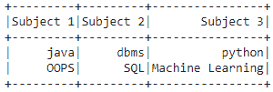
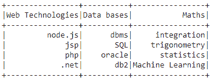

# PySpark–从列表

创建数据框

> 原文:[https://www . geesforgeks . org/py spark-create-data frame-from-list/](https://www.geeksforgeeks.org/pyspark-create-dataframe-from-list/)

在本文中，我们将讨论如何从列表中创建 Pyspark 数据帧。

为此，首先创建一个数据列表和一个列名列表。然后将此压缩数据传递给 spark.createDataFrame()方法。该方法用于创建数据帧。数据属性将是数据列表，而列属性将是名称列表。

> data frame = spark . createdata frame(数据，列)

**示例 1:** 从两个列表创建 Pyspark 学生数据框的 Python 代码。

## 蟒蛇 3

```py
# importing module
import pyspark

# importing sparksession from 
# pyspark.sql module
from pyspark.sql import SparkSession

# creating sparksession and giving 
# an app name
spark = SparkSession.builder.appName('sparkdf').getOrCreate()

# list  of college data with two lists
data = [["java", "dbms", "python"], 
        ["OOPS", "SQL", "Machine Learning"]]

# giving column names of dataframe
columns = ["Subject 1", "Subject 2", "Subject 3"]

# creating a dataframe
dataframe = spark.createDataFrame(data, columns)

# show data frame
dataframe.show()
```

**输出:**



**示例 2:** 从 4 个列表中创建一个数据框

## 蟒蛇 3

```py
# importing module
import pyspark

# importing sparksession from 
# pyspark.sql module
from pyspark.sql import SparkSession

# creating sparksession and giving 
# an app name
spark = SparkSession.builder.appName('sparkdf').getOrCreate()

# list  of college data with two lists
data = [["node.js", "dbms", "integration"],
        ["jsp", "SQL", "trigonometry"],
        ["php", "oracle", "statistics"],
        [".net", "db2", "Machine Learning"]]

# giving column names of dataframe
columns = ["Web Technologies", "Data bases", "Maths"]

# creating a dataframe
dataframe = spark.createDataFrame(data, columns)

# show data frame
dataframe.show()
```

**输出:**

