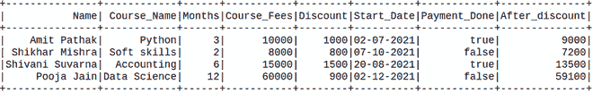
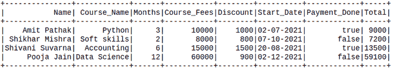

# PySpark 数据框基于其他列添加列

> 原文:[https://www . geesforgeks . org/py spark-data frame-add-column-based-on-other-columns/](https://www.geeksforgeeks.org/pyspark-dataframe-add-column-based-on-other-columns/)

在本文中，我们将看到如何向 Pyspark Dataframe 添加基于另一列的列。

**创建用于演示的数据框:**

在这里，我们将从给定数据集的列表中创建一个数据帧。

## 蟒蛇 3

```
# Create a spark session
from pyspark.sql import SparkSession
spark = SparkSession.builder.appName('SparkExamples').getOrCreate()

# Create a spark dataframe
columns = ["Name", "Course_Name",
           "Months",
           "Course_Fees", "Discount",
           "Start_Date", "Payment_Done"]
data = [
    ("Amit Pathak", "Python", 3, 10000, 1000,
     "02-07-2021", True),
    ("Shikhar Mishra", "Soft skills", 2,
     8000, 800, "07-10-2021", False),
    ("Shivani Suvarna", "Accounting", 6,
     15000, 1500, "20-08-2021", True),
    ("Pooja Jain", "Data Science", 12,
     60000, 900, "02-12-2021", False),
]

df = spark.createDataFrame(data).toDF(*columns)

# View the dataframe
df.show()
```

**输出:**


## 方法 1:使用带列()

它用于更改值、转换现有列的数据类型、创建新列等等。

> **语法:** df.withColumn(colName，col)
> 
> **通过添加一列或替换同名的现有列，返回:**一个新的:类:` DataFrame '。

## 蟒蛇 3

```
new_df = df.withColumn('After_discount',
                       df.Course_Fees - df.Discount)
new_df.show()
```

**输出:**



## 方法 2:使用 SQL 查询

在这里，我们将在 Pyspark 中使用 SQL 查询，我们将在 createTempView()的帮助下创建表的临时视图，并且该临时视图的生命期一直到 sparkSession 的生命期。registerTempTable()将创建临时表，如果它不可用，或者如果它可用，则替换它。

然后在创建表之后，选择将所有值作为字符串的表 by SQL 子句。

## 蟒蛇 3

```
df.registerTempTable('table')
newDF = spark.sql('select *, Course_Fees - Discount as Total from table')
newDF.show()
```

**输出:**



## **方法三:使用 UDF**

在这个方法中，我们将定义用户定义一个函数，该函数将接受两个参数并返回总价。这个功能允许我们根据自己的需求创建一个新的功能。

现在，我们定义 UDF 函数的数据类型，并创建将返回该行中所有值之和的值的函数。

## 蟒蛇 3

```
# import the functions as F from pyspark.sql
import pyspark.sql.functions as F
from pyspark.sql.types import IntegerType

# define the sum_col
def Total(Course_Fees, Discount):
    res = Course_Fees - Discount
    return res

# integer datatype is defined
new_f = F.udf(Total, IntegerType())

# calling and creating the new
# col as udf_method_sum
new_df = df.withColumn(
  "Total_price", new_f("Course_Fees", "Discount"))

# Showing the Dataframe
new_df.show()
```

**输出:**

