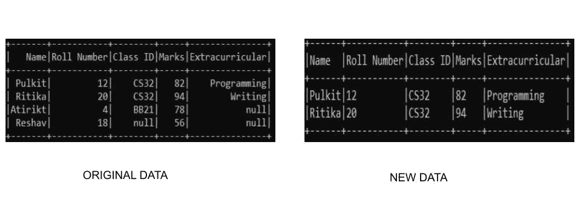
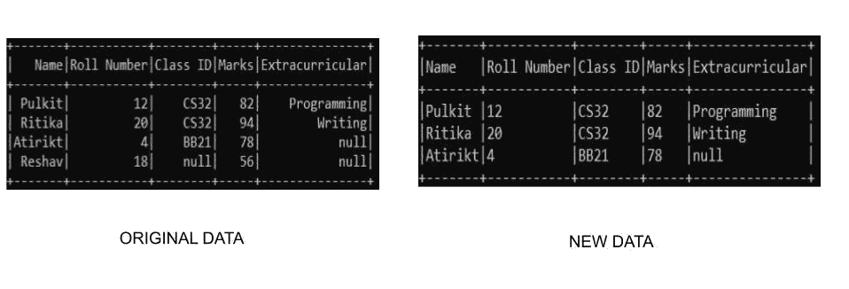
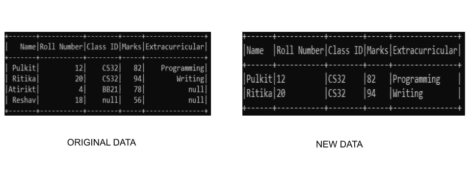

# PySpark 数据框–删除空值或无值的行

> 原文:[https://www . geesforgeks . org/py spark-data frame-drop-row-with-null-or-none-values/](https://www.geeksforgeeks.org/pyspark-dataframe-drop-rows-with-null-or-none-values/)

有时在处理数据帧中的数据时，我们可能会得到空值。为了清理数据集，我们必须移除数据框中的所有空值。因此，在本文中，我们将学习如何在 PySpark 数据框中删除空值或无值的行。

### **使用的功能**

在 pyspark 中， **drop()** 函数可用于从数据帧中移除空值。它采用以下参数:-

> **语法:**data frame _ name . na . drop(how =“any/all”，thresh=threshold_value，subset =[“column _ name _ 1”、“column _ name _ 2”])
> 
> *   **如何–**这需要两个值中的任何一个**“任意”**或**“全部”**。“任意”，如果任何列包含空值，则删除一行；如果所有列都包含空值，则删除一行。默认情况下，它设置为“任意”
> *   **thresh–**这将取整数值，并删除小于 thresh 且保存非空值的行。默认情况下，它设置为“无”。
> *   **子集–**该参数用于选择特定的列，以其中的空值为目标。默认情况下，它是“无”

**注意:** DataFrame 有一个变量 na，它代表类 DataFrameNaFunctions 的一个实例。因此，我们使用 DataFrame 上的 na 变量来使用 drop()函数。

我们正在使用 **findspark.init()** 函数指定我们到 spark 目录的路径，以便我们的程序能够在本地机器中找到 apache spark 的位置。如果您正在云上运行程序，请忽略这一行。假设我们在 c drive 中有一个名为 spark 的 spark 文件夹，那么这个函数看起来像:- **findspark.init('c:/spark ')。**在本地运行程序时，不指定路径有时可能会导致 py4j . protocol . py4j 错误。

### 例子

**示例 1:删除所有具有空值的行**

在本例中，我们将创建自己的自定义数据集，并使用 drop()函数来消除具有空值的行。我们将删除数据框中所有具有空值的行。因为我们正在创建自己的数据，所以我们需要指定我们的模式以及它，以便创建数据集。

## 蟒蛇 3

```
from pyspark.sql.types import StructType, StructField, StringType, IntegerType, FloatType
from pyspark.sql import SparkSession
import findspark

# spark location
# add the respective path to your spark
findspark.init('_path-to-spark_')

# Initialize our data
data2 = [("Pulkit", 12, "CS32", 82, "Programming"),
         ("Ritika", 20, "CS32", 94, "Writing"),
         ("Atirikt", 4, "BB21", 78, None),
         ("Reshav", 18, None, 56, None)
         ]

# Start spark session
spark = SparkSession.builder.appName("Student_Info").getOrCreate()

# Define schema
schema = StructType([
    StructField("Name", StringType(), True),
    StructField("Roll Number", IntegerType(), True),
    StructField("Class ID", StringType(), True),
    StructField("Marks", IntegerType(), True),
    StructField("Extracurricular", StringType(), True)
])

# create the dataframe
df = spark.createDataFrame(data=data2, schema=schema)

# drop None Values
df.na.drop(how="any").show(truncate=False)

# stop spark session
spark.stop()
```

**输出:**



**示例 2:删除特定列中所有空值的行**

我们还可以使用子集字段选择特定的列进行检查。在本例中，我们使用自定义数据集，并将删除仅在类标识列中具有空值的行的数据。因为我们正在创建自己的数据，所以我们需要指定我们的模式以及它，以便创建数据集。我们可以通过以下方式进行操作:-

## 蟒蛇 3

```
from pyspark.sql.types import StructType, StructField, StringType, IntegerType, FloatType
from pyspark.sql import SparkSession
import findspark

# spark location
# add the respective path to your spark
findspark.init('_path-to-spark_')

# Initialize our data
data2 = [("Pulkit", 12, "CS32", 82, "Programming"),
         ("Ritika", 20, "CS32", 94, "Writing"),
         ("Atirikt", 4, "BB21", 78, None),
         ("Reshav", 18, None, 56, None)
         ]

# Start spark session
spark = SparkSession.builder.appName("Student_Info").getOrCreate()

# Define schema
schema = StructType([
    StructField("Name", StringType(), True),
    StructField("Roll Number", IntegerType(), True),
    StructField("Class ID", StringType(), True),
    StructField("Marks", IntegerType(), True),
    StructField("Extracurricular", StringType(), True)
])

# create the dataframe
df = spark.createDataFrame(data=data2, schema=schema)

# drop None Values
df.na.drop(subset=["Class ID"]).show(truncate=False)

# stop spark session
spark.stop()
```

**输出:**



**示例 3:使用 dropna()方法删除所有具有空值的行**

第三种删除空值行的方法是使用 **dropna()** 函数。dropna()函数的执行方式与 na.drop()相似。这里我们不需要指定任何变量，因为它会检测空值并自行删除行。因为我们正在创建自己的数据，所以我们需要指定我们的模式以及它，以便创建数据集。我们可以通过以下方式在 pyspark 中使用它:-

## 蟒蛇 3

```
from pyspark.sql.types import StructType, StructField, StringType, IntegerType, FloatType
from pyspark.sql import SparkSession
import findspark

# spark location
# add the respective path to your spark
findspark.init('_path-to-spark_')

# Initialize our data
data2 = [("Pulkit", 12, "CS32", 82, "Programming"),
         ("Ritika", 20, "CS32", 94, "Writing"),
         ("Atirikt", 4, "BB21", 78, None),
         ("Reshav", 18, None, 56, None)
         ]

# Start spark session
spark = SparkSession.builder.appName("Student_Info").getOrCreate()

# Define schema
schema = StructType([
    StructField("Name", StringType(), True),
    StructField("Roll Number", IntegerType(), True),
    StructField("Class ID", StringType(), True),
    StructField("Marks", IntegerType(), True),
    StructField("Extracurricular", StringType(), True)
])

# create the dataframe
df = spark.createDataFrame(data=data2, schema=schema)

# drop None Values
df.dropna().show(truncate=False)

# stop spark session
spark.stop()
```

**输出:**

