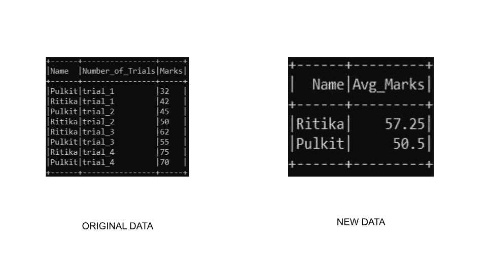

# PySpark–按降序对数据帧进行分组和排序

> 原文:[https://www . geesforgeks . org/py spark-group by-and-sort-data frame-按降序排列/](https://www.geeksforgeeks.org/pyspark-groupby-and-sort-dataframe-in-descending-order/)

在本文中，我们将讨论如何对 PySpark 数据帧进行分组，然后按降序对其进行排序。

### 使用的方法

*   **groupBy():**py spark 中的 group by()函数用于对数据帧上的相同数据进行分组，同时对分组数据执行聚合函数。

> **语法:** DataFrame.groupBy(*cols)
> 
> **参数:**
> 
> *   cols→C*colm*ns，我们需要通过它们来对数据进行分组

*   **sort():**sort()函数用于对一列或多列进行排序。默认情况下，它按升序排序。

> **语法:**排序(*列，升序=真)
> 
> **参数:**
> 
> *   列→需要执行排序的列。

*   PySpark DataFrame 还提供了对一列或多列进行排序的 **orderBy()** 函数。默认情况下，它按升序排序。

> **语法:** orderBy(*cols，升序=True)
> 
> **参数:**
> 
> *   列→需要执行排序的列。
> *   升序→布尔值表示排序将按升序进行

**示例 1:** 在本例中，我们将按名称和聚合标记对数据帧进行分组。我们将使用 sort()函数对表进行排序，其中我们将使用 col()函数和 desc()函数对列进行访问，以降序对其进行排序。

## 蟒蛇 3

```py
# import the required modules
from pyspark.sql import SparkSession
from pyspark.sql.functions import avg, col, desc

# Start spark session
spark = SparkSession.builder.appName("GeeksForGeeks").getOrCreate()

# Define sample data
simpleData = [("Pulkit","trial_1",32),
    ("Ritika","trial_1",42),
    ("Pulkit","trial_2",45),
    ("Ritika","trial_2",50),
    ("Ritika","trial_3",62),
    ("Pulkit","trial_3",55),
    ("Ritika","trial_4",75),
    ("Pulkit","trial_4",70)
  ]

# define the schema
schema = ["Name","Number_of_Trials","Marks"]

# create a dataframe
df = spark.createDataFrame(data=simpleData, schema = schema)

# group by name and aggrigate using
# average marks sort the column using
# col and desc() function
df.groupBy("Name") \
  .agg(avg("Marks").alias("Avg_Marks")) \
  .sort(col("Avg_Marks").desc()) \
  .show()

# stop spark session
spark.stop()
```

**输出:**



**示例 2:** 在本例中，我们将按名称和聚合标记对数据帧进行分组。我们将使用 sort()函数对表进行排序，其中我们将访问 desc()函数中的列，以降序对其进行排序。

## 蟒蛇 3

```py
# import the required modules
from pyspark.sql import SparkSession
from pyspark.sql.functions import avg, col, desc

# Start spark session
spark = SparkSession.builder.appName("Student_Info").getOrCreate()

# sample dataset
simpleData = [("Pulkit","trial_1",32),
    ("Ritika","trial_1",42),
    ("Pulkit","trial_2",45),
    ("Ritika","trial_2",50),
    ("Ritika","trial_3",62),
    ("Pulkit","trial_3",55),
    ("Ritika","trial_4",75),
    ("Pulkit","trial_4",70)
  ]

# define the schema to be used
schema = ["Name","Number_of_Trials","Marks"]

# create the dataframe
df = spark.createDataFrame(data=simpleData, schema = schema)

# perform groupby operation on name table
# aggrigate marks and give it a new name
# sort in descending order by avg_marks
df.groupBy("Name") \
  .agg(avg("Marks").alias("Avg_Marks")) \
  .sort(desc("Avg_Marks")) \
  .show()

# stop sparks session
spark.stop()
```

**输出:**


**示例 3:** 在本例中，我们将按名称和聚合标记对数据帧进行分组。我们将使用 orderBy()函数对表进行排序，在该函数中，我们将传递升序参数作为 False，以降序对数据进行排序。

## 蟒蛇 3

```py
# import required modules
from pyspark.sql import SparkSession
from pyspark.sql.functions import avg, col, desc

# Start spark session
spark = SparkSession.builder.appName("Student_Info").getOrCreate()

# sample dataset
simpleData = [("Pulkit","trial_1",32),
    ("Ritika","trial_1",42),
    ("Pulkit","trial_2",45),
    ("Ritika","trial_2",50),
    ("Ritika","trial_3",62),
    ("Pulkit","trial_3",55),
    ("Ritika","trial_4",75),
    ("Pulkit","trial_4",70)
  ]

# define the schema
schema = ["Name","Number_of_Trials","Marks"]

# create a dataframe
df = spark.createDataFrame(data=simpleData, schema = schema)

df.groupBy("Name")\
    .agg(avg("Marks").alias("Avg_Marks"))\
    .orderBy("Avg_Marks", ascending=False)\
    .show()

# stop sparks session
spark.stop()
```

**输出:**

