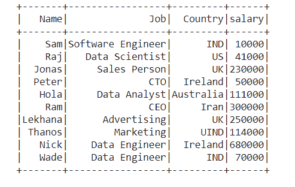
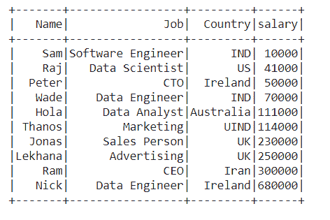
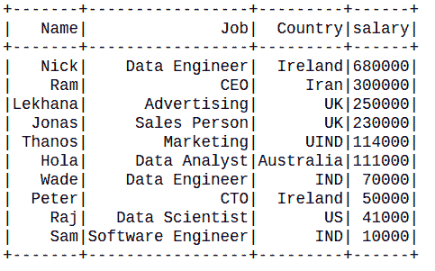

# PySpark–order by()和 sort()

> 原文:[https://www.geeksforgeeks.org/pyspark-orderby-and-sort/](https://www.geeksforgeeks.org/pyspark-orderby-and-sort/)

在本文中，我们将看到如何在 **PySpark 中按指定的列对数据框**进行排序。我们可以利用 **orderBy()** 和 **sort()** 对 PySpark 中的数据帧进行排序

### **OrderBy()方法:**

**OrderBy()** 函数 i 用于根据对象的索引值对其进行排序。

> **语法:** DataFrame.orderBy(cols，args)
> 
> **参数:**
> 
> *   列:要排序的列列表
> *   参数:指定列中列出的列的排序顺序(即升序或降序)
> 
> **返回类型:**返回按指定列排序的新的**数据框**。

**数据框创建:**创建一个名为**火花**的新**火花会话对象**，然后使用自定义数据创建一个**数据框**。

## 蟒蛇 3

```py
# Importing necessary libraries
from pyspark.sql import SparkSession
from pyspark.sql import functions as f

# Create a spark session
spark = SparkSession.builder.appName(
  'pyspark - example join').getOrCreate()

# Define data in  a dataframe
dataframe = [
    ("Sam", "Software Engineer", "IND", 10000),
    ("Raj", "Data Scientist", "US", 41000),
    ("Jonas", "Sales Person", "UK", 230000),
    ("Peter", "CTO", "Ireland", 50000),
    ("Hola", "Data Analyst", "Australia", 111000),
    ("Ram", "CEO", "Iran", 300000),
    ("Lekhana", "Advertising", "UK", 250000),
    ("Thanos", "Marketing", "UIND", 114000),
    ("Nick", "Data Engineer", "Ireland", 680000),
    ("Wade", "Data Engineer", "IND", 70000)
]

# Column names of dataframe
columns = ["Name", "Job", "Country", "salary"]

# Create the spark dataframe
df = spark.createDataFrame(data=dataframe, schema=columns)

# Printing the dataframe
df.show()
```

**输出:**



**示例 1:** 按单列对数据帧进行排序

**按照数据框中员工**【工资】**的**升序**排序**数据框。

## 蟒蛇 3

```py
# Order the data by ascending order 
# of Salary
df.orderBy(['Salary'], ascending = [True]).show()

# or
# df.orderBy(f.col("Salary").asc()).show()

# or
# df.orderBy(['Salary']).show()
```

**输出:**



**示例 2:按降序对数据帧进行排序。**

## 蟒蛇 3

```py
# Order the data by dec order 
# of Salary
df.orderBy(['Salary'], ascending = [False]).show()
```

**输出:**



**例 3:按多列排序数据帧**

按照数据框中员工“职务”的降序和“工资”的升序对数据框进行排序。当具有相同“职务”的两行之间发生冲突时，将通过按“薪金”的升序列出行来解决。

## 蟒蛇 3

```py
# Sort the dataframe by descending order
# of 'Job' and whenever there is conflict
# in 'Job', it'll be resolved by ordering 
# based on ascending order of 'Salary'
df.orderBy(f.col("Job").desc(),f.col("Salary").asc()).show()

# or
# df.orderBy(["Job", "Salary"],ascending = [False, True]).show()
```