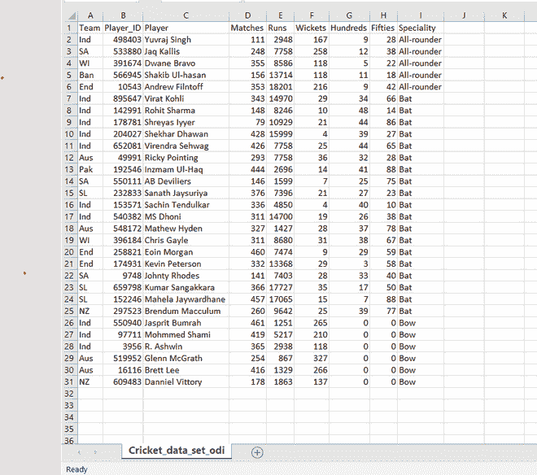
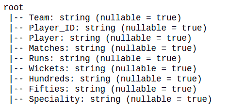
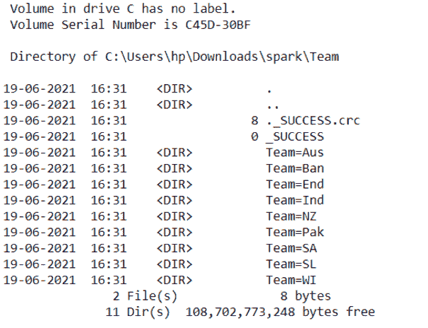
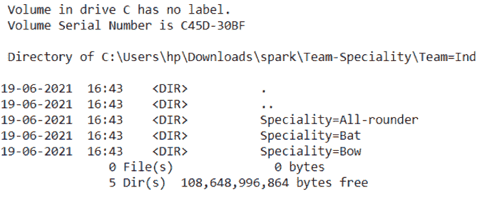
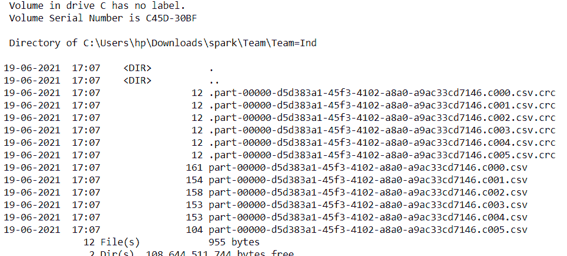

# PySpark partitionBy()方法

> 原文:[https://www.geeksforgeeks.org/pyspark-partitionby-method/](https://www.geeksforgeeks.org/pyspark-partitionby-method/)

PySpark partitionBy()用于在将数据帧写入磁盘/文件系统时根据列值进行分区。通过调用 partitionBy()将数据框写入磁盘时，Pyspark 会根据分区列拆分记录，并将每个分区数据存储到一个子目录中。

PySpark Partition 是一种基于一个或多个分区键将大型数据集拆分为较小数据集的方法。您也可以使用 partitionBy()在多个列上创建分区，只需将要分区的列作为参数传递给此方法。

```
Syntax: partitionBy(self, *cols)
```

让我们通过读取 CSV 文件来创建一个数据帧。你可以在这个链接[找到数据集 Cricket_data_set_odi.csv](https://www.kaggle.com/cricketdataset/cricket-data-set-odi?select=Cricket_data_set_odi.csv)



**创建数据框进行演示:**

## 蟒蛇 3

```
# importing module
import pyspark
from pyspark.sql import SparkSession
from pyspark.context import SparkContext

# creating sparksession and giving an app name
spark = SparkSession.builder.appName('sparkdf').getOrCreate()

# create DataFrame
df=spark.read.option(
  "header",True).csv("Cricket_data_set_odi.csv")

# Display schema
df.printSchema() 
```

**输出:**



### 带一列的 PySpark 分区 By():

从上面的数据框中，我们将使用团队作为我们下面示例的分区键:

## 蟒蛇 3

```
df.write.option("header", True) \
        .partitionBy("Team") \
        .mode("overwrite") \
        .csv("Team")

# change directory
cd Team

# On our DataFrame, we have a total
# of 9 different teams hence,
# it creates 9 directories as shown below.
# The name of the sub-directory would be
# the partition column and its value 
# (partition column=value).
ls
```

**输出:**



### 带多列的 PySpark 分区 By():

您也可以使用 PySpark partitionBy()在多个列上创建分区。只需将要分区的列作为参数传递给此方法。

从上面的数据框中，我们使用团队和专业作为下面示例的分区键。

## 蟒蛇 3

```
# From above DataFrame, we will be using 
# Team and Speciality as a partition key 
# for our examples below.
# partitionBy()
df.write.option("header", True) \
        .partitionBy("Team", "Speciality") \
        .mode("overwrite") \
        .csv("Team-Speciality")

# change directory
cd Team = Ind
cd Team-Speciality
cd Team = Ind
ls
```

**输出:**



### 控制每个分区文件的记录数:

如果要控制每个分区的记录数，请使用选项 maxRecordsPerFile。当您的数据有偏差时，这尤其有用(一些分区记录很少，而其他分区记录很多)。

## 蟒蛇 3

```
# partitionBy() control number of partitions
df.write.option("header",True) \
        .option("maxRecordsPerFile", 2) \
        .partitionBy("Team") \
        .mode("overwrite") \
        .csv("Team")
# change directory
cd Team
ls
```

**输出:**

