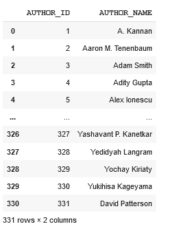
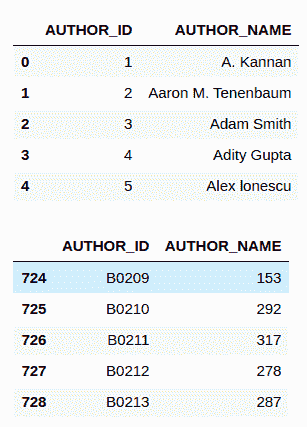
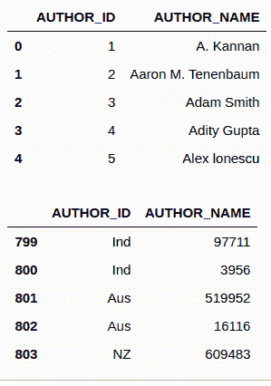

# PySpark–将 CSV 文件读入数据框

> 原文:[https://www . geesforgeks . org/py spark-read-CSV-file-into-data frame/](https://www.geeksforgeeks.org/pyspark-read-csv-file-into-dataframe/)

在本文中，我们将看到如何将 CSV 文件读入 Dataframe。为此，我们将使用 Pyspark 和 Python。

**使用的文件:**

*   [作者](https://media.geeksforgeeks.org/wp-content/cdn-uploads/20210909170847/authors.csv)
*   [书 _ 作者](https://media.geeksforgeeks.org/wp-content/cdn-uploads/20210909170859/book_author.csv)
*   [书籍](https://media.geeksforgeeks.org/wp-content/cdn-uploads/20210909170912/books.csv)

## 将 CSV 文件读入数据框

在这里，我们将使用 spark.read.csv 将单个 CSV 读入 dataframe，然后使用创建包含该数据的 dataframe。toPandas()。

## 蟒蛇 3

```py
from pyspark.sql import SparkSession

spark = SparkSession.builder.appName(
    'Read CSV File into DataFrame').getOrCreate()

authors = spark.read.csv('/content/authors.csv', sep=',',
                         inferSchema=True, header=True)

df = authors.toPandas()
df.head()
```

**输出:**



这里，我们传递了我们的 csv 文件 authors.csv。其次，我们传递了 CSV 文件中使用的分隔符。这里的分隔符是逗号**'，**。接下来，我们将**推断模式**属性设置为**真**，这将通过 CSV 文件并自动将其模式适配到 PySpark 数据帧中。然后，我们使用 **toPandas()** 方法将 PySpark 数据帧转换为熊猫数据帧 **df** 。

## 读取多个 CSV 文件

为了读取多个 CSV 文件，我们将把 CSV 文件的路径 python 列表作为**字符串**类型传递。

## 蟒蛇 3

```py
from pyspark.sql import SparkSession

spark = SparkSession.builder.appName('Read Multiple CSV Files').getOrCreate()

path = ['/content/authors.csv',
        '/content/book_author.csv']

files = spark.read.csv(path, sep=',',
                       inferSchema=True, header=True)

df1 = files.toPandas()
display(df1.head())
display(df1.tail())
```

**输出:**



这里，我们导入了当前工作目录中的 authors.csv 和 book_author.csv，它们的分隔符为逗号“**、**”，第一行为 Header。

## 读取目录中的所有 CSV 文件

要读取目录中的所有 CSV 文件，我们将使用 ***** 来考虑目录中的每个文件。

## 蟒蛇 3

```py
from pyspark.sql import SparkSession

spark = SparkSession.builder.appName(
    'Read All CSV Files in Directory').getOrCreate()

file2 = spark.read.csv('/content/*.csv', sep=',',
                    inferSchema=True, header=True)

df1 = file2.toPandas()
display(df1.head())
display(df1.tail())
```

**输出:**



这会读取当前工作目录中存在的所有 **CSV** 文件，分隔符为逗号“**、**，第一行为表头。