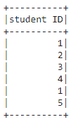
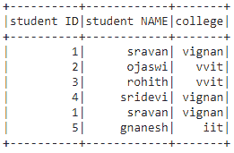
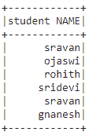
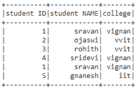

# PySpark–从数据框中选择列

> 原文:[https://www . geesforgeks . org/py spark-select-columns-from-data frame/](https://www.geeksforgeeks.org/pyspark-select-columns-from-dataframe/)

在本文中，我们将讨论如何从 pyspark 数据框中选择列。为此，我们将使用 select()函数。

> **语法:** dataframe.select(参数)。显示()
> 
> 哪里，
> 
> *   dataframe 是数据帧的名称
> *   参数是要选择的列
> *   show()函数用于显示选定的列

让我们创建一个示例数据帧

## 蟒蛇 3

```
# importing module
import pyspark

# importing sparksession from pyspark.sql module
from pyspark.sql import SparkSession

# creating sparksession and giving an app name
spark = SparkSession.builder.appName('sparkdf').getOrCreate()

# list  of students  data
data = [["1", "sravan", "vignan"], ["2", "ojaswi", "vvit"],
        ["3", "rohith", "vvit"], ["4", "sridevi", "vignan"],
        ["1", "sravan", "vignan"], ["5", "gnanesh", "iit"]]

# specify column names
columns = ['student ID', 'student NAME', 'college']

# creating a dataframe from the lists of data
dataframe = spark.createDataFrame(data, columns)

print("Actual data in dataframe")
# show dataframe
dataframe.show()
```

**输出:**


### 选择单列

使用列名，我们可以获得数据框中的整个列

> **语法:**data frame . select(“column _ name”)。显示()

## 蟒蛇 3

```
# select column with column name
dataframe.select('student ID').show()
```

**输出:**



### 选择多个列

使用多个列名，我们可以获得数据框中的整个列

> **语法:**data frame . select([“column _ name 1”、“column_name 2”、“column _ name n”])。显示()

## 蟒蛇 3

```
# select multiple column with column name
dataframe.select(['student ID', 'student NAME', 'college']).show()
```

**输出:**



### 使用列号选择

这里我们将根据列号选择列。这可以使用索引操作符来完成。我们可以将列号作为索引传递给 dataframe.columns[]。

> **语法:**data frame . select(data frame . columns[column _ number])。显示()

## 蟒蛇 3

```
# select column with column number 1
dataframe.select(dataframe.columns[1]).show()
```

**输出:**



基于列号访问多个列。在这里，我们将使用切片操作符来选择多个列。

> **语法**:data frame . select(data frame . columns[column _ start:column _ end])。显示()
> 
> 其中，column_start 是起始索引，column_end 是结束索引

## 蟒蛇 3

```
# select column with column number slice
# operator
dataframe.select(dataframe.columns[0:3]).show()
```

**输出:**

