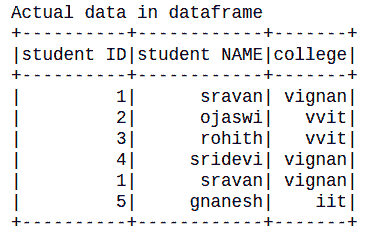

# PySpark–按多列对数据框进行排序

> 原文:[https://www . geesforgeks . org/py spark-sort-data frame-by-multi-columns/](https://www.geeksforgeeks.org/pyspark-sort-dataframe-by-multiple-columns/)

在本文中，我们将看到如何按多列对 PySpark 数据帧进行排序。

**可以这样做:**

*   使用排序()
*   使用 orderBy()

**创建用于演示的数据框:**

## 蟒蛇 3

```
# importing module
import pyspark

# importing sparksession from pyspark.sql module
from pyspark.sql import SparkSession

# creating sparksession and giving an app name
spark = SparkSession.builder.appName('sparkdf').getOrCreate()

# list  of students  data
data = [["1", "sravan", "vignan"],
        ["2", "ojaswi", "vvit"],
        ["3", "rohith", "vvit"],
        ["4", "sridevi", "vignan"],
        ["1", "sravan", "vignan"],
        ["5", "gnanesh", "iit"]]

# specify column names
columns = ['student ID', 'student NAME', 'college']

# creating a dataframe from the lists of data
dataframe = spark.createDataFrame(data, columns)

print("Actual data in dataframe")

# show dataframe
dataframe.show()
```

**输出:**



### **方法 1:使用 sort()函数**

该函数用于对列进行排序。

> **语法:** dataframe.sort(['column1 '，' column2 '，' column n']，升序=True)
> 
> **在哪里，**
> 
> *   dataframe 是使用 pyspark 从嵌套列表中创建的 dataframe 名称
> *   其中列是第 11 列
> *   升序=真指定数据帧按升序排列，升序=假指定数据帧按降序排列

**示例 1:** Python 代码，通过按升序传递多个列(2 列)的列表来对数据帧进行排序。

## 蟒蛇 3

```
# show dataframe by sorting the dataframe
# based on two columns in ascending order
dataframe.sort(['college','student ID'],
               ascending = True).show()
```