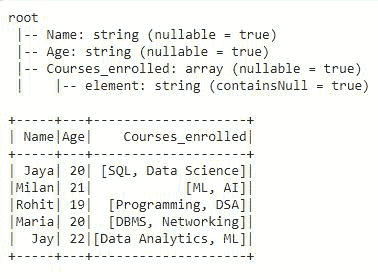
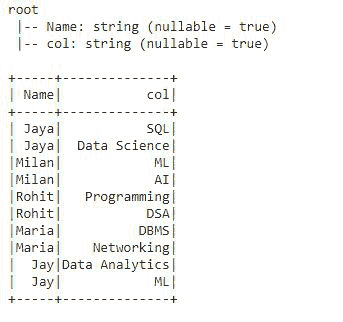
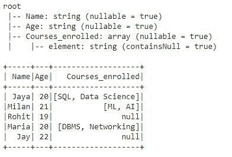
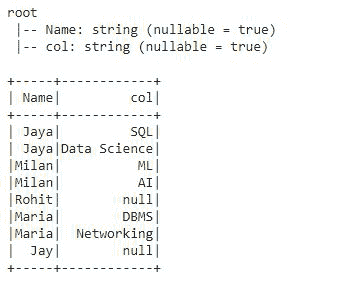
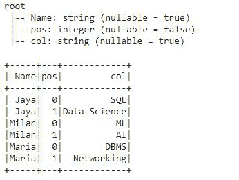
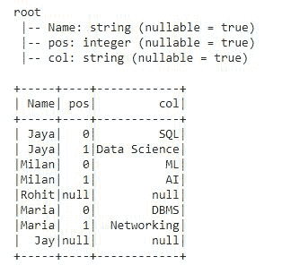

# Pyspark–将多个阵列列拆分成排

> 原文:[https://www . geesforgeks . org/pyspark-split-multi-array-columns-in-row/](https://www.geeksforgeeks.org/pyspark-split-multiple-array-columns-into-rows/)

假设我们有一个数据框，其中包含具有不同类型值的列，如字符串、整数等。，有时列数据也是数组格式。使用数组有时很困难，为了消除困难，我们希望将这些数组数据拆分成行。

要将多个数组列数据拆分为行，pyspark 提供了一个名为 **explode()** 的函数。使用 explode，我们将为数组中的每个元素获得一个新行。当一个数组传递给这个函数时，它会创建一个新的默认列，并且包含所有数组元素作为它的行，数组中的空值将被忽略。这是一个内置功能，可在 **pyspark.sql.functions 模块**中获得。

> **语法:**py spark . SQL . functions . explode(col)
> 
> **参数:**
> 
> *   **col** 是一个数组列名，我们想把它拆分成行。
> 
> **注意:**只需要一个位置参数，即一次只能拆分一列。

**示例:**使用 explode()拆分阵列列

在本例中，我们将创建一个包含三列的数据框，一列是包含学生姓名的“姓名”，另一列是包含学生年龄的“年龄”，最后一列和第三列“课程 _ 注册”包含这些学生注册的课程。前两列包含字符串类型的简单数据，但第三列包含数组格式的数据。我们将把包含数组格式数据的“课程注册”列拆分为行。

## 蟒蛇 3

```py
# importing pyspark
import pyspark

# importing sparksessio
from pyspark.sql import SparkSession

# importing all from pyspark.sql.functions 
# like Row, array, explode etc.
from pyspark.sql.functions import *

# creating a sparksession object and
# providing appName 
spark=SparkSession.builder.appName("sparkdf").getOrCreate()

# now creating dataframe
# creating the row data and giving array
# values for dataframe
data = [('Jaya', '20', ['SQL','Data Science']),
        ('Milan', '21', ['ML','AI']),
        ('Rohit', '19', ['Programming', 'DSA']),
        ('Maria', '20', ['DBMS', 'Networking']),
        ('Jay', '22', ['Data Analytics','ML'])]

# column names for dataframe
columns = ['Name', 'Age', 'Courses_enrolled']

# creating dataframe with createDataFrame()
df = spark.createDataFrame(data, columns)

# printing dataframe schema
df.printSchema()

# show dataframe
df.show()
```

**输出:**



在 dataframe 的模式中，我们可以看到前两列包含字符串类型的数据，第三列包含数组数据。现在，我们将使用 explode()将数组列拆分为行。

## 蟒蛇 3

```py
# using select function applying 
# explode on array column
df2 = df.select(df.Name,explode(df.Courses_enrolled))

# printing the schema of the df2
df2.printSchema()

# show df2
df2.show()
```

**输出:**



在这个输出中，我们可以看到数组列被拆分为行。explode()函数为 array col 创建了一个默认的 col 列，每个 array 元素都被转换成一行，并且该列的类型也被更改为 string，之前它的类型是 array，如上面的 df 输出中所述。

### 爆炸类型()

有三种方法可以分解数组列:

*   爆炸 _ 外部()
*   posexplode()
*   posexplode _ outer()

让我们用一个例子来理解它们。为此，我们将创建一个数据框，其中也包含一些空数组，并将使用不同类型的分解将数组列拆分为行。

## 蟒蛇 3

```py
# creating the row data and giving array 
# values for dataframe along with null values
data = [('Jaya', '20', ['SQL', 'Data Science']),
        ('Milan', '21', ['ML', 'AI']),
        ('Rohit', '19', None),
        ('Maria', '20', ['DBMS', 'Networking']),
        ('Jay', '22', None)]

# column names for dataframe
columns = ['Name', 'Age', 'Courses_enrolled']

# creating dataframe with createDataFrame()
df = spark.createDataFrame(data, columns)

# printing dataframe schema
df.printSchema()

# show dataframe
df.show()
```

**输出:**



**1。explode _ outer():**explode _ outer 函数为数组元素的每个元素将数组列拆分为一行，不管它是否包含空值。而简单分解()忽略列中的空值。

## 蟒蛇 3

```py
# now using select function applying
# explode_outer on array column
df4 = df.select(df.Name, explode_outer(df.Courses_enrolled))

# printing the schema of the df4
df4.printSchema()

# show df2
df4.show()
```

**输出:**



如上所述，explode_outer()不会忽略数组列的空值。显然，我们可以看到空值也显示为数据帧的行。

**2。posexplode():**posexplode()为数组中的每个元素将数组列拆分为行，并且还提供了元素在数组中的位置。它创建两列“pos”来携带数组元素的位置，创建“col”来携带特定的数组元素，并忽略空值。现在，我们将对数组列“课程注册”应用 posexplode()。

## 蟒蛇 3

```py
# using select function applying 
# explode on array column
df2 = df.select(df.Name, posexplode(df.Courses_enrolled))

# printing the schema of the df2
df2.printSchema()

# show df2
df2.show()
```

**输出:**



posexplode()将数组拆分为行，并提供数组元素的位置，在这个输出中，我们得到了“pos”列中数组元素的位置。它忽略了数组列中的空值。

**3。posexplode _ outer():**posexplode _ outer()为数组中的每个元素将数组列拆分为行，并且还提供了元素在数组中的位置。它创建两列“pos”来携带数组元素的位置，创建“col”来携带特定的数组元素，无论它是否也包含空值。这意味着 posexplode _ outer()具有 explode _ outer()和 posexplot()函数的功能。让我们看看这个例子:

现在，我们将在数组列“课程注册”上应用 posexplode_outer()。

## 蟒蛇 3

```py
# using select function applying 
# explode on array column
df2 = df.select(df.Name, posexplode_outer(df.Courses_enrolled))

# printing the schema of the df2
df2.printSchema()

# show df2
df2.show()
```

**输出:**



作为，posexplode_outer()提供了 explode_outer()和 posexplode()这两个爆炸函数的功能。在输出中，我们可以清楚地看到，我们已经获得了所有数组元素的行和位置值，包括“pos”和“col”列中的空值。