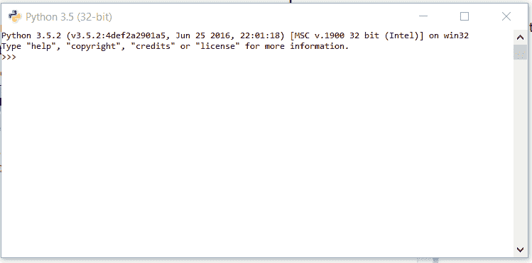
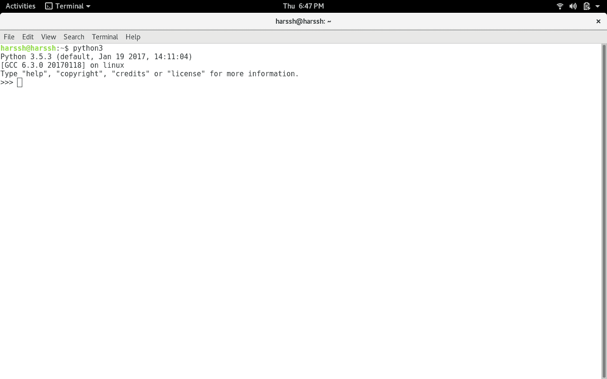

# Python 3 基础知识

> 原文:[https://www.geeksforgeeks.org/python-3-basics/](https://www.geeksforgeeks.org/python-3-basics/)

[Python](https://www.geeksforgeeks.org/python-tutorial-learn-python-3-with-examples/) 是吉多·范·罗苏姆在 90 年代初开发的，最新版本是 3.7.1，我们可以简单的称之为 Python3。Python 3.0 于 2008 年发布。并且是解释语言，即它没有被编译，解释器将逐行检查代码。这篇文章可以用来学习非常基础的 [Python 编程语言](https://www.geeksforgeeks.org/python-programming-language/)。

所以在继续之前..让我们做最受欢迎的“地狱世界”传统😛并因此将 Python 的语法与 C、C++、Java 进行比较(我之所以选择这 3 种语言，是因为它们是最著名、最常用的语言)。

```py
# Python code for "Hello World"
# nothing else to type...see how simple is the syntax.

print("Hello World")      
```

**注意:**请注意 Python 对于其作用域并不依赖于大括号({ })，而是对其作用域使用缩进。
现在继续下一步**让我们开始 Python 的基础知识**。我将在一些小部分中介绍基础知识。仔细阅读它们，相信我，你会很容易地学会 Python 的基础知识。

**[介绍和设置](https://www.geeksforgeeks.org/python-language-introduction/)**

1.  If you are on **Windows OS** download Python by [Clicking here](https://www.python.org/downloads/windows/) and now install from the setup and in the start menu type IDLE.IDLE, you can think it as an Python’s IDE to run the Python Scripts.

    它看起来会莫名其妙地这样:
    

2.  If you are on **Linux/Unix-like** just open the terminal and on 99% linux OS Python comes preinstalled with the OS.Just type ‘python3’ in terminal and you are ready to go.
    It will look like this :
    

    > “> > >”表示 python 外壳及其准备好接受 python 命令和代码的部分。

    **[变量和数据结构](https://www.geeksforgeeks.org/python-set-2-variables-expressions-conditions-and-functions/)**

    在像 C、C++和 Java 这样的其他编程语言中，您需要声明变量的类型，但是在 Python 中，您不需要这样做。只需输入变量，当给它赋值时，它会自动知道给定的值是 int、float、char 还是 String。

    ```py
    # Python program to declare variables
    myNumber = 3
    print(myNumber)

    myNumber2 = 4.5
    print(myNumber2)

    myNumber ="helloworld"
    print(myNumber)
    ```

    **输出:**

    ```py
    3
    4.5
    helloworld

    ```

    看，多简单，只要创建一个变量，给它赋值，然后用 print 函数打印就行了。Python 有 4 种内置数据结构，即[列表](https://www.geeksforgeeks.org/python-set-3-strings-lists-tuples-iterations/)、[字典](https://www.geeksforgeeks.org/python-set-4-dictionary-keywords-python/)、[元组](https://www.geeksforgeeks.org/python-set-3-strings-lists-tuples-iterations/)和集合。

    **List** 是 python 中最基础的数据结构。列表是一个可变的数据结构，即项目可以在列表创建后添加到列表中。就像你要去当地市场购物，列了一些商品的清单，然后你可以在清单上添加越来越多的商品。
    append()函数用于向列表中添加数据。

    ```py
    # Python program to illustrate a list 

    # creates a empty list
    nums = [] 

    # appending data in list
    nums.append(21)
    nums.append(40.5)
    nums.append("String")

    print(nums)
    ```

    **输出:**

    ```py
    [21, 40.5, String]
    ```

    **评论:**

    ```py
    # is used for single line comment in Python
    """ this is a comment """ is used for multi line comments
    ```

    **输入和输出**

    在这一节中，我们将学习如何从用户那里获取输入，从而操纵它或简单地显示它。input()函数用于接受用户的输入。

    ```py
    # Python program to illustrate
    # getting input from user
    name = input("Enter your name: ") 

    # user entered the name 'harssh'
    print("hello", name)
    ```

    **输出:**

    ```py
    hello harssh   
    ```

    ```py
    # Python3 program to get input from user

    # accepting integer from the user
    # the return type of input() function is string ,
    # so we need to convert the input to integer
    num1 = int(input("Enter num1: "))
    num2 = int(input("Enter num2: "))

    num3 = num1 * num2
    print("Product is: ", num3)
    ```

    **输出:**

    ```py
    Enter num1: 8 Enter num2: 6 ('Product is: ', 48)

    ```

    **选择**

    Python 中的选择是使用两个关键字“if”和“elif”以及 else (elseif)进行的

    ```py
    # Python program to illustrate
    # selection statement

    num1 = 34
    if(num1>12):
        print("Num1 is good")
    elif(num1>35):
        print("Num2 is not gooooo....")
    else:
        print("Num2 is great")
    ```

    **输出:**

    ```py
    Num1 is good
    ```

    **功能**

    你可以把函数想象成一堆代码，用来完成整个 Python 脚本中的特定任务。Python 使用关键字“def”来定义函数。
    **语法:**

    ```py
    def function-name(arguments):
                #function body
    ```

    ```py
    # Python program to illustrate
    # functions
    def hello():
        print("hello")
        print("hello again")
    hello()

    # calling function
    hello()               
    ```

    **输出:**

    ```py
    hello
    hello again
    hello
    hello again

    ```

    现在，正如我们所知，任何程序都是从一个‘main’函数开始的……让我们像许多其他编程语言一样创建一个 main 函数。

    ```py
    # Python program to illustrate 
    # function with main
    def getInteger():
        result = int(input("Enter integer: "))
        return result

    def Main():
        print("Started")

        # calling the getInteger function and 
        # storing its returned value in the output variable
        output = getInteger()     
        print(output)

    # now we are required to tell Python 
    # for 'Main' function existence
    if __name__=="__main__":
        Main()
    ```

    **输出:**

    ```py
    Started
    Enter integer: 5

    ```

    **[【迭代(循环)](https://www.geeksforgeeks.org/loops-and-loop-control-statements-continue-break-and-pass-in-python/)**

    顾名思义，它叫一遍又一遍地重复事情。我们将在这里使用最流行的“for”循环。

    ```py
    # Python program to illustrate
    # a simple for loop

    for step in range(5):    
        print(step)
    ```

    **输出:**

    ```py
    0
    1
    2
    3
    4

    ```

    **[模块](https://www.geeksforgeeks.org/python/#Modules in Python)**

    Python 有一个非常丰富的模块库，它有几个函数来完成许多任务。你可以通过[点击这里](https://www.geeksforgeeks.org/python/#Modules in Python)
    来阅读更多关于 python 标准库的信息。“导入”关键字用于将特定模块导入到你的 Python 代码中。例如，考虑以下程序。

    ```py
    # Python program to illustrate
    # math module
    import math

    def Main():
        num = -85

        # fabs is used to get the absolute 
        # value of a decimal
        num = math.fabs(num) 
        print(num)

    if __name__=="__main__":
        Main()
    ```

    **输出:**

    ```py
    85.0
    ```

    这些是 Python 编程语言的一些最基本的内容，我将在接下来的文章中涵盖中级和高级 Python 主题。

    本文由 **Harsh Wardhan Chaudhary** 供稿。如果你喜欢 GeeksforGeeks 并想投稿，你也可以使用[contribute.geeksforgeeks.org](http://www.contribute.geeksforgeeks.org)写一篇文章或者把你的文章邮寄到 contribute@geeksforgeeks.org。看到你的文章出现在极客博客主页上，帮助其他极客。您的文章在发布前将首先由极客团队的极客进行审查。

    如果你发现任何不正确的地方，或者你想分享更多关于上面讨论的话题的信息，请写评论。