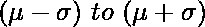
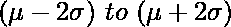
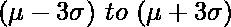
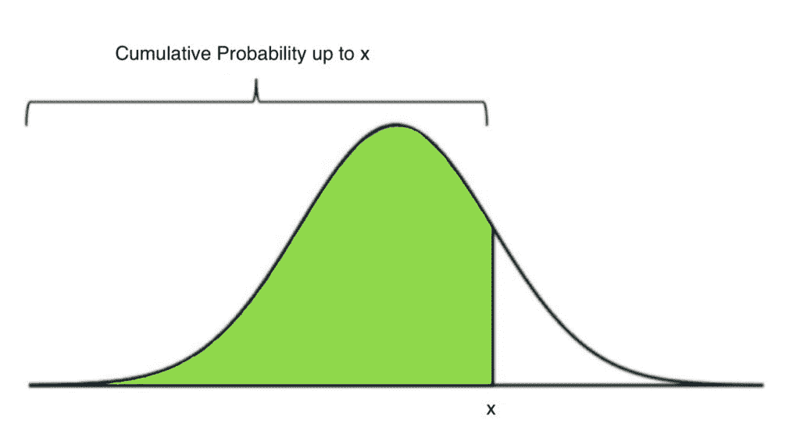

# Python–统计中的 68-95-99.7 规则

> 原文:[https://www . geesforgeks . org/python-68-95-99-7-统计中的规则/](https://www.geeksforgeeks.org/python-68-95-99-7-rule-in-statistics/)

**经验法则**(也称为 **68-95-99.7 法则**或**三适马法则**)指出，对于任何[正态分布](https://www.geeksforgeeks.org/mathematics-probability-distributions-set-3-normal-distribution/)，我们有以下观察结果:

*   68%的观测值位于平均值附近的 1 个标准偏差之间:
*   95%的观测值位于平均值附近的 2 个标准偏差之间:
*   99.7%的观测值位于平均值附近的 3 个标准偏差之间:

下图是标准正态分布图，平均值= **0** ，标准差= **1** ，说明了经验法则。

[](https://media.geeksforgeeks.org/wp-content/uploads/20200624134047/chart11.jpg)

我们可以使用 Python 的 **SciPy** 模块提供的函数来验证这一点。

我们可以使用 **scipy.stats.norm** 模块的 **cdf()** 功能来计算累积概率(分布曲线下的面积)。

> **语法:** cdf(x，均值，SD)
> **参数:**
> 
> *   **x :** 要计算累积概率的值
> *   **平均值:**分布的平均值
> *   **标准差:**分布的标准差

[](https://media.geeksforgeeks.org/wp-content/uploads/20200624134228/chart2-copy.jpg)

下面是实现:

```
import matplotlib.pyplot as plt
import numpy as np
from scipy.stats import norm

# setting the values of
# mean and S.D.
mean = 0
SD = 1

# value of cdf between one, two
# and three S.D. around the mean
one_sd = norm.cdf(SD, mean, SD) - norm.cdf(-SD, mean, SD)
two_sd = norm.cdf(2 * SD, mean, SD) - norm.cdf(-2 * SD, mean, SD)
three_sd = norm.cdf(3 * SD, mean, SD) - norm.cdf(-3 * SD, mean, SD)

# printing the value of fractions
# within each band
print("Fraction of values within one SD =", one_sd)
print("Fraction of values within two SD =", two_sd)
print("Fraction of values within three SD =", three_sd)
```

**输出:**

```
Fraction of values within one SD = 0.6826894921370859
Fraction of values within two SD = 0.9544997361036416
Fraction of values within three SD = 0.9973002039367398

```

因此，我们看到数值的分数几乎等于 **0.65** 、 **0.95** 和 **0.997** 。从而验证了经验法则。