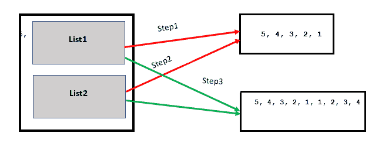
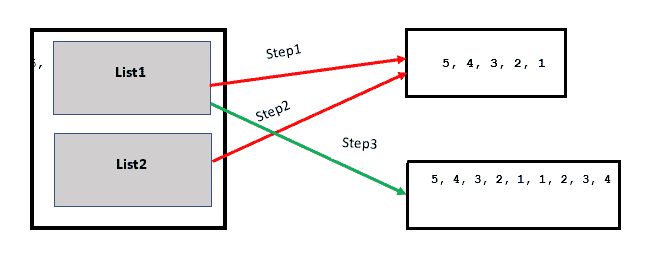

# Python | a += b 不总是 a = a + b

> 原文:[https://www . geesforgeks . org/python-a-b-不总是-a-a-b/](https://www.geeksforgeeks.org/python-a-b-is-not-always-a-a-b/)

在 python 中，a += b 的行为方式并不总是与 a = a + b 相同，相同的操作数在不同的条件下可能会给出不同的结果。但是要理解它们为什么表现出不同的行为，你必须深入研究变量的工作原理。

所以首先，你需要知道幕后发生了什么。

**创建新变量:**

## 蟒蛇 3

```
a = 10
print(" id of a : ", id(10) ," Value : ", a  )
```

**输出:**

```
id of a :  11094592  Value :  10
```

在上面的例子中，值 10 被存储在内存中，它的引用被赋给。

**修改变量:**

## 蟒蛇 3

```
a = 10  # Assigning value to variable creats new object
print(" id of a : ", id(a) ," Value : ", a  )

a = a + 10 # Modifying value of variable creats new object
print(" id of a : ", id(a) ," Value : ", a  )

a += 10 # Modifying value of variable creats new object
print(" id of a : ", id(a) ," Value : ", a  )
```

**输出:**

```
id of a :  11094592  Value :  10
id of a :  11094912  Value :  20
id of a :  11095232  Value :  30
```

每当我们创建或修改 int、float、char、string 时，它们都会创建新的对象，并将新创建的引用分配给各自的变量。

但是在列表中没有看到相同的行为

## 蟒蛇 3

```
a = [0, 1] # stores this array in memory and assign its reference to a
print("id of a: ",id(a) , "Value : ", a )

a = a + [2, 3] # this will also behave same store data in memory and assign ref. to variable
print("id of a: ",id(a) , "Value : ", a )

a += [4, 5]
print("id of a: ",id(a) , "Value : ", a )

#But now this will now create new ref. instead this will modify the current object so
# all the other variable pointing to a will also gets changes
```

**输出:**

```
id of a:  140266311673864 Value :  [0, 1]
id of a:  140266311673608 Value :  [0, 1, 2, 3]
id of a:  140266311673608 Value :  [0, 1, 2, 3, 4, 5]  
```

**此时你可以看到 a = a + b 与 a += b 有些时候不同的原因了。**

考虑以下列表操作示例:
**示例 1:**

## 蟒蛇 3

```
list1 = [5, 4, 3, 2, 1]
list2 = list1
list1 += [1, 2, 3, 4] # modifying value in current reference

print(list1)
print(list2) # as on line 4 it modify the value without creating new object
             # variable list2 which is pointing to list1 gets changes
```

**输出:**

```
[5, 4, 3, 2, 1, 1, 2, 3, 4]
[5, 4, 3, 2, 1, 1, 2, 3, 4]
```



**例 2**

## 蟒蛇 3

```
list1 = [5, 4, 3, 2, 1]
list2 = list1
list1 = list1 + [1, 2, 3, 4]

# Contents of list1 are same as above
# program, but contents of list2 are
# different.
print(list1)
print(list2)
```

**输出:**

```
[5, 4, 3, 2, 1, 1, 2, 3, 4]
[5, 4, 3, 2, 1]
```



*   表达式 **list1 += [1，2，3，4]** 就地修改列表，这意味着它扩展了列表，使得“list1”和“list2”仍然具有对同一列表的引用。
*   表达式 **list1 = list1 + [1，2，3，4]** 创建一个新列表，并将“list1”引用更改为新列表，“list2”仍然引用旧列表。