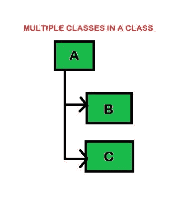
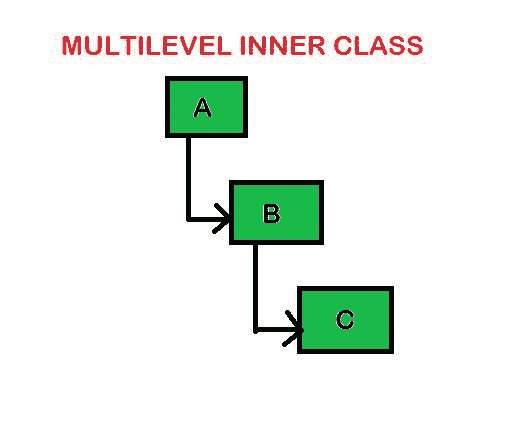

# Python–访问父类属性

> 原文:[https://www . geesforgeks . org/python-access-parent-class-attribute/](https://www.geeksforgeeks.org/python-access-parent-class-attribute/)

类是用户定义的蓝图或原型，从中创建对象。类提供了一种将数据和功能捆绑在一起的方法。创建一个新类会创建一个新类型的对象，从而允许创建该类型的新实例。每个类实例都可以附加属性来维护其状态。类实例也可以有方法(由其类定义)来修改其状态。

**示例:**

```py
# Python program to demonstrate
# classes and objects

# Creating a class 
class Student:

    # Class Variable
    stream = 'COE'

    def __init__(self, name, roll_no):

        # Instance Variable
        self.name = name 
        self.roll_no = roll_no 

# Objects of Student class 
a = Student('SHIVAM', 3425) 
b = Student('SACHIN', 3624)

print(a.stream)
print(b.stream)
print(a.name)
print(b.name)
print(a.roll_no) 
print(b.roll_no)

# Class variables can be 
# accessed using class 
# name also 
print(Student.stream)
```

**输出:**

```py
COE
COE
SHIVAM
SACHIN
3425
3624
COE

```

**注意:**更多信息请参考 [Python 类和对象](https://www.geeksforgeeks.org/python-classes-and-objects/)。

#### 访问父类函数

当一个类从另一个类继承时，它继承了另一个类的属性和方法。从另一个类继承的类称为子类，子类继承的类称为父类。但是你有没有想过如何访问父类的方法？这真的很简单，你只需要在子类的构造函数中调用父类的构造函数，然后子类的对象就可以访问父类的方法和属性。

**示例:**

```py
# Python code to demonstrate 
# how parent constructors are called. 

# parent class 
class Person( object ):     

        # __init__ is known as the constructor          
        def __init__(self, name, idnumber):    
                self.name = name 
                self.idnumber = idnumber 

        def display(self): 
                print(self.name) 
                print(self.idnumber) 

# child class 
class Employee( Person ):            
        def __init__(self, name, idnumber, salary): 
                self.salary = salary 

                # invoking the constructor of 
                # the parent class  
                Person.__init__(self, name, idnumber)  

        def show(self):
            print(self.salary)

# creation of an object
# variable or an instance 
a = Employee('Rahul', 886012, 30000000)     

# calling a function of the
# class Person using Employee's
# class instance 
a.display()
a.show() 
```

**输出:**

```py
Rahul
886012
30000000

```

**注意:**更多信息请参考 Python 中的[继承](https://www.geeksforgeeks.org/inheritance-in-python/)。

#### 从内部类访问父类方法

内部类或嵌套类是在另一个类的主体中定义的。如果使用类创建对象，则可以使用根类中的对象。一个类可以有一个或多个内部类。

**内部类的类型:**

*   多重内部类
*   多级内部类

**多个内部类:**包含多个内部类的类。



**示例:**

```py
class Electronics:
    def __init__(self):
        print('SINGLA ELECTRONICS')
        self.laptop=self.Laptop()
        self.mobile=self.Mobile()

    # Inner Class 1
    class Laptop:
        def operation(self):
            print('DELL Inspiron 15')

    # Inner Class 2
    class Mobile:
        def operation(self):
            print('Redmi Note 5')

# Driver Code
ele = Electronics()
ele.laptop.operation()
ele.mobile.operation()
```

**输出:**

```py
SINGLA ELECTRONICS
DELL Inspiron 15
Redmi Note 5

```

**多级内部类:**在多级内部类中，内部类包含另一个类，它是前一个类的内部类。



**示例:**

```py
class Vehicle:

    def __init__(self):

        # instantiating the 'Inner' class
        self.inner = self.Car()

        # instantiating the multilevel
        # 'InnerInner' class
        self.innerinner = self.inner.Maruti()

    def show_classes(self):
        print("This is in Outer class that is Vehicle")

    # inner class
    class Car:
        # First Inner Class

        def __init__(self):

            # instantiating the 
            # 'InnerInner' class
            self.innerinner = self.Maruti()

        def show_classes(self):
            print("This is in Inner class that is Car")

        # multilevel inner class
        class Maruti:

            def inner_display(self, msg):
                print("This is in multilevel InnerInner\
                      class that is Maruti")
                print(msg)

# Driver Code
outer = Vehicle()
outer.show_classes()
inner = outer.Car()
inner.show_classes()
innerinner = inner.Maruti()

# Calling the method inner_display
innerinner.inner_display("Just Print It!")
```

**输出:**

```py
This is in Outer class that is Vehicle
This is in Inner class that is Car
This is in multilevel InnerInner class that is Maruti
Just Print It!

```