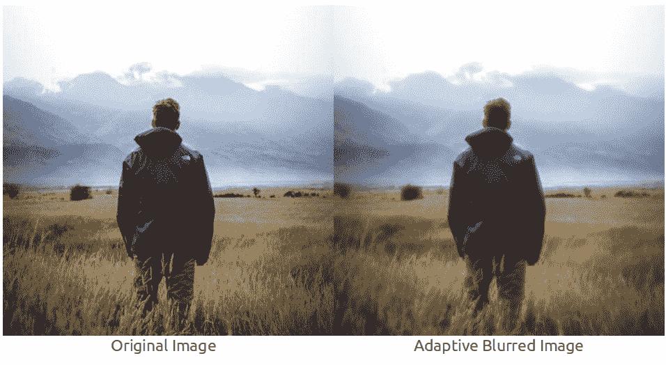
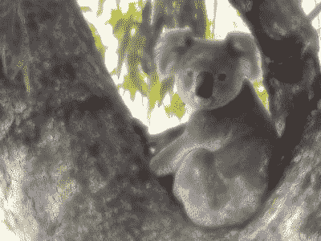

# Python – Adaptive Blur in Wand

> 原文：[https://www.geeksforgeeks.org/python-adaptive-blur-in-wand/](https://www.geeksforgeeks.org/python-adaptive-blur-in-wand/)

**Adaptive Blur** is a kind of blur. The only difference is that blur intensity around the detectable edges in image is less while, it is greater on areas without edges. Adaptive Blur can be done using **adaptive_blur** function. 



> **Syntax :** 
>  
> 
> ## Python3
> 
> ```py
> wand.image.adaptive_blur(radius="radius_value",
>                            sigma="sigma_value",
>             channel = "optional_channel_value")
>  
> # radius should always be greater than sigma(standard deviation)
> ```
> 
> **Parameters :** 
> 
> <figure class="table">
> 
> | Parameter | Input Type | Description |
> | --- | --- | --- |
> | radius | numbers.real | the radius of the, in pixels, not counting the center pixel. Default is 0.0. |
> | sigma | numbers.real | the standard deviation of the, in pixels. Default value is 0.0. |
> | channel | basestring | Optional color channel to apply blur. |
> 
> </figure>

**Example #1:** 


## Python3

```py
# import Image from wand.image module
from wand.image import Image

# read file using Image function
with Image(filename ="gfg.png") as img:
    # perform adaptive blur effect using adaptive_blur() function
    img.adaptive_blur(radius = 8, sigma = 4)
    # save final image
    img.save(filename ="adblur_gfg.png")
```

**Output:** 


**Example #2:** 


## Python3

```py
# import Image from wand.image module
from wand.image import Image

# read file using Image function
with Image(filename ="koala.jpeg") as img:

    # perform adaptive blur effect using adaptive_blur() function
    img.blur(radius = 8, sigma = 3)

    # save final image
    img.save(filename ="adblur_koala.jpeg")
```

**Output:** 

