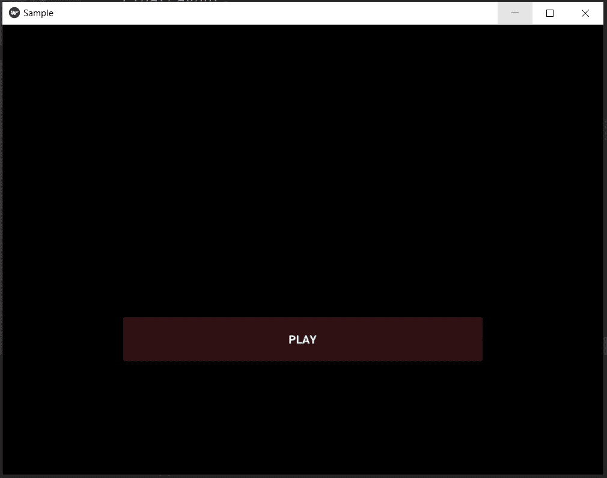

# Python–在 kivy 中添加音频文件

> 原文:[https://www . geesforgeks . org/python-add-audio-files-in-kivy/](https://www.geeksforgeeks.org/python-add-audio-files-in-kivy/)

Kivy 是 Python 中独立于平台的 GUI 工具。Kivy 是一个用 Python 构建跨平台应用的工具，可以在安卓、IOS、Linux、Windows 上运行。

**音频小部件:**
该模块用于在 kivy 中加载音频文件。

```
 from kivy.core.audio import SoundLoader 
```

下面是如何在 kivy 中导入音频文件的代码。

**注意:**只能用“”导入音频文件。wav 格式。

```
from kivy.app import App
from kivy.uix.boxlayout import BoxLayout
from kivy.core.audio import SoundLoader
from kivy.uix.screenmanager import ScreenManager, Screen, FadeTransition

class Tester(BoxLayout):
    def __init__(self, **kwargs):
        super().__init__(**kwargs)

    def play_sound(self):
        sound = SoundLoader.load('sampleaudio.wav')
        if sound:
            sound.play()

class SampleApp(App):

    def build(self):
        return Tester()

myApp = SampleApp()
myApp.run()
```

**。上述代码的 kv 文件[Sample.kv]:**

```
<Tester>:
    orientation: "vertical"
    spacing: 50
    space_x: self.size[0]/3
    canvas.before:
        Color:
            rgba: (0, 0, 0, 0)
        Rectangle:
            size: self.size
            pos: self.pos

    FloatLayout:
        orientation:'vertical'
        padding:100
        spacing:30
        Button:
            size_hint:0.6, 0.1
            pos_hint :{'center_x':0.5, 'center_y':0.3}
            text:'PLAY'
            bold:True
            background_color: (1, .36, .4, .55)
            on_release: root.play_sound()
```

**输出:**

下面代码的输出如下图，点击播放按钮会播放一个音频文件‘sample audio . wav’。