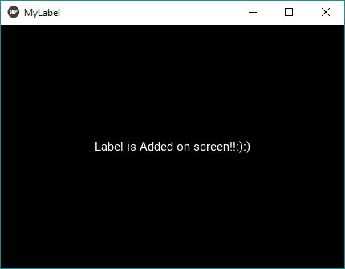
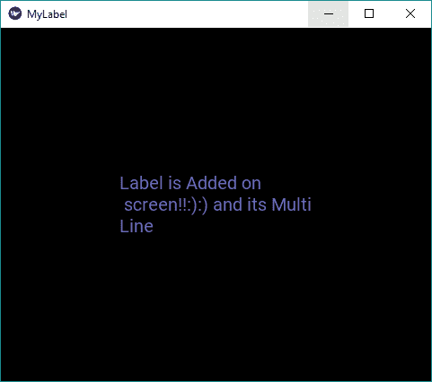
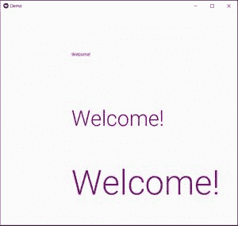

# Python |给 kivy 窗口添加标签

> 原文:[https://www . geesforgeks . org/python-add-label-to-a-kivy-window/](https://www.geeksforgeeks.org/python-add-label-to-a-kivy-window/)

Kivy 是 Python 中独立于平台的 GUI 工具。因为它可以在安卓、iOS、Linux 和视窗等平台上运行。它基本上是用来开发安卓应用的，但并不意味着它不能在桌面应用上使用。
**标签小部件–**
标签小部件用于渲染文本。它支持 ASCII 和 unicode 字符串。标签是我们想要添加到窗口中的文本，给按钮，等等。在标签上，我们也可以应用样式，即增加文本、大小、颜色等。
让我们看看如何给[窗口添加标签。](https://www.geeksforgeeks.org/kivy-tutorial/) 

> [Kivy 教程–通过示例学习 Kivy](https://www.geeksforgeeks.org/kivy-tutorial/)。

**如何添加标签？**

```
1) import kivy
2) import kivy App
3) import label
4) set minimum version (optional)
5) Extend the App class
6) overwrite the build function
7) Add and return label
8) Run the instance of class
```

下面是代码:

## 蟒蛇 3

```
# import kivy module
import kivy

# this restricts the kivy version i.e
# below this kivy version you cannot use the app or software
kivy.require("1.9.1")

# base Class of your App inherits from the App class.
# app:always refers to the instance of your application
from kivy.app import App

# if you not import label and use it it through error
from kivy.uix.label import Label

# defining the App class
class MyLabelApp(App):
    def build(self):
        # label display the text on screen
        lbl = Label(text ="Label is Added on screen !!:):)")
        return lbl

# creating the object
label = MyLabelApp()
# run the window
label.run()
```

**输出:**



**如何在标签中做造型？**T3】

## 蟒蛇 3

```
# change only line 19 else all will same.

# text colour
l2 = Label(text ="Label is Added on \n screen !!:):)
            and its Multi\nLine", font_size ='20sp',
            color =[0.41, 0.42, 0.74, 1])
```

**输出:**



**如何标注文字？**
您可以使用文本标记来更改文本的样式。语法类似于上面的语法，但是还有一些东西。

## 蟒蛇 3

```
# markup text with different colour
l2 = Label(text ="[color = ff3333][b]'Label'[/b] is Added [/color]\n
                  [color = 3333ff]Screen !!:):):):)[/color]",
                  font_size ='20sp', markup = True)
```

**输出:**


**我们可以使用的更多标记标签–**

> [b][/b] **- >** 激活粗体文本
> [i][/i] **- >** 激活斜体文本
> [u][/u] **- >** 下划线文本
> [s][/s] **- >** 删除线通过文本
> [font =][/font]**->**更改字体
> 【size =】引用中的引用+边界框将出现在标签中。参考文献
> 【锚点=】**->**在文本中放置一个锚点。您可以使用标签获取您的锚点在文本中的位置。锚点
> [sub][/sub] **- >** 将文本显示在相对于其前面文本的下标位置。
> [sup][/sup] **- >** 将文本显示在相对于其前文本的上标位置。

参考资料:【https://kivy . org/doc/stability/API-kivy . uix . label . html】

**标签使用 KivyMD**
KivyMD 是 Kivy 框架的扩展。KivyMD 是一个材料设计小部件的集合，用于制作移动应用程序的图形用户界面框架 Kivy。

首先，我们将从 kivyMD.uix 库中导入 MDlabel

MDLabel 有以下参数-

*   文本-我们要放在标签上的文本
*   hali gn-我们想要放置标签的位置。
*   主题-文本颜色的主题，如自定义、主要、次要、提示或错误
*   如果主题是自定义的，我们可以给一个 RGB 元组分配文本颜色。
*   类似字体样式的标题

以下是使用 MDLabel 的示例

## 蟒蛇 3

```
from kivymd.app import MDApp
from kivymd.uix.label import MDLabel
from kivymd.uix.screen import Screen

class Demo(MDApp):

    def build(self):
        #defining screen
        screen = Screen()

        #defining 1st label
        l=MDLabel(text="Welcome!",pos_hint={'center_x':0.8,
                                            'center_y':0.8},
                  theme_text_color="Custom",
                  text_color=(0.5,0,0.5,1),
                  font_style='Caption')

        #defining 2nd label
        l1 = MDLabel(text="Welcome!", pos_hint={'center_x':0.8,
                                                'center_y':0.5},
                     theme_text_color="Custom",
                     text_color=(0.5, 0, 0.5, 1),
                     font_style='H2')

        #defining 3rd label
        l2 = MDLabel(text="Welcome!", pos_hint={'center_x':0.8,
                                                'center_y':0.2},
                     theme_text_color="Custom",
                     text_color=(0.5, 0, 0.5, 1),
                      font_style='H1')

        screen.add_widget(l)

        screen.add_widget(l1)
        screen.add_widget(l2)
        return screen

if __name__ == "__main__":
    Demo().run()
```

