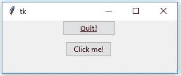

# Python |给 tkinter 按钮添加样式

> 原文:[https://www . geesforgeks . org/python-add-style-to-tkinter-button/](https://www.geeksforgeeks.org/python-add-style-to-tkinter-button/)

Tkinter 是一个 Python 标准库，用于创建 GUI(图形用户界面)应用程序。它是 Python 最常用的包之一。Tkinter 在 Tk 主题小部件的帮助下，支持传统和现代图形支持。Tkinter 的所有小部件在 **tkinter.ttk** 中都有。
在 tkinter.ttk 按钮中添加样式有点令人毛骨悚然，因为它不支持直接实现。在 ttk 中添加样式。按钮我们必须首先创建一个样式类的对象，它在 tkinter.ttk.
中可用

我们可以创建 ttk。通过使用以下步骤按钮:

```py
btn = ttk.Button(master, option = value, ...)
```

**ttk。按钮选项-**

> **命令:**按下按钮时要调用的功能。
> **文本:**出现在按钮上的文本。
> **图像:**要出现在按钮上的图像。
> **样式:**渲染此按钮时使用的样式。

在 ttk 上添加样式。按钮我们不能直接在选项中传递值。首先，我们必须创建一个样式对象，它可以创建如下:

```py
 style = ttk.Style()
```

下面的代码将只为选定的按钮添加样式，也就是说，只有那些按钮会发生变化，我们将传递样式选项。
**代码#1:**

## 蟒蛇 3

```py
# Import Required Module
from tkinter import *
from tkinter.ttk import *

# Create Object
root = Tk()

# Set geometry (widthxheight)
root.geometry('100x100')

# This will create style object
style = Style()

# This will be adding style, and
# naming that style variable as
# W.Tbutton (TButton is used for ttk.Button).
style.configure('W.TButton', font =
               ('calibri', 10, 'bold', 'underline'),
                foreground = 'red')

# Style will be reflected only on
# this button because we are providing
# style only on this Button.
''' Button 1'''
btn1 = Button(root, text = 'Quit !',
                style = 'W.TButton',
             command = root.destroy)
btn1.grid(row = 0, column = 3, padx = 100)

''' Button 2'''

btn2 = Button(root, text = 'Click me !', command = None)
btn2.grid(row = 1, column = 3, pady = 10, padx = 100)

# Execute Tkinter
root.mainloop()
```

**输出:**



只有一个按钮将得到样式，因为在上面的代码中，我们只在一个按钮中提供样式。

**代码#2** 在所有可用按钮上应用样式

## 蟒蛇 3

```py
# Import Required Module
from tkinter import *
from tkinter.ttk import *

# Create Root Object
root = Tk()

# Set Geometry(widthxheight)
root.geometry('100x100')

# Create style Object
style = Style()

# Will add style to every available button
# even though we are not passing style
# to every button widget.
style.configure('TButton', font =
               ('calibri', 10, 'bold', 'underline'),
                foreground = 'red')
# button 1
btn1 = Button(root, text = 'Quit !',
                  style = 'TButton',
             command = root.destroy)

btn1.grid(row = 0, column = 3, padx = 100)

# button 2
btn2 = Button(root, text = 'Click me !', command = None)
btn2.grid(row = 1, column = 3, pady = 10, padx = 100)

# Execute Tkinter
root.mainloop()
```