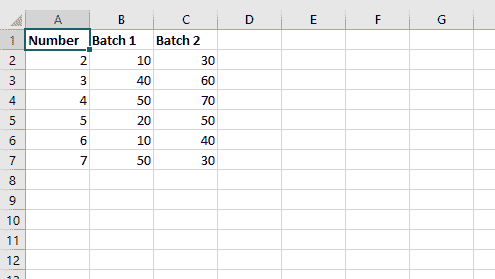
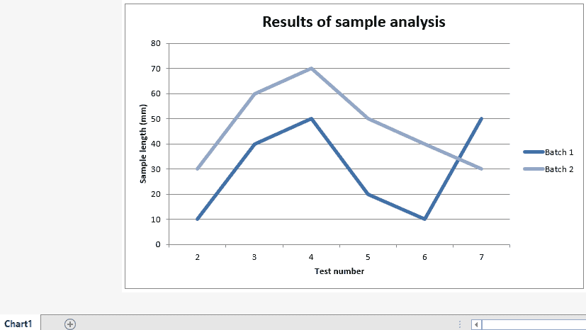

# Python |使用 XlsxWriter 模块

在 excel 工作表中添加图表

> 原文:[https://www . geesforgeks . org/python-add-a-chart sheet-in-a-excel-sheet-use-xlsxwriter-module/](https://www.geeksforgeeks.org/python-adding-a-chartsheet-in-an-excel-sheet-using-xlsxwriter-module/)

**先决条件:** [在 excel 表格上创建并书写](https://www.geeksforgeeks.org/python-create-and-write-on-excel-file-using-xlsxwriter-module/)

**`XlsxWriter`** 是一个 Python 库，使用它可以对 excel 文件执行多种操作，如创建、编写、算术运算和绘制图形。让我们看看如何使用实时数据在 excel 工作表中添加图表并在其上绘制折线图。

图表至少由一系列一个或多个数据点组成。系列本身由单元格区域的引用组成。要在图表表上绘制图表，首先要创建特定图表类型的图表对象(如折线图等)。).创建图表对象后，在其中插入数据，最后将该图表对象添加到 chartsheet 对象中。

**代码:**在 excel 表格中添加图表。
为了创建只保存图表的工作表，我们使用了工作簿对象的 **`add_chartsheet()`** 方法。

```py
# Python3 program for adding a chartsheet 
# in an excel sheet using xlsxwriter

# we import xlsxwriter module 
import xlsxwriter

# Workbook() takes one, non-optional, argument   
# which is the filename that we want to create.
workbook = xlsxwriter.Workbook('chartsheet.xlsx')

# The workbook object is then used to add new   
# worksheet via the add_worksheet() method.  
worksheet = workbook.add_worksheet()

# create a worksheet that only holds a chart
# using add_chartsheet() method of workbook object.
chartsheet = workbook.add_chartsheet()

# Create a new Format object to formats cells 
# in worksheets using add_format() method . 

# here we create bold format object 
bold = workbook.add_format({'bold': 1})

# Add the worksheet data that the charts will refer to.
headings = ['Number', 'Batch 1', 'Batch 2']
data = [
    [2, 3, 4, 5, 6, 7],
    [10, 40, 50, 20, 10, 50],
    [30, 60, 70, 50, 40, 30],
]

# Write a row of data starting from 'A1' 
# with bold format . 
worksheet.write_row('A1', headings, bold)

# Write a column of data starting from  
# 'A2', 'B2', 'C2' respectively . 
worksheet.write_column('A2', data[0])
worksheet.write_column('B2', data[1])
worksheet.write_column('C2', data[2])

# Create a chart object that can be added 
# to a worksheet using add_chart() method. 

# here we create a line chart object . 
chart1 = workbook.add_chart({'type': 'line'})

# Add a data series to a chart 
# using add_series method. 

# Configure the first series. 
# = Sheet1 !$A$1 is equivalent to ['Sheet1', 0, 0].

# note : spaces is not inserted in b / w
# = and Sheet1, Sheet1 and !
# if space is inserted it throws warning.
chart1.add_series({
    'name':       '= Sheet1 !$B$1',
    'categories': '= Sheet1 !$A$2:$A$7',
    'values':     '= Sheet1 !$B$2:$B$7',})

# Configure a second series. 
# Note use of alternative syntax to define ranges. 
# [sheetname, first_row, first_col, last_row, last_col]. 
chart1.add_series({
    'name':       ['Sheet1', 0, 2],
    'categories': ['Sheet1', 1, 0, 6, 0],
    'values':     ['Sheet1', 1, 2, 6, 2],})

# Add a chart title  
chart1.set_title ({'name': 'Results of sample analysis'})

# Add x-axis label 
chart1.set_x_axis({'name': 'Test number'})

# Add y-axis label 
chart1.set_y_axis({'name': 'Sample length (mm)'})

# Set an Excel chart style.
chart1.set_style(11)

# Add the chart to the chartsheet.
chartsheet.set_chart(chart1)

# Display the chartsheet as the
# active sheet when the workbook is opened.
chartsheet.activate();

# Finally, close the Excel file  
# via the close() method. 
workbook.close()
```

**输出:**

