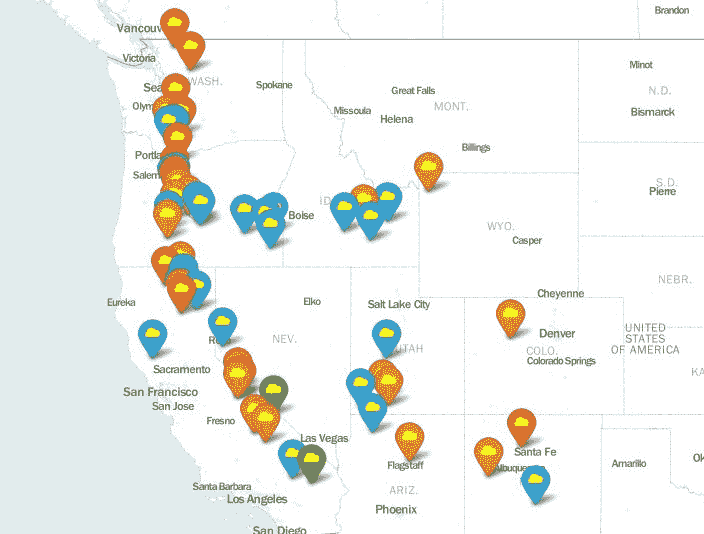

# Python |使用树叶包为火山位置添加标记

> 原文:[https://www . geesforgeks . org/python-向火山位置添加标记-使用-leaf-package/](https://www.geeksforgeeks.org/python-adding-markers-to-volcano-locations-using-folium-package/)

Python 是一种多用途语言，它的实用程序不仅仅是普通的编程。它可以用来开发游戏、抓取互联网或开发深度学习模型。
我们将使用名为**的 Python 库【T2 之叶】(带熊猫)以及*火山 _ 美国*数据集(包含本项目中使用的必要数据)。该脚本将创建一个保存的网页。打开它后，用户将被引导到谷歌地图，在那里火山的位置将被标记，它们的颜色根据海拔设置。**

**设置:**
首先，安装像叶子、熊猫这样的库，以及上面提到的数据集:

```
pip3 install folium
pip3 install pandas
```

现在，您需要下载所需的数据集，[火山 _USA.txt](https://pythonhow.com/data/Volcanoes_USA.txt) 。请记住在保存 Python 脚本的同一个目录中下载它。此外，请务必从数据集中的“名称”列的值中删除撇号“' ”,如果存在的话。

**预定义功能:**

*   **平均值()**–一个熊猫函数，可以计算数组/序列中的值的平均值。
*   **地图()**–使用默认波浪线或自定义波浪线网址生成给定宽度和高度的基础地图。
*   **标记()**–在地图上创建一个简单的库存传单标记，带有可选的弹出文本或文森特可视化。

**用户自定义功能:**

*   **color()**–用于根据火山的海拔给标记赋予颜色。

下面是实现:

## 蟒蛇 3

```
#import the necessary packages
import folium
import pandas as pd

# importing the dataset as a csv file,
# and storing it as a dataframe in 'df'
df=pd.read_csv('Volcanoes.txt')

# calculating the mean of the latitudes
# and longitudes of the locations of volcanoes
latmean=df['LAT'].mean()
lonmean=df['LON'].mean()

# Creating a map object using Map() function.
# Location parameter takes latitudes and
# longitudes as starting location.
# (Map will be centered at those co-ordinates)
map5 = folium.Map(location=[latmean,lonmean],
        zoom_start=6,tiles = 'Mapbox bright')

# Function to change the marker color
# according to the elevation of volcano
def color(elev):
    if elev in range(0,1000):
        col = 'green'
    elif elev in range(1001,1999):
        col = 'blue'
    elif elev in range(2000,2999):
        col = 'orange'
    else:
        col='red'
    return col

# Iterating over the LAT,LON,NAME and
# ELEV columns simultaneously using zip()
for lat,lan,name,elev in zip(df['LAT'],df['LON'],df['NAME'],df['ELEV']):
    # Marker() takes location coordinates
    # as a list as an argument
    folium.Marker(location=[lat,lan],popup = name,
                  icon= folium.Icon(color=color(elev),
                  icon_color='yellow',icon = 'cloud')).add_to(map5)

# Save the file created above
print(map5.save('test7.html'))
```

**输出:**



**参考:**
http://python-visualization . github . io/leaf/docs-v 0 . 5 . 0/modules . html