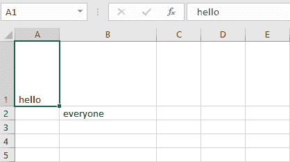
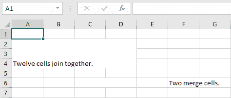
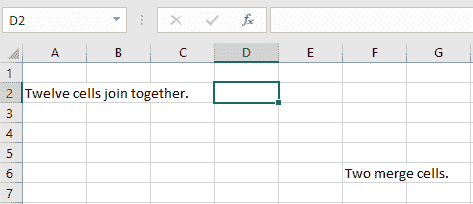
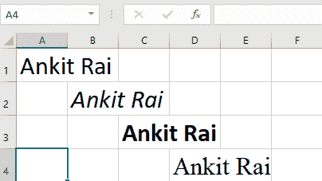

# Python |使用 openpyxl 模块调整 excel 文件的行和列

> 原文:[https://www . geesforgeks . org/python-调整 excel 文件的行和列-使用-openpyxl-module/](https://www.geeksforgeeks.org/python-adjusting-rows-and-columns-of-an-excel-file-using-openpyxl-module/)

**前提条件:** Excel 文件使用 openpyxl [书写](https://www.geeksforgeeks.org/python-writing-excel-file-using-openpyxl-module/) | [阅读](https://www.geeksforgeeks.org/python-reading-excel-file-using-openpyxl-module/)

#### 设置单元格的高度和宽度:

工作表对象具有控制行高和列宽的`row_dimensions`和`column_dimensions`属性。一张表的`row_dimensions`和`column_dimensions` 是字典一样的值；row_dimensions 包含 RowDimension 对象，column_dimensions 包含 ColumnDimension 对象。在 row_dimensions 中，可以使用行的编号(在本例中为 1 或 2)来访问其中一个对象。在 column_dimensions 中，可以使用列的字母(在本例中为 A 或 B)来访问其中一个对象。

**代码#1 :** 设置单元格尺寸的程序。

```py
# import openpyxl module
import openpyxl

# Call a Workbook() function of openpyxl 
# to create a new blank Workbook object
wb = openpyxl.Workbook()

# Get workbook active sheet  
# from the active attribute. 
sheet = wb.active

# writing to the specified cell
sheet.cell(row = 1, column = 1).value = ' hello '

sheet.cell(row = 2, column = 2).value = ' everyone '

# set the height of the row
sheet.row_dimensions[1].height = 70

# set the width of the column
sheet.column_dimensions['B'].width = 20

# save the file
wb.save('dimension.xlsx')
```

**输出:**


#### 合并单元格:

可以使用 merge_cells() sheet 方法将矩形区域的单元格合并为单个单元格。`merge_cells()`的参数是要合并的矩形区域的左上角和右下角单元格的单个字符串。

**代码#2 :** 合并单元格的程序。

```py
import openpyxl
wb = openpyxl.Workbook()
sheet = wb.active

# merge cell from A2 to D4 i.e.
# A2, B2, C2, D2, A3, B3, C3, D3, A4, B4, C4 and D4 .
# A2:D4' merges 12 cells into a single cell. 
sheet.merge_cells('A2:D4')

sheet.cell(row = 2, column = 1).value = 'Twelve cells join together.'

# merge cell C6 and D6
sheet.merge_cells('C6:D6')

sheet.cell(row = 6, column = 6).value = 'Two merge cells.'

wb.save('merge.xlsx')
```

**输出:**


#### 取消单元格合并:

若要取消合并单元格，请调用取消合并单元格()方法。

**代码#3 :** 编程取消合并单元格。

```py
import openpyxl
wb = openpyxl.load_workbook('merge.xlsx')
sheet = wb.active

# unmerge the cells
sheet.unmerge_cells('A2:D4')

sheet.unmerge_cells('C6:D6')

wb.save('merge.xlsx')
```

**输出:**


#### 设置单元格的字体样式:

要自定义单元格中的字体样式，重要的是，从 openpyxl.styles 模块导入 font()函数。

**代码#4 :** 设置文本字体的程序。

```py
import openpyxl

# import Font function from openpyxl
from openpyxl.styles import Font

wb = openpyxl.Workbook()
sheet = wb.active

sheet.cell(row = 1, column = 1).value = "Ankit Rai"

# set the size of the cell to 24
sheet.cell(row = 1, column = 1).font = Font(size = 24 )

sheet.cell(row = 2, column = 2).value = "Ankit Rai"

# set the font style to italic
sheet.cell(row = 2, column = 2).font = Font(size = 24, italic = True)

sheet.cell(row = 3, column = 3).value = "Ankit Rai"

# set the font style to bold
sheet.cell(row = 3, column = 3).font = Font(size = 24, bold = True)

sheet.cell(row = 4, column = 4).value = "Ankit Rai"

# set the font name to 'Times New Roman'
sheet.cell(row = 4, column = 4).font = Font(size = 24, name = 'Times New Roman')

wb.save('styles.xlsx')
```

**输出:**
