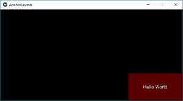
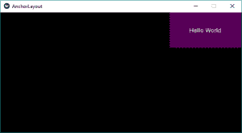
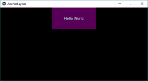
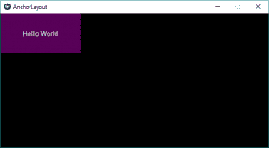
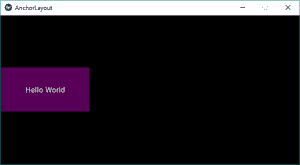
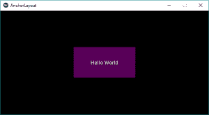
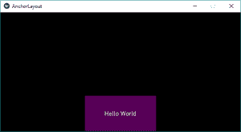
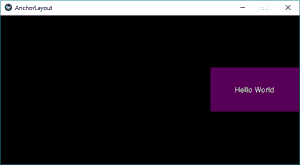

# Python|基维的锚地 [T1】

> 原文:[https://www.geeksforgeeks.org/python-anchorlayout-in-kivy/](https://www.geeksforgeeks.org/python-anchorlayout-in-kivy/)

[Kivy](https://www.geeksforgeeks.org/kivy-tutorial/) 是 Python 中独立于平台的 GUI 工具。因为它可以在安卓、IOS、linux 和 Windows 等平台上运行。它基本上是用来开发安卓应用程序的，但并不意味着它不能在桌面应用程序上使用。

> 👉🏽 [Kivy 教程–通过示例学习 Kivy](https://www.geeksforgeeks.org/kivy-tutorial/)。

### 锚定布局:

锚定布局将其子元素与边框(顶部、底部、左侧、右侧)或中心对齐。下面给出的类用于实现锚点布局。

```
kivy.uix.anchorlayout.AnchorLayout
```

锚定布局可以用参数初始化:

```
anchor_x
Parameters can be passed: “left”, “right” and “center”.

anchor_y
Parameters can be passed:“top”,  “bottom” and “center”.

```

选择小部件在父容器中的放置位置。

> 有 9 个不同的布局区域可以放置`Anchorlayout` 进行效果:
> 
> 左上、中上、右上、中左、中右、中右、左下、中下和右下。

**注意:**记得给一个锚点布局添加多个小部件，只把小部件放在同一个位置。

```
Basic Approach:

1) import kivy
2) import kivyApp
4) import Anchorlayout
5) Set minimum version(optional)
6) create App class
7) return Layout/widget/Class(according to requirement)
8) Run an instance of the class
```

**方法的实施(带有一些样式):**

**1) anchor_x= '右'，anchor_y= '底':**

```
# Sample Python application demonstrating
# the working of AnchorLayout in Kivy

# Module imports

# base Class of your App inherits from the App class. 
# app:always refers to the instance of your application 
from kivy.app import App

# The AnchorLayout aligns its children to a border
# (top, bottom, left, right) or center
from kivy.uix.anchorlayout import AnchorLayout

# BoxLayout arranges children in a vertical or horizontal box.
# or help to put the childrens at the desired location.
from kivy.uix.boxlayout import BoxLayout

# creates the button in kivy 
# if not imported shows the error
from kivy.uix.button import Button

# A Kivy app demonstrating the working of anchor layout
class AnchorLayoutApp(App):

    def build(self):

        # Anchor Layout1
        layout = AnchorLayout(
        anchor_x ='right', anchor_y ='bottom')
        btn = Button(text ='Hello World',
                     size_hint =(.3, .3),
                     background_color =(1.0, 0.0, 0.0, 1.0))

        layout.add_widget(btn)
        return layout 

# creating the object root for AnchorLayoutApp() class  
root = AnchorLayoutApp()
# Run the Kivy app
root.run()
```

**输出:**


如果您想改变`AnchorLayouts` 的位置，那么只需用下面的代码替换上面代码中的类代码，或者您可以用任何参数改变`anchor_x`和 anchor_y，如上所述进行任意 9 个组合。

**2) anchor_x= '右'，anchor_y= '上':**

```
# A Kivy app demonstrating the working of anchor layout
class AnchorLayoutApp(App):

    def build(self):

        # Anchor Layout1
        layout = AnchorLayout(
        anchor_x ='right', anchor_y ='top')
        btn = Button(text ='Hello World',
                     size_hint =(.3, .3),
                     background_color =(1.0, 0.0, 1.0, 1.0))

        layout.add_widget(btn)
        return layout 
```

**输出:**


**3) anchor_x= '中'，anchor_y= '顶':**
T3】输出:


**4) anchor_x= '左'，anchor_y= '上':**
**输出:**


**5) anchor_x= '左'，anchor_y= '底':**
T3】输出:


**6) anchor_x= '左'，anchor_y= '中':**
**输出:**


**7) anchor_x= '中心'，anchor_y= '中心':**
**输出:**


**8) anchor_x= '中心'，anchor_y= '底部':**
**输出:**


**9) anchor_x= '右'，anchor_y= '中':**
**输出:**
