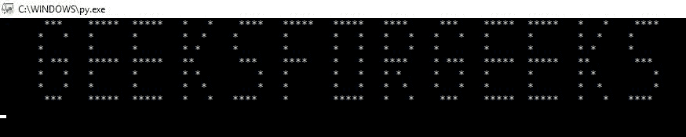

# Python |显示“极客头像”的动画横幅

> 原文:[https://www . geeksforgeeks . org/python-动画-横幅-展示-geeksforgeeks/](https://www.geeksforgeeks.org/python-animated-banner-showing-geeksforgeeks/)

想花里胡哨，创作一个动画横幅吗？这个程序将在 Python 控制台上打印一个很酷的动画横幅。最初，它只适合显示**【极客 forgeeks】**。你可以自己添加更多的角色，这是一个挑战。

**重要提示:-要实现这一点，您必须在控制台中打开文件，而不是通过编辑器/IDLE。**

Python 实现:

```py
import os
import time

#You can change the width of the display according to your wish.
WIDTH = 250

# Written below currently is GeeksForGeeks. If you wish to get more
# written, you have to add each alphabet manually.
message = "geeksforgeeks".upper()

#The message will get printed here.
printedMessage = [ "","","","","","","","","","","","","","", ]

"""
What we have done here is a dictionary mapping the letters to their line.
These mapped indexes identify itself to each letter in the dictionary and 
also for each line in the display.
"""
characters = { " " : [ " ",
                       " ",
                       " ",
                       " ",
                       " ",
                       " ",
                       " " ],

               "E" : [ "*****",
                       "*    ",
                       "*    ",
                       "*****",
                       "*    ",
                       "*    ",
                       "*****" ],

               "O" : [ "*****",
                       "*   *",
                       "*   *",
                       "*   *",
                       "*   *",
                       "*   *",
                       "*****" ],

               "K" : [ " *   *",
                       " *  * ",
                       " * *  ",
                       " **   ",
                       " * *  ",
                       " *  * ",
                       " *   *" ],

               "S" : ["  **** ",
                       " *     ",
                       " *     ",
                       "  ***  ",
                       "     * ",
                       "     * ",
                       " ****  " ],

               "G" : [" ***  ",
                       "*   * ",
                       "*     ",
                       "* *** ",
                       "*   * ",
                       "*   * ",
                       " ***  " ],

               "F" : ["***** ",
                       "*     ",
                       "*     ",
                       "****  ",
                       "*     ",
                       "*     ",
                       "*     " ],

               "R" : [" ****  ",
                      " *   * ",
                      " *   * ",
                      " ****  ",
                      " * *   ",
                      " *  *  ",
                      " *   * " ]

               }

for row in range(7):
    for char in message:
        printedMessage[row] += (str(characters[char][row]) + "  ")

offset = WIDTH
while True:
    os.system("cls")

    for row in range(7):
        print(" " * offset + printedMessage[row][max(0,offset*-1):WIDTH - offset])

    offset -=1

    if offset <= ((len(message)+2)*6) * -1:
        offset = WIDTH

    #Use this to change the speed of the animation that you wish to keep.
    time.sleep(0.10)
```

**输出(原始输出将从右向左移动。基本上是一部动画。):**
