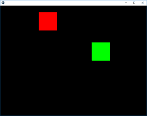

# Python |动画在 Kivy 中使用。kv 文件

> 原文:[https://www . geesforgeks . org/python-animation-in-kivy-using-kv-file/](https://www.geeksforgeeks.org/python-animation-in-kivy-using-kv-file/)

Kivy 是 Python 中独立于平台的 GUI 工具。因为它可以在安卓、IOS、Linux 和视窗等平台上运行。它基本上是用来开发安卓应用程序的，但并不意味着它不能在桌面应用程序上使用。

## 动画:

动画和动画转换用于动画小部件属性。您必须至少指定一个属性名称和目标值。要使用动画，请按照下列步骤操作:

*   设置动画对象
*   在小部件上使用动画对象

> 要使用动画，您必须从 kivy 导入:
> 动画导入动画

```
Basic Approaches: 

1) import runTouchApp
2) import Builder
3) import Widget
4) import Animation
5) import Clock
6) import Window
7) import random
8) import listproperty
9) Build the .kv file
10) Create root class
11) Create the clock and anim react class used to animate the boxes
12) Run the App
```

在下面的例子中，我们创建了两个框(红色和绿色)，其中我们给红色框提供动画，即当应用程序启动时，红色框处于其动画视图中，但是为了清除概念，我提供了绿色框，单击该绿色框可以提供随机动画，即它可以随机前往任何地方。
程序由两个主要类组成首先是**时钟**类，当我们声明它是动画时，它是红框的，绿框动画在**动画**类中。

为了提供运动，你必须以速度来玩。

**实施方法:**

## 蟒蛇 3

```
# work same as kivy.App used to run the App
from kivy.base import runTouchApp

# to use .kv file as a string we have to import it
from kivy.lang import Builder

# A Widget is the base building block of GUI interfaces in Kivy
from kivy.uix.widget import Widget

# The Clock object allows you to schedule a
# function call in the future
from kivy.clock import Clock

# Animation and AnimationTransition are
# used to animate Widget properties
from kivy.animation import Animation

# The Properties classes are used when
# you create an EventDispatcher.
from kivy.properties import ListProperty

# Core class for creating the default Kivy window.
from kivy.core.window import Window

# As name suggest used when random things required
from random import random

# load the kv file as string
Builder.load_string('''
<Root>:

# Setting the position (initial) of boxes

    ClockRect:
        pos: 300, 300
    AnimRect:
        pos: 500, 300

# creation and animation of red box
<ClockRect>:
    canvas:
        Color:
            rgba: 1, 0, 0, 1
        Rectangle:
            pos: self.pos
            size: self.size

# creation and animation of red box
<AnimRect>:
    canvas:
        Color:
            rgba: 0, 1, 0, 1
        Rectangle:
            pos: self.pos
            size: self.size
''')

# Create the root class
class Root(Widget):
    pass

# Create the clock class Then is when clicked
# how much time to animate
# the red colour block animation is created by it
class ClockRect(Widget):
    velocity = ListProperty([10, 15])

    def __init__(self, **kwargs):
        super(ClockRect, self).__init__(**kwargs)
        Clock.schedule_interval(self.update, 1 / 60.)

    def update(self, *args):
        self.x += self.velocity[0]
        self.y += self.velocity[1]

        if self.x < 0 or (self.x + self.width) > Window.width:
            self.velocity[0] *= -1
        if self.y < 0 or (self.y + self.height) > Window.height:
            self.velocity[1] *= -1

# Create the Animation class
# And add animation
# green colour box is animated through this class
class AnimRect(Widget):

    def anim_to_random_pos(self):
        Animation.cancel_all(self)
        random_x = random() * (Window.width - self.width)
        random_y = random() * (Window.height - self.height)

        anim = Animation(x = random_x, y = random_y,
                         duration = 4,
                         t ='out_elastic')
        anim.start(self)

    def on_touch_down(self, touch):
        if self.collide_point(*touch.pos):
            self.anim_to_random_pos()

# run the App
runTouchApp(Root())
```

**输出:**



**动画输出视频:**

<video class="wp-video-shortcode" id="video-317545-1" width="640" height="360" preload="metadata" controls=""><source type="video/webm" src="https://media.geeksforgeeks.org/wp-content/uploads/20190627165425/Anim.webm?_=1">[https://media.geeksforgeeks.org/wp-content/uploads/20190627165425/Anim.webm](https://media.geeksforgeeks.org/wp-content/uploads/20190627165425/Anim.webm)</video>