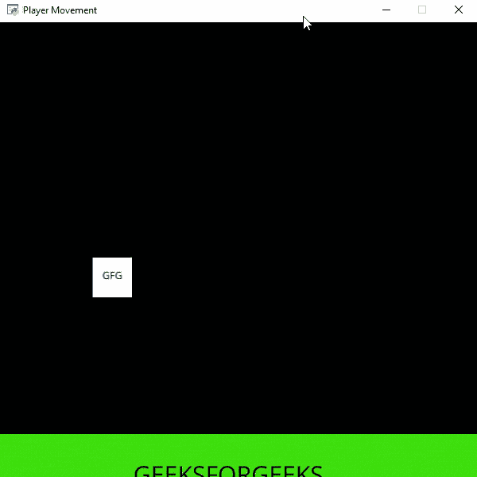

# Python 街机–在游戏中添加子弹

> 原文:[https://www . geesforgeks . org/python-arcade-游戏中添加子弹/](https://www.geeksforgeeks.org/python-arcade-adding-bullets-in-game/)

在本文中，我们将学习如何使用 Python 在 Arcade 中为游戏添加项目符号。

## 添加项目符号

在本例中，我们将向屏幕添加项目符号。为此，我们将使用一些函数:

**draw_text():** 此功能用于使用 Pyglet 的标签将文本绘制到屏幕上。

> **语法:** arcade.draw_text(text，x，y，颜色，大小，宽度，对齐，font_name)
> 
> **参数:**
> 
> *   文本:我们要显示的文本
> *   x : x 坐标
> *   y : y 坐标
> *   颜色:文本的颜色
> *   大小:字体的大小
> *   宽度:文本的宽度
> *   对齐:文本的对齐
> *   字体名称:字体的名称

**物理引擎平台转换器():**在平台转换器中使用的简单物理引擎。

> **语法:**街机。物理引擎平台变形器(玩家精灵、平台、重力、梯子)
> 
> **参数:**
> 
> *   玩家精灵:玩家的精灵
> *   平台:它无法穿越的精灵
> *   重力:每帧向下的加速度
> *   梯子:用户可以攀爬的梯子

### 使用的精灵():

  

在下面的例子中，我们将创建一个 MainGame()类。在这个类里面，首先我们要初始化一些速度、场景、子弹精灵和玩家精灵的变量，然后我们将在这个类里面创建 4 个函数。

*   **on_draw():** 在这个功能里面，我们将在屏幕上使用我们的场景。
*   **setup():** 在这个函数中，我们将初始化我们的场景对象，然后我们将加载我们的玩家和平台的精灵。之后，我们将调用 PhysicsEnginePlatformer()函数。
*   **on_update():** 在这个功能中，我们将更新物理引擎，玩家精灵的 x 坐标，以及子弹的 y 坐标。
*   **on_key_press()和 on_key_release():** 在此功能中，我们将根据按下或释放的键盘键来更改速度变量的值。当用户按下向下箭头键时，我们将加载我们的子弹精灵。

下面是实现:

## 蟒蛇 3

```
# Importing arcade module
import arcade

# Creating MainGame class
class MainGame(arcade.Window):
    def __init__(self):
        super().__init__(600, 600,
                         title="Player Movement")

        # Initializing a variable to store
        # the velocity of the player
        self.vel_x = 0

        # Creating variable for bullet sprite
        self.bullet = None

        # Creating variable to store player sprite
        self.player = None

        # Creating variable for our game engine
        self.physics_engine = None

    # Creating on_draw() function to draw on the screen
    def on_draw(self):
        arcade.start_render()

        # Drawing our scene
        self.scene.draw()

    def setup(self):
         # Initialize Scene object
        self.scene = arcade.Scene()

        # Creating different sprite lists
        self.scene.add_sprite_list("Player")
        self.scene.add_sprite_list("Platforms",
                                   use_spatial_hash=True)

        # Adding player sprite
        self.player_sprite = arcade.Sprite("Player.png", 1)

        # Adding coordinates for the center of the sprite
        self.player_sprite.center_x = 64
        self.player_sprite.center_y = 90

        # Adding Sprite in our scene
        self.scene.add_sprite("Player", self.player_sprite)

        # Adding platform sprite according to level
        platform = arcade.Sprite(f"Platform.png", 1)

        # Adding coordinates for the center of the platform
        platform.center_x = 300
        platform.center_y = 32
        self.scene.add_sprite("Platforms", platform)

        # Creating Physics engine
        self.physics_engine = arcade.PhysicsEnginePlatformer(
            self.player_sprite, self.scene.get_sprite_list("Platforms"), 0.5
        )

    # Creating on_update function to
    # update the x coordinate
    def on_update(self, delta_time):

        # Changing x coordinate of player
        self.player_sprite.center_x += self.vel_x * delta_time

        # Updating the physics engine to move the player
        self.physics_engine.update()

        # If self.bullet has sprites
        if self.bullet != None:

            # Iterating over every bullet and changing y coordinate
            for bullet in self.scene.get_sprite_list("Bullet"):
                bullet.center_y += 5

    # Creating function to change the velocity
    # when button is pressed
    def on_key_press(self, symbol, modifier):

        # Checking the button pressed
        # and changing the value of velocity
        if symbol == arcade.key.LEFT:
            self.vel_x = -300
        elif symbol == arcade.key.RIGHT:
            self.vel_x = 300
        elif symbol == arcade.key.UP:
            if self.physics_engine.can_jump():
                self.player_sprite.change_y = 15
        elif symbol == arcade.key.DOWN:

            # Loading bullet sprite
            self.bullet = arcade.Sprite("Bullet.png", 1)

            # Initializing the starting coordinates
            self.bullet.center_x = self.player_sprite.center_x
            self.bullet.bottom = self.player_sprite.top

            # Adding the bullet sprite in the scene
            self.scene.add_sprite("Bullet", self.bullet)

    # Creating function to change the velocity
    # when button is released
    def on_key_release(self, symbol, modifier):

        # Checking the button released
        # and changing the value of velocity
        if symbol == arcade.key.LEFT:
            self.vel_x = 0
        elif symbol == arcade.key.RIGHT:
            self.vel_x = 0

# Calling MainGame class
game = MainGame()
game.setup()
arcade.run()
```

**输出:**

