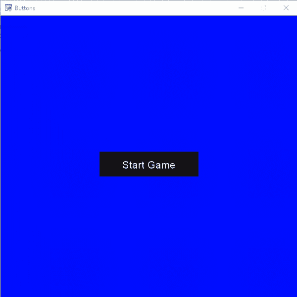
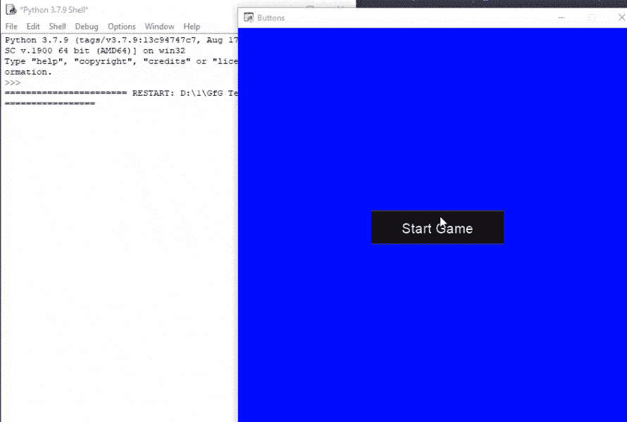

# Python 街机–添加按钮

> 原文:[https://www.geeksforgeeks.org/python-arcade-adding-buttons/](https://www.geeksforgeeks.org/python-arcade-adding-buttons/)

在本文中，我们将学习如何使用 python 在 Arcade 中创建按钮。

## 添加按钮

在街机中，我们可以很容易地在游戏中添加按钮。

**为此，我们将使用一些函数:**

#### UIManager():

> **语法:** arcade.gui.UIManager(窗口，auto_enable)
> 
> **参数:**
> 
> *   窗口:我们的游戏窗口
> *   自动启用:接受布尔值

#### UIBoxLayout():

> **语法:** arcade.gui.UIBoxLayout(x，y，垂直，对齐，子级，大小)
> 
> **参数:**
> 
> *   x:左下方的 x 坐标
> *   y:左下角的 x 坐标
> *   垂直:布局子级垂直(真)或水平(假)
> *   对齐:沿正交方向对齐子对象(x:左、中、右/ y:上、中、下)
> *   儿童:初始儿童，可以添加更多
> *   大小:如果这个 UIWidget 想要增长的话，给 UILayout 的提示

#### UIFlatButton():

> **语法:**arcade . GUI . uiflatton(x，y，宽度，高度，文本，样式)
> 
> **参数:**
> 
> *   x:小部件的 x 坐标。
> *   y:小部件的 y 坐标。
> *   宽度:小部件的宽度。如果未指定，默认为纹理宽度。
> *   高度:小部件的高度。如果未指定，默认为纹理高度。
> *   文本:要添加到按钮的文本。
> *   样式:用于设置按钮的样式

现在，为了创建我们的按钮，我们将创建一个名为 MainClass 的类，在这个类中，我们将为 UIManager 初始化一个变量。之后，我们将使用 UIFlatButton()创建我们的按钮，然后我们将在 UIManager 中添加这个按钮。然后我们将创建一个 on_draw()函数来绘制我们的按钮。

**下面是实现:**

## 蟒蛇 3

```
# Importing arcade module
import arcade
# Importing arcade gui
import arcade.gui

# Creating MainGame class
class MainGame(arcade.Window):
    def __init__(self):
        super().__init__(600, 600, title="Buttons")

        # Changing background color of screen
        arcade.set_background_color(arcade.color.BLUE)

        # Creating a UI MANAGER to handle the UI
        self.uimanager = arcade.gui.UIManager()
        self.uimanager.enable()

        # Creating Button using UIFlatButton
        start_button = arcade.gui.UIFlatButton(text="Start Game",
                                               width=200)

        # Adding button in our uimanager
        self.uimanager.add(
            arcade.gui.UIAnchorWidget(
                anchor_x="center_x",
                anchor_y="center_y",
                child=start_button)
        )

    # Creating on_draw() function to draw on the screen

    def on_draw(self):
        arcade.start_render()

        # Drawing our ui manager
        self.uimanager.draw()

# Calling MainGame class
MainGame()
arcade.run()
```

**输出:**



## 在按钮中添加功能

现在我们将创建一个 on_buttonclick()函数，每次用户按下按钮时都会调用该函数。

## 蟒蛇 3

```
# Importing arcade module
import arcade
# Importing arcade gui
import arcade.gui

# Creating MainGame class
class MainGame(arcade.Window):
    def __init__(self):
        super().__init__(600, 600, title="Buttons")

        # Changing background color of screen
        arcade.set_background_color(arcade.color.BLUE)

        # Creating a UI MANAGER to handle the UI
        self.uimanager = arcade.gui.UIManager()
        self.uimanager.enable()

        # Creating Button using UIFlatButton
        start_button = arcade.gui.UIFlatButton(text="Start Game",
                                               width=200)

        # Assigning our on_buttonclick() function
        start_button.on_click = self.on_buttonclick

        # Adding button in our uimanager
        self.uimanager.add(
            arcade.gui.UIAnchorWidget(
                anchor_x="center_x",
                anchor_y="center_y",
                child=start_button)
        )

    # This function will be called everytime the user
    # presses the start button
    def on_buttonclick(self, event):
        print("Button is clicked")

    # Creating on_draw() function to draw on the screen
    def on_draw(self):
        arcade.start_render()

        # Drawing our ui manager
        self.uimanager.draw()

# Calling MainGame class
MainGame()
arcade.run()
```

**输出:**

