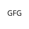
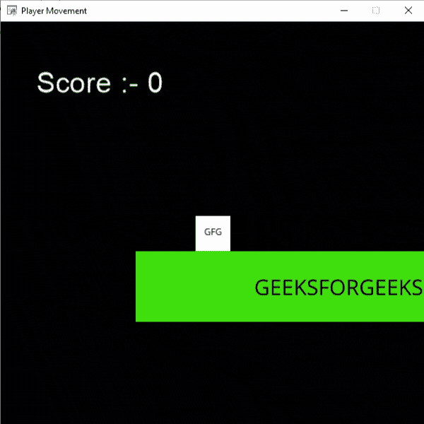
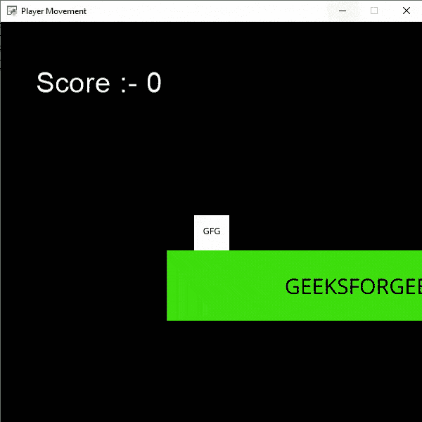

# 蟒蛇街机-增加敌人

> 原文:[https://www.geeksforgeeks.org/python-arcade-adding-enemies/](https://www.geeksforgeeks.org/python-arcade-adding-enemies/)

在这篇文章中，我们将学习如何在街机中增加敌人。

## 添加敌人

为了给我们的游戏增加敌人，我们将遵循以下步骤:

*   首先，我们将创建一个变量来存储敌人的精灵。

**语法:**

```
 self.enemy = None
```

*   之后，我们将再创建一个变量来存储敌人的速度。

**语法:**

```
self.enemy_move = velocity
```

*   将我们的敌人精灵储存在敌人变量中。

**语法:**

```
self.enemy = arcade.Sprite("path",1)
```

*   设置初始坐标。

**语法:**

```
self.enemy.center_x = value
self.enemy.center_y = value
```

*   在场景中添加敌人的精灵。

**语法:**

```
self.scene.add_sprite("Enemy", self.enemy)
```

*   通过改变 x 坐标移动敌人。

**语法:**

```
self.enemy.center_x += self.enemy_move
```

*   检查玩家和敌人之间的碰撞。

**语法:**

> 敌人 _ 碰撞=街机. check _ for _ conflict _ with _ list(
> 
> self.player_sprite，self.scene.get_sprite_list(“敌人”)
> 
> )

*   如果他们碰撞，然后删除玩家精灵。

**语法:**

> 对于敌人 _ 碰撞中的敌人:
> 
> self . player _ sprite . remove _ from _ sprite _ list()

## 使用的功能:

*   **draw_text():** 此功能用于使用 Pyglet 的标签将文本绘制到屏幕上。

> **语法:** arcade.draw_text(text，x，y，颜色，大小，宽度，对齐，font_name)
> 
> **参数:**
> 
> 文本:我们要显示的文本
> 
> x : x 坐标
> 
> y : y 坐标
> 
> 颜色:文本的颜色
> 
> 大小:字体的大小
> 
> 宽度:文本的宽度
> 
> 对齐:文本的对齐
> 
> 字体名称:字体的名称

*   **Camera():**Camera 类用于控制可见视口。

> **语法:**街机。摄像机(宽度、高度、窗口)
> 
> **参数:**
> 
> 宽度:视口的宽度
> 
> 高度:视口的高度
> 
> 窗口:与此摄像机关联的窗口

*   **场景():**表示场景对象的类。

> **语法:**街机。场景(精灵列表，名称映射)
> 
> **参数:**
> 
> 精灵列表:精灵列表对象的列表
> 
> 名称映射:精神列表对象的字典

*   **physicsenengineplatformer():**简单化的物理引擎，用于平台。

> **语法:**街机。物理引擎平台变形器(玩家精灵、平台、重力、梯子)
> 
> **参数:**
> 
> 玩家精灵:玩家的精灵
> 
> 平台:它无法穿越的精灵
> 
> 重力:每帧向下的加速度
> 
> 梯子:用户可以攀爬的梯子

## 使用的精灵:


平台



运动员


敌军

在下面的例子中，我们将创建一个 MainGame()类。在这个类里面，首先我们要初始化速度、相机、分数、等级、敌人、敌人精灵和玩家精灵的一些变量，然后我们将在这个类里面创建 6 个函数。

*   **on_draw():** 在这个功能里面，我们将使用我们的相机，在屏幕上绘制场景和我们的评分文本。
*   **setup():** 在这个功能中，我们将初始化我们的相机和场景对象，然后我们将加载我们的玩家和平台的精灵，然后我们将加载我们的敌人精灵，并初始化开始的 x 和 y 坐标。之后，我们将调用 PhysicsEnginePlatformer()函数。
*   **on_update():** 在这个功能中，我们将更新玩家的精灵、相机和物理引擎的 x 坐标。我们还将在敌人精灵的 x 坐标中添加我们的敌人移动变量。然后我们将检查敌人和玩家之间的碰撞。如果玩家与敌人相撞，我们将移除玩家精灵。
*   **on_key_press()和 on_key_release():** 在此功能中，我们将根据按下或释放的键盘键来更改速度变量的值。
*   **camera_move():** 在这个功能中，我们会根据我们玩家的当前位置来移动我们的相机。

**示例:**增加敌人

## 蟒蛇 3

```
# Importing arcade module
import arcade

# Creating MainGame class
class MainGame(arcade.Window):
    def __init__(self):
        super().__init__(600, 600,
                         title="Player Movement")

        # Initializing a variable to store
        # the velocity of the player
        self.vel_x = 0

        # Creating variable for Camera
        self.camera = None

        # Creating variable to store current score
        self.score = 0

        # Creating variable to move the enemy
        self.enemy_move = 5

        # Creating variable for enemy sprite
        self.enemy = None

        # Creating scene object
        self.scene = None

        # Creating variable to store player sprite
        self.player = None

        # Creating variable for our game engine
        self.physics_engine = None

    # Creating on_draw() function to draw on the screen
    def on_draw(self):
        arcade.start_render()

        # Drawing the text
        arcade.draw_text('Score :- '+str(self.score), 
                         self.player_sprite.center_x - 500 / 2,
                         self.player_sprite.center_y + 200,
                         arcade.color.WHITE, 30, 5000, 'left')

        # Using the camera
        self.camera.use()

        # Drawing our scene
        self.scene.draw()

    def setup(self):
         # Initialize Scene object
        self.scene = arcade.Scene()

        # Using Camera() function
        self.camera = arcade.Camera(600, 600)

        # Loading enemy sprite
        self.enemy = arcade.Sprite("Enemy.png", 1)

        # Initializing the starting coordinates
        self.enemy.center_x = 500
        self.enemy.center_y = 110

        # Adding the enemy sprite in the scene
        self.scene.add_sprite("Enemy", self.enemy)

        # Creating different sprite lists
        self.scene.add_sprite_list("Player")
        self.scene.add_sprite_list("Platforms",
                                   use_spatial_hash=True)

        # Adding player sprite
        self.player_sprite = arcade.Sprite("Player.png", 1)

        # Adding coordinates for the center of the sprite
        self.player_sprite.center_x = 64
        self.player_sprite.center_y = 90

        # Adding Sprite in our scene
        self.scene.add_sprite("Player", self.player_sprite)

        # Adding platform sprite according to level
        platform = arcade.Sprite(f"Platform.png", 1)

        # Adding coordinates for the center of the platform
        platform.center_x = 300
        platform.center_y = 32
        self.scene.add_sprite("Platforms", platform)

        # Creating Physics engine
        self.physics_engine = arcade.PhysicsEnginePlatformer(
            self.player_sprite, self.scene.get_sprite_list("Platforms"), 0.5
        )

    # Creating on_update function to
    # update the x coordinate
    def on_update(self, delta_time):

        # Moving the position of enemy
        self.enemy.center_x += self.enemy_move

        # Changing the direction of enemy movement
        if self.enemy.center_x > 500 or self.enemy.center_x < 160:
            self.enemy_move *= -1

        # Checking if the enemy is colliding with player or not
        enemy_collide = arcade.check_for_collision_with_list(
            self.player_sprite, self.scene.get_sprite_list("Enemy")
        )

        # Looping through each enemy and removing the player
        # if colliding
        for enemy in enemy_collide:
            # Remove the coin
            self.player_sprite.remove_from_sprite_lists()

        # Changing x coordinate of player
        self.player_sprite.center_x += self.vel_x * delta_time

        # Updating the physics engine to move the player
        self.physics_engine.update()

        # Calling the camera_move function
        self.camera_move()

    # Creating function to change the velocity
    # when button is pressed
    def on_key_press(self, symbol, modifier):

        # Checking the button pressed
        # and changing the value of velocity
        if symbol == arcade.key.LEFT:
            self.vel_x = -300
        elif symbol == arcade.key.RIGHT:
            self.vel_x = 300
        elif symbol == arcade.key.UP:
            if self.physics_engine.can_jump():
                self.player_sprite.change_y = 15

    # Creating function to change the velocity
    # when button is released
    def on_key_release(self, symbol, modifier):

        # Checking the button released
        # and changing the value of velocity
        if symbol == arcade.key.LEFT:
            self.vel_x = 0
        elif symbol == arcade.key.RIGHT:
            self.vel_x = 0

    def camera_move(self):

        # Getting the x coordinate for the center of camera
        screen_x = self.player_sprite.center_x - \
            (self.camera.viewport_width / 2)

        # Getting the y coordinate for the center of camera
        screen_y = self.player_sprite.center_y - \
            (self.camera.viewport_height / 2)

        # Moving the camera
        self.camera.move_to([screen_x, screen_y])

# Calling MainGame class
game = MainGame()
game.setup()
arcade.run()
```

**输出:**



## 杀死敌人

现在我们想在玩家跳到敌人身上时杀死它。为此，我们将检查底部的其他玩家是否等于顶部的敌人。如果它是相等的，那么我们将删除层精灵。

*   首先，我们将玩家底部的坐标存储在一个变量中。

**语法:**

> x = int(self . player _ sprite . center _ y–14)

*   同样，敌人顶部的坐标在不同的变量中。

**语法:**

> y = int(self .敌方. center_y + 25)

*   然后，如果 x 和 y 相等，并且敌人和玩家正在碰撞，那么我们将移除我们的敌人精灵。

**语法:**

> 如果 x == y:
> 
> self .敌国. _ from _ sprite _ lists()

### **示例:**使用街机杀死敌人

## 蟒蛇 3

```
# Importing arcade module
import arcade

# Creating MainGame class
class MainGame(arcade.Window):
    def __init__(self):
        super().__init__(600, 600,
                         title="Player Movement")

        # Initializing a variable to store
        # the velocity of the player
        self.vel_x = 0

        # Creating variable for Camera
        self.camera = None

        # Creating variable to store current score
        self.score = 0

        # Creating variable to move the enemy
        self.enemy_move = 2

        # Creating variable for enemy sprite
        self.enemy = None

        # Creating scene object
        self.scene = None

        # Creating variable to store player sprite
        self.player = None

        # Creating variable for our game engine
        self.physics_engine = None

    # Creating on_draw() function to draw on the screen
    def on_draw(self):
        arcade.start_render()

        # Drawing the text
        arcade.draw_text('Score :- '+str(self.score), 
                         self.player_sprite.center_x - 500 / 2,
                         self.player_sprite.center_y + 200,
                         arcade.color.WHITE, 30, 5000, 'left')

        # Using the camera
        self.camera.use()

        # Drawing our scene
        self.scene.draw()

    def setup(self):

         # Initialize Scene object
        self.scene = arcade.Scene()

        # Using Camera() function
        self.camera = arcade.Camera(600, 600)

        # Loading enemy sprite
        self.enemy = arcade.Sprite("Enemy.png", 1)

        # Initializing the starting coordinates
        self.enemy.center_x = 500
        self.enemy.center_y = 110

        # Adding the enemy sprite in the scene
        self.scene.add_sprite("Enemy", self.enemy)

        # Creating different sprite lists
        self.scene.add_sprite_list("Player")
        self.scene.add_sprite_list("Platforms",
                                   use_spatial_hash=True)

        # Adding player sprite
        self.player_sprite = arcade.Sprite("Player.png", 1)

        # Adding coordinates for the center of the sprite
        self.player_sprite.center_x = 64
        self.player_sprite.center_y = 90

        # Adding Sprite in our scene
        self.scene.add_sprite("Player", self.player_sprite)

        # Adding platform sprite according to level
        platform = arcade.Sprite(f"Platform.png", 1)

        # Adding coordinates for the center of the platform
        platform.center_x = 300
        platform.center_y = 32
        self.scene.add_sprite("Platforms", platform)

        # Creating Physics engine
        self.physics_engine = arcade.PhysicsEnginePlatformer(
            self.player_sprite, self.scene.get_sprite_list("Platforms"), 0.5
        )

    # Creating on_update function to
    # update the x coordinate

    def on_update(self, delta_time):

        # Moving the position of enemy
        self.enemy.center_x += self.enemy_move

        # Changing the direction of enemy movement
        if self.enemy.center_x > 500 or self.enemy.center_x < 160:
            self.enemy_move *= -1

        # Checking if the enemy is colliding with player or not
        enemy_collide = arcade.check_for_collision_with_list(
            self.player_sprite, self.scene.get_sprite_list("Enemy")
        )

        # Looping through each enemy and removing the player if colliding
        for enemy in enemy_collide:

            # Checking the top of enemy and bottom of player
            x = int(self.player_sprite.center_y - 14)
            y = int(self.enemy.center_y + 25)
            if x == y:
                self.enemy.remove_from_sprite_lists()
            else:
                # Remove the coin
                self.player_sprite.remove_from_sprite_lists()

        # Changing x coordinate of player
        self.player_sprite.center_x += self.vel_x * delta_time

        # Updating the physics engine to move the player
        self.physics_engine.update()

        # Calling the camera_move function
        self.camera_move()

    # Creating function to change the velocity
    # when button is pressed
    def on_key_press(self, symbol, modifier):

        # Checking the button pressed
        # and changing the value of velocity
        if symbol == arcade.key.LEFT:
            self.vel_x = -300
        elif symbol == arcade.key.RIGHT:
            self.vel_x = 300
        elif symbol == arcade.key.UP:
            if self.physics_engine.can_jump():
                self.player_sprite.change_y = 15

    # Creating function to change the velocity
    # when button is released
    def on_key_release(self, symbol, modifier):

        # Checking the button released
        # and changing the value of velocity
        if symbol == arcade.key.LEFT:
            self.vel_x = 0
        elif symbol == arcade.key.RIGHT:
            self.vel_x = 0

    def camera_move(self):

        # Getting the x coordinate for the center of camera
        screen_x = self.player_sprite.center_x - \
            (self.camera.viewport_width / 2)

        # Getting the y coordinate for the center of camera
        screen_y = self.player_sprite.center_y - \
            (self.camera.viewport_height / 2)

        # Moving the camera
        self.camera.move_to([screen_x, screen_y])

# Calling MainGame class
game = MainGame()
game.setup()
arcade.run()
```

**输出:**

