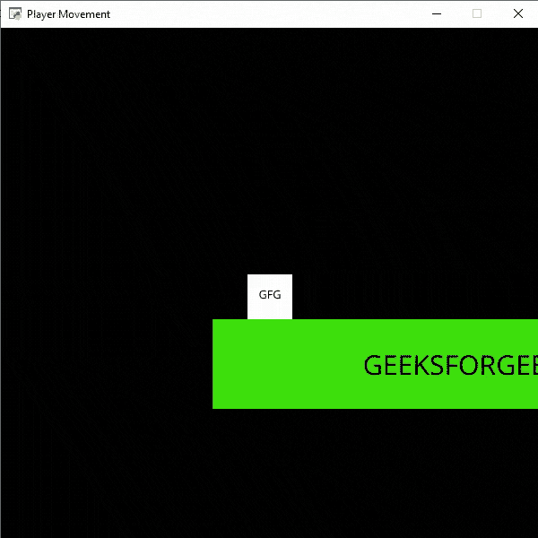

# Python 街机–添加移动平台

> 原文:[https://www . geesforgeks . org/python-arcade-add-move-platforms/](https://www.geeksforgeeks.org/python-arcade-adding-moving-platforms/)

在本文中，我们将讨论如何在 Python 中为我们的街机游戏添加移动平台。

## 添加移动平台

我们可以通过以下步骤在街机游戏中轻松添加移动平台:

*   为精灵和移动平台的速度创建 2 个新变量。

```
self.moving_vel = 3
self.moving_platform = None
```

*   加载精灵并添加初始坐标。

```
self.moving_platform = arcade.Sprite("Moving.png",1)
self.moving_platform.center_x = 500
self.moving_platform.center_y = 500
```

*   更新平台的 y 坐标。

```
self.moving_platform.center_y -= self.moving_vel
```

*   如果平台越过边界，改变平台的方向。

```
if self.moving_platform.center_y < 100 or self.moving_platform.center_y>600:
   self.moving_vel *= -1
```

### 使用的精灵:

  

为此，我们将创建一个 MainGame()类。首先在这个类中，我们将初始化一些变量，包括玩家速度、平台速度、相机、玩家精灵、物理引擎和我们的场景。之后，我们将在这个类中创建 6 个函数。

*   **on_draw():** 在这个功能里面，我们将使用我们的相机，然后我们将绘制我们的场景。
*   **setup():** 在这个功能中，我们将初始化我们的相机和场景对象，然后我们将加载我们的播放器和平台的精灵。之后，我们将调用 PhysicsEnginePlatformer()函数。
*   **on_update():** 在这个函数中，我们将通过添加速度变量的值来更新玩家精灵的 x 坐标，我们还将更新我们移动平台的 y 坐标。之后，我们将调用我们的 camera_move()函数。
*   **on_key_press():** 在此功能中，我们将根据按下的键盘键改变 vel_x 变量的值。
*   **on_key_release():** 在这个函数中，我们将根据释放的键盘键来改变 vel_x 变量的值。
*   **camera_move():** 在这个功能中，我们会根据玩家的当前位置来改变摄像头的位置。

下面是实现:

## 蟒蛇 3

```
# Importing arcade module
import arcade

# Creating MainGame class       
class MainGame(arcade.Window):
    def __init__(self):
        super().__init__(600, 600, title="Player Movement")

        # Initializing a variable to store
        # the velocity of the player
        self.vel_x = 0

        # Creating variable for Camera
        self.camera = None

        # Creating variable for moving velocity
        self.moving_vel = 3

        # Creating variable for Platform
        self.moving_platform = None

        # Creating scene object
        self.scene = None

        # Creating variable to store player sprite
        self.player = None

        # Creating variable for our game engine
        self.physics_engine = None

    # Creating on_draw() function to draw on the screen
    def on_draw(self):
        arcade.start_render()

        # Using the camera
        self.camera.use()

        # Drawing our scene
        self.scene.draw()

    def setup(self):
         # Initialize Scene object
        self.scene = arcade.Scene()

        # Using Camera() function
        self.camera= arcade.Camera(600,600)

        # Creating different sprite lists
        self.scene.add_sprite_list("Player")
        self.scene.add_sprite_list("Platforms", use_spatial_hash=True)

        # Adding player sprite
        self.player_sprite = arcade.Sprite("Player.png", 1)

        # Adding coordinates for the center of the sprite
        self.player_sprite.center_x = 64
        self.player_sprite.center_y = 600

        #Adding Sprite in our scene
        self.scene.add_sprite("Player", self.player_sprite)

        #Adding moving Platform sprite
        self.moving_platform = arcade.Sprite("Moving.png",1)

        # Adding starting coordinates
        self.moving_platform.center_x = 500
        self.moving_platform.center_y = 500

        # Adding to Platforms sprite group 
        self.scene.add_sprite("Platforms",  self.moving_platform)

        # Adding platform sprite according to level
        platform = arcade.Sprite(f"Platform.png", 1)

        # Adding coordinates for the center of the platform
        platform.center_x = 300
        platform.center_y = 32
        self.scene.add_sprite("Platforms", platform)

        # Creating Physics engine
        self.physics_engine = arcade.PhysicsEnginePlatformer(
            self.player_sprite,
          self.scene.get_sprite_list("Platforms"),
          0.5
        )

    # Creating on_update function to
    # update the x coordinate
    def on_update(self,delta_time):

        # Changing x coordinate of player
        self.player_sprite.center_x += self.vel_x * delta_time

        # Updating the physics engine to move the player
        self.physics_engine.update()

        # Adding moving velocity in moving platform
        self.moving_platform.center_y -= self.moving_vel

        # Changing the direction 
        if self.moving_platform.center_y < 100 or
        self.moving_platform.center_y>600:
            self.moving_vel *= -1

        # Calling the camera_move function
        self.camera_move()

    # Creating function to change the velocity
    # when button is pressed
    def on_key_press(self, symbol,modifier):

        # Checking the button pressed
        # and changing the value of velocity
        if symbol == arcade.key.LEFT:
            self.vel_x = -300
        elif symbol == arcade.key.RIGHT:
            self.vel_x = 300
        elif symbol == arcade.key.UP:
            if self.physics_engine.can_jump():
                self.player_sprite.change_y = 15

    # Creating function to change the velocity
    # when button is released
    def on_key_release(self, symbol, modifier):

        # Checking the button released
        # and changing the value of velocity
        if symbol == arcade.key.LEFT:
            self.vel_x = 0
        elif symbol == arcade.key.RIGHT:
            self.vel_x = 0

    def camera_move(self):
        # Getting the x coordinate for the center of camera
        screen_x = self.player_sprite.center_x -
        (self.camera.viewport_width / 2)

        # Getting the y coordinate for the center of camera
        screen_y = self.player_sprite.center_y -
        (self.camera.viewport_height / 2)

        # Moving the camera
        self.camera.move_to([screen_x, screen_y])

# Calling MainGame class       
game = MainGame()
game.setup()
arcade.run()
```

**输出:**

