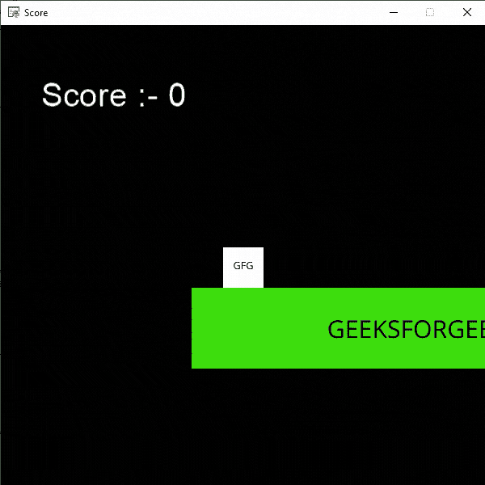
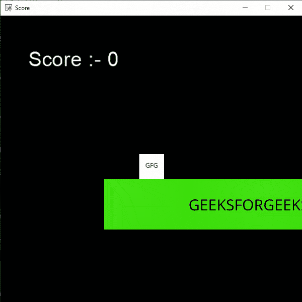

# Python 街机–显示分数

> 原文:[https://www.geeksforgeeks.org/python-arcade-display-score/](https://www.geeksforgeeks.org/python-arcade-display-score/)

在本文中，我们将学习如何用 Python 在 Arcade 中显示分数。

## 显示分数

在这个例子中，我们将简单地在屏幕上显示我们的分数，并且我们将增加每个玩家跳跃的分数。为此，我们将使用一些函数:

**draw_text():** 此功能用于使用 Pyglet 的标签将文本绘制到屏幕上。

> **语法:** arcade.draw_text(text，x，y，颜色，大小，宽度，对齐，font_name)
> 
> **参数:**
> 
> *   **文本:**我们要显示的文本
> *   **x :** x 坐标
> *   **y :** y 坐标
> *   **颜色:**文字的颜色
> *   **大小:**字体的大小
> *   **宽度:**文本的宽度
> *   **对齐:**文本对齐
> *   **字体名称:**字体名称

**Camera():**Camera 类用于控制可见视口。

> **语法:**街机。摄像机(宽度、高度、窗口)
> 
> **参数:**
> 
> *   **宽度:**视口的宽度
> *   **高度:**视口高度
> *   **窗口:**与此摄像机关联的窗口

**场景():**表示场景对象的类。

> **语法:**街机。场景(精灵列表，名称映射)
> 
> **参数:**
> 
> *   **sprite _ list:**sprite list 对象的列表
> *   **名称映射:**sprite list 对象的字典

**物理引擎平台转换器():**在平台转换器中使用的简单物理引擎。

> **语法:**街机。物理引擎平台变形器(玩家精灵、平台、重力、梯子)
> 
> **参数:**
> 
> *   **玩家 _ 精灵:**玩家的精灵
> *   **平台:**它无法通过的精灵
> *   **重力:**每帧向下加速度
> *   **梯子:**用户可以攀爬的梯子

**使用的精灵():**

 

在下面的例子中，我们将创建一个 MainGame()类。在这个类中，首先我们要初始化一些速度、相机、分数、等级和玩家精灵的变量，然后我们将在这个类中创建 6 个函数。

*   **on_draw():** 在这个功能里面，我们将使用我们的相机，在屏幕上绘制场景和我们的评分文本。
*   **setup():** 在这个功能中，我们将初始化我们的相机和场景对象，然后我们将加载我们的播放器和平台的精灵。之后，我们将调用 PhysicsEnginePlatformer()函数。
*   **on_update():** 在这个功能中，我们将更新玩家的精灵、相机和物理引擎的 x 坐标。我们也将改变我们在这个函数中的级别。
*   **on_key_press()** **和 on_key_release():** 在此功能中，我们将根据按下或释放的键盘键来更改速度变量的值。如果玩家按下向上箭头键，那么我们将增加分数的值。
*   **camera_move():** 在这个功能中，我们会根据我们玩家的当前位置来移动我们的相机。

**下面是实现:**

## 蟒蛇 3

```py
# Importing arcade module
import arcade

# Creating MainGame class
class MainGame(arcade.Window):
    def __init__(self):
        super().__init__(600, 600,
                         title="Player Movement")

        # Initializing a variable to store
        # the velocity of the player
        self.vel_x = 0

        # Creating variable for Camera
        self.camera = None

        # Creating variable to store current score
        self.score = 0

        # Creating scene object
        self.scene = None

        # Creating variable to store player sprite
        self.player = None

        # Creating variable for our game engine
        self.physics_engine = None

    # Creating on_draw() function to draw on the screen
    def on_draw(self):
        arcade.start_render()

        # Drawing the text
        arcade.draw_text('Score :- '+str(self.score), 
                         self.player_sprite.center_x - 500 / 2,
                         self.player_sprite.center_y + 200,
                         arcade.color.WHITE, 30, 5000, 'left')

        # Using the camera
        self.camera.use()
        # Drawing our scene
        self.scene.draw()

    def setup(self):

         # Initialize Scene object
        self.scene = arcade.Scene()\

        # Using Camera() function
        self.camera = arcade.Camera(600, 600)

        # Creating different sprite lists
        self.scene.add_sprite_list("Player")
        self.scene.add_sprite_list("Platforms",
                                   use_spatial_hash=True)

        # Adding player sprite
        self.player_sprite = arcade.Sprite("Player.png", 1)

        # Adding coordinates for the center of the sprite
        self.player_sprite.center_x = 64
        self.player_sprite.center_y = 60

        # Adding Sprite in our scene
        self.scene.add_sprite("Player", self.player_sprite)

        # Adding platform sprite according to level
        platform = arcade.Sprite(f"Platform.png", 1)

        # Adding coordinates for the center of the platform
        platform.center_x = 300
        platform.center_y = 32
        self.scene.add_sprite("Platforms", platform)

        # Creating Physics engine
        self.physics_engine = arcade.PhysicsEnginePlatformer(
            self.player_sprite, self.scene.get_sprite_list("Platforms"), 0.5
        )

    # Creating on_update function to
    # update the x coordinate
    def on_update(self, delta_time):

        # Changing x coordinate of player
        self.player_sprite.center_x += self.vel_x * delta_time

        # Updating the physics engine to move the player
        self.physics_engine.update()

        # Calling the camera_move function
        self.camera_move()

    # Creating function to change the velocity
    # when button is pressed

    def on_key_press(self, symbol, modifier):

        # Checking the button pressed
        # and changing the value of velocity
        if symbol == arcade.key.LEFT:
            self.vel_x = -300
        elif symbol == arcade.key.RIGHT:
            self.vel_x = 300
        elif symbol == arcade.key.UP:
            if self.physics_engine.can_jump():
                self.player_sprite.change_y = 15

                # Increasing the score
                self.score += 10

    # Creating function to change the velocity
    # when button is released

    def on_key_release(self, symbol, modifier):

        # Checking the button released
        # and changing the value of velocity
        if symbol == arcade.key.LEFT:
            self.vel_x = 0
        elif symbol == arcade.key.RIGHT:
            self.vel_x = 0

    def camera_move(self):

        # Getting the x coordinate for the center of camera
        screen_x = self.player_sprite.center_x - \
            (self.camera.viewport_width / 2)

        # Getting the y coordinate for the center of camera
        screen_y = self.player_sprite.center_y - \
            (self.camera.viewport_height / 2)

        # Moving the camera
        self.camera.move_to([screen_x, screen_y])

# Calling MainGame class
game = MainGame()
game.setup()
arcade.run()
```

**输出:**



## 重置分数

在这个例子中，每当玩家从平台上跌落时，我们将把我们的分数重置为 0，并从起始位置重新开始游戏。为此，我们将简单地在 on_update()函数中添加下面的行。

```py
if self.player_sprite.center_y < -20:
   self.score = 0
   self.setup()
```

如果玩家从平台上掉下来，我们会将分数变量的值设置为 0，并调用 setup()函数来重启游戏。

**下面是实现:**

## 蟒蛇 3

```py
# Importing arcade module
import arcade

# Creating MainGame class
class MainGame(arcade.Window):
    def __init__(self):
        super().__init__(600, 600,
                         title = "Score")

        # Initializing a variable to store
        # the velocity of the player
        self.vel_x = 0

        # Creating variable for Camera
        self.camera = None

        # Creating variable to store current score
        self.score = 0

        # Creating scene object
        self.scene = None

        # Creating variable to store player sprite
        self.player = None

        # Creating variable for our game engine
        self.physics_engine = None

    # Creating on_draw() function to draw on the screen
    def on_draw(self):
        arcade.start_render()

        # Drawing the text
        arcade.draw_text('Score :- '+str(self.score),
                         self.player_sprite.center_x -500 / 2,
                         self.player_sprite.center_y +200,
                         arcade.color.WHITE,30,5000,'left')

        # Using the camera
        self.camera.use()
        # Drawing our scene
        self.scene.draw()

    def setup(self):

         # Initialize Scene object
        self.scene = arcade.Scene()

        # Using Camera() function
        self.camera = arcade.Camera(600, 600)

        # Creating different sprite lists
        self.scene.add_sprite_list("Player")
        self.scene.add_sprite_list("Platforms",
                                   use_spatial_hash=True)

        # Adding player sprite
        self.player_sprite = arcade.Sprite("Player.png", 1)

        # Adding coordinates for the center of the sprite
        self.player_sprite.center_x = 64
        self.player_sprite.center_y = 60

        # Adding Sprite in our scene
        self.scene.add_sprite("Player", self.player_sprite)

        # Adding platform sprite according to level
        platform = arcade.Sprite(f"Platform.png", 1)

        # Adding coordinates for the center of the platform
        platform.center_x = 300
        platform.center_y = 32
        self.scene.add_sprite("Platforms", platform)

        # Creating Physics engine
        self.physics_engine = arcade.PhysicsEnginePlatformer(
            self.player_sprite, self.scene.get_sprite_list("Platforms"), 0.5
        )

    # Creating on_update function to
    # update the x coordinate
    def on_update(self, delta_time):

        # Changing x coordinate of player
        self.player_sprite.center_x += self.vel_x * delta_time

        # Updating the physics engine to move the player
        self.physics_engine.update()

        # Setting the score to 0 whenever
        # player falss from the platform
        if self.player_sprite.center_y < -20:
            self.score = 0
            self.setup()

        # Calling the camera_move function
        self.camera_move()

    # Creating function to change the velocity
    # when button is pressed
    def on_key_press(self, symbol, modifier):

        # Checking the button pressed
        # and changing the value of velocity
        if symbol == arcade.key.LEFT:
            self.vel_x = -300
        elif symbol == arcade.key.RIGHT:
            self.vel_x = 300
        elif symbol == arcade.key.UP:
            if self.physics_engine.can_jump():
                self.player_sprite.change_y = 15

                # Increasing the score
                self.score += 10

    # Creating function to change the velocity
    # when button is released
    def on_key_release(self, symbol, modifier):

        # Checking the button released
        # and changing the value of velocity
        if symbol == arcade.key.LEFT:
            self.vel_x = 0
        elif symbol == arcade.key.RIGHT:
            self.vel_x = 0

    def camera_move(self):

        # Getting the x coordinate for the center of camera
        screen_x = self.player_sprite.center_x - \
            (self.camera.viewport_width / 2)

        # Getting the y coordinate for the center of camera
        screen_y = self.player_sprite.center_y - \
            (self.camera.viewport_height / 2)

        # Moving the camera
        self.camera.move_to([screen_x, screen_y])

# Calling MainGame class
game = MainGame()
game.setup()
arcade.run()
```

**输出:**

