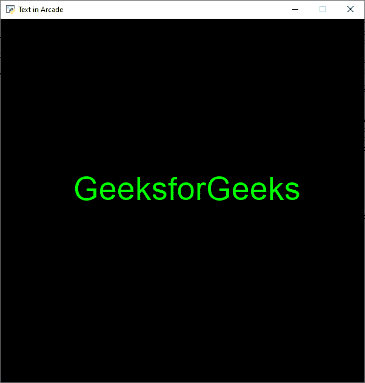
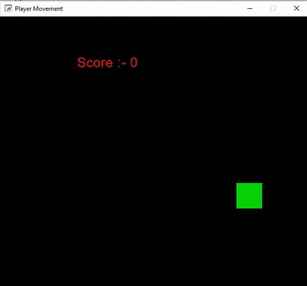

# Python 街机–显示文本

> 原文:[https://www.geeksforgeeks.org/python-arcade-display-text/](https://www.geeksforgeeks.org/python-arcade-display-text/)

在本文中，我们将学习如何用 Python 向街机游戏添加文本。

## 添加简单文本

我们可以使用 draw_text()函数在街机中添加文本。

> **语法:** arcade.draw_text(text，x，y，颜色，大小，宽度，对齐，font_name)
> 
> **参数:**
> 
> *   **文本:**我们要显示的文本
> *   **x :** x 坐标
> *   **y :** y 坐标
> *   **颜色:**文字的颜色
> *   **大小:**字体的大小
> *   **宽度:**文本的宽度
> *   **对齐:**文本对齐
> *   **字体名称:**字体名称

在下面的例子中，我们将创建一个名为 MainGame 的类，在这个类中，我们将创建一个 on_draw()函数，在这个函数中我们将渲染和绘制我们的文本。然后我们将调用 MainGame()类和 arcade.run()函数。

**下面是实现:**

## 蟒蛇 3

```py
# Importing arcade module
import arcade

# Creating MainGame class       
class MainGame(arcade.Window):
    def __init__(self):
        super().__init__(600, 600,
                         title="Text in Arcade")

    # Creating on_draw() function to draw on the screen
    def on_draw(self):
        arcade.start_render()

        # Drawing the text using draw_text()
        # draw_text function is used to draw 
        # text to the screen using Pyglet’s label.
        arcade.draw_text("GeeksforGeeks",120.0,300.0,
                         arcade.color.GREEN,40,80,'left')

# Calling MainGame class       
MainGame()
arcade.run()
```

**输出:**



## 更新文本

在这个例子中，我们将把分数显示为文本，我们希望玩家每次触摸屏幕边框时，分数增加 10 分。为此，我们将在 MainGame 类中为玩家的 x 和 y 坐标、分数和速度初始化一些变量。之后，我们将创建 2 个函数:

*   **on_draw():** 我们将在这个函数中绘制我们的玩家和文本。
*   **on_update():** 我们将通过添加速度来更新玩家的 x 坐标。然后我们会改变玩家的方向，如果玩家越过屏幕的边界，就会增加分数。在这之后，我们将调用我们的 MainGame()类。

**下面是实现:**

## 蟒蛇 3

```py
# Importing arcade module
import arcade

# Creating MainGame class       
class MainGame(arcade.Window):
    def __init__(self):
        super().__init__(600, 600, title="Player Movement")

        # Initializing the initial x and y coordinated
        self.x = 250 
        self.y = 250

        # Creating variable to store the score
        self.score = 0

        # Initializing a variable to store
        # the velocity of the player
        self.vel = 300

    # Creating on_draw() function to draw on the screen
    def on_draw(self):
        arcade.start_render()

        # Drawing the rectangle using
        # draw_rectangle_filled function
        arcade.draw_rectangle_filled(self.x, self.y,50, 50,
                                     arcade.color.GREEN )

        # Drawing the text
        arcade.draw_text('Score :- '+str(self.score),150.0,500.0,
                         arcade.color.RED,20,180,'left')

    # Creating on_update function to
    # update the x coordinate
    def on_update(self,delta_time):
        self.x += self.vel * delta_time

        # Changing the direction of
        # movement if player crosses the screen
        # and increasing the score
        if self.x>=550 or self.x<=50:
            self.score += 10
            self.vel *= -1

# Calling MainGame class       
MainGame()
arcade.run()
```

**输出:**

