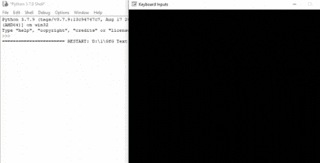
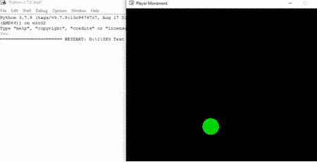

# Python 街机–处理键盘输入

> 原文:[https://www . geesforgeks . org/python-arcade-handling-keyboard-input/](https://www.geeksforgeeks.org/python-arcade-handling-keyboard-input/)

在本文中，我们将讨论如何在 Python arcade 模块中处理键盘输入。

在街机中，你可以很容易地检查哪个键盘按钮被按下，并根据它执行任务。

**为此，我们将使用这些函数:**

*   on_key_press()
*   on_key_release()

> **语法:**
> 
> *   on_key_press(符号、修饰符)
> *   on_key_release(符号、修改器)
> 
> **参数:**
> 
> *   **符号:**被击中的键
> *   **修饰符:**在此事件期间按下的所有修饰符(shift、ctrl、num lock)的按位“与”。

每当用户按下键盘按钮时，将调用 on_key_press()函数。类似地，每当用户释放键盘按钮时，都会调用 on_key_released()。

## 例 1:

在这个例子中，我们将使用街机模块创建一个简单的程序，该程序将检查上箭头键是否被按下。

然后我们将在这个类中创建三个函数。

*   **on_draw():** 在这个函数里面，我们将使用 arcade.start_render()开始渲染。
*   **on_key_press():** 只要按下一个键盘键，就会调用该功能。在该功能中，我们将检查按下的键是否是向上箭头键，然后我们将打印“上箭头键被按下”。
*   **on_key_release():** 每当释放一个键盘按键，就会调用该功能。在这个功能中，我们将检查释放的键是否是向上箭头键，然后我们将打印“上箭头键被释放”。

下面是实现:

## 蟒蛇 3

```
# Importing arcade module
import arcade

# Creating MainGame class       
class MainGame(arcade.Window):
    def __init__(self):
        super().__init__(600, 600, title="Keyboard Inputs")

    # Creating on_draw() function to draw on the screen
    def on_draw(self):
        arcade.start_render()

    # Creating function to check button is pressed
    # or not
    def on_key_press(self, symbol,modifier):

        # Checking the button pressed
        # is up arrow key or not
        if symbol == arcade.key.UP:
            print("Upper arrow key is pressed")

    # Creating function to check button is released
    # or not
    def on_key_release(self, symbol, modifier):

        # Checking the button pressed
        # is up arrow key or not
        if symbol == arcade.key.UP:
            print("Upper arrow key is released")

# Calling MainGame class       
MainGame()
arcade.run()
```

**输出:**



## 例 2:

在这个例子中，我们根据键盘输入移动播放器。

为此，我们将创建一个 MainGame()类。在这个类中，首先，我们将初始化一些变量，用于玩家精灵的 x 和 y 坐标以及玩家的 x 和 y 速度，然后我们将在这个类中创建 4 个函数。

*   **on_draw():** 在这个函数里面，我们将绘制我们的玩家，并开始渲染。
*   **setup():** 在这个功能中，我们将初始化我们的相机和场景对象，然后我们将加载我们的播放器和平台的精灵。之后，我们将调用 PhysicsEnginePlatformer()函数。
*   **on_update():** 在这个函数中，我们将通过添加 vel_x 和 vel_y 变量的值来更新玩家的精灵的 x 和 y 坐标，
*   **on_key_press():** 在此功能中，我们将根据按下的键盘键改变 vel_x 和 vel_y 变量的值。
*   **on_key_release():** 在此功能中，我们将根据释放的键盘按键改变 vel_x 和 vel_y 变量的值。

### 下面是实现:

## 蟒蛇 3

```
# Importing arcade module
import arcade

# Creating MainGame class       
class MainGame(arcade.Window):
    def __init__(self):
        super().__init__(600, 600, title="Player Movement")

        # Initializing the initial x and y coordinated
        self.x = 250 
        self.y = 250

        # Initializing a variable to store
        # the velocity of the player
        self.vel_x = 0
        self.vel_y = 0

    # Creating on_draw() function to draw on the screen
    def on_draw(self):
        arcade.start_render()

        # Drawing the rectangle using
        # draw_rectangle_filled function
        arcade.draw_circle_filled(self.x, self.y,25,
                                     arcade.color.GREEN )
    # Creating on_update function to
    # update the x coordinate
    def on_update(self,delta_time):
        self.x += self.vel_x * delta_time
        self.y += self.vel_y * delta_time

    # Creating function to change the velocity
    # when button is pressed
    def on_key_press(self, symbol,modifier):

        # Checking the button pressed
        # and changing the value of velocity
        if symbol == arcade.key.UP:
            self.vel_y = 300
            print("Up arrow key is pressed")
        elif symbol == arcade.key.DOWN:
            self.vel_y = -300
            print("Down arrow key is pressed")
        elif symbol == arcade.key.LEFT:
            self.vel_x = -300
            print("Left arrow key is pressed")
        elif symbol == arcade.key.RIGHT:
            self.vel_x = 300
            print("Right arrow key is pressed")

    # Creating function to change the velocity
    # when button is released
    def on_key_release(self, symbol, modifier):

        # Checking the button released
        # and changing the value of velocity
        if symbol == arcade.key.UP:
            self.vel_y = 0
        elif symbol == arcade.key.DOWN:
            self.vel_y = 0
        elif symbol == arcade.key.LEFT:
            self.vel_x = 0
        elif symbol == arcade.key.RIGHT:
            self.vel_x = 0

# Calling MainGame class       
MainGame()
arcade.run()
```

**输出:**

