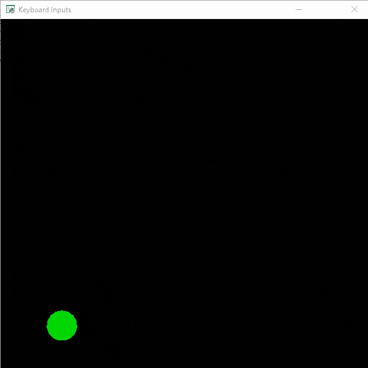
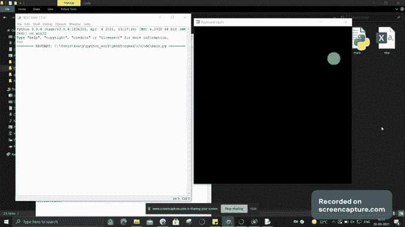

# Python 街机–处理鼠标输入

> 原文:[https://www . geesforgeks . org/python-arcade-handling-mouse-inputs/](https://www.geeksforgeeks.org/python-arcade-handling-mouse-inputs/)

在本文中，我们将学习如何在 Python 的街机模块中处理鼠标输入。

在 Arcade 中，您可以使用以下功能轻松处理鼠标输入:

**on_mouse_motion():**

> **语法:** on_mouse_motion(x，y，dx，dy)
> 
> **参数:**
> 
> *   x : x 坐标
> *   y : y 坐标
> *   dx:x 坐标的变化
> *   dy:y 坐标的变化

**on_mouse_press():**

> **语法:** on_mouse_press( x，y，按钮，修饰符)
> 
> **参数:**
> 
> *   x : x 坐标
> *   y : y 坐标
> *   按钮:按下的按钮
> *   修饰符:在此事件期间按下的所有修饰符(shift、ctrl、num lock)的按位“与”。

每当用户移动鼠标时，将调用 on_mouse_motion()函数。同样，每当用户按下鼠标按钮时，on_mouse_press()将被调用。

## 使用鼠标输入的移动

在这里，我们将使用街机模块创建一个简单的程序，使用鼠标输入来移动我们的角色。

在下面的例子中，我们将创建一个 MainGame()类。首先在这个类里面，我们将初始化玩家的起始 x 和 y 坐标。然后我们将在这个类中创建三个函数。

*   **on_draw():-** 在这个函数内部，我们将使用 arcade.start_render()开始渲染，然后我们将绘制我们的玩家。
*   **on_mouse_motion():-** 只要用户移动鼠标，就会调用这个函数。在这个函数里面，我们会改变玩家的 x 和 y 坐标。

**下面是实现:**

## 蟒蛇 3

```py
# Importing arcade module
import arcade

# Creating MainGame class
class MainGame(arcade.Window):
    def __init__(self):
        super().__init__(600, 600, title="Keyboard Inputs")

        # Starting location of player
        self.x = 100
        self.y = 100

    # Creating on_draw() function to draw on the screen
    def on_draw(self):
        arcade.start_render()

        # Drawing our player
        arcade.draw_circle_filled(self.x, self.y, 25,
                                  arcade.color.GREEN)

    # Creating function to check the position
    # of the mouse
    def on_mouse_motion(self, x, y, dx, dy):
        """
        Called whenever the mouse moves.
        """
        self.x = x
        self.y = y

# Calling MainGame class
MainGame()
arcade.run()
```

**输出:**



## 处理鼠标点击

现在，为了处理鼠标点击，我们将创建一个名为“on_mouse_press”的新函数。每次用户点击鼠标按钮时都会调用这个函数。

## 蟒蛇 3

```py
# Importing arcade module
import arcade

# Creating MainGame class       
class MainGame(arcade.Window):
    def __init__(self):
        super().__init__(600, 600, title="Keyboard Inputs")

        # Starting location of player
        self.x = 100
        self.y = 100

    # Creating on_draw() function to draw on the screen
    def on_draw(self):
        arcade.start_render()

        # Drawing our player
        arcade.draw_circle_filled(self.x, self.y,25,
                                     arcade.color.GREEN )

    # Creating function to check the position
    # of the mouse
    def on_mouse_motion(self, x, y, dx, dy):
        """
        Called whenever the mouse moves.
        """
        self.x = x
        self.y = y

    # Creating function to check the mouse clicks
    def on_mouse_press(self, x, y, button, modifiers):
        print("Mouse button is pressed")

# Calling MainGame class       
MainGame()
arcade.run()
```

**输出:**

