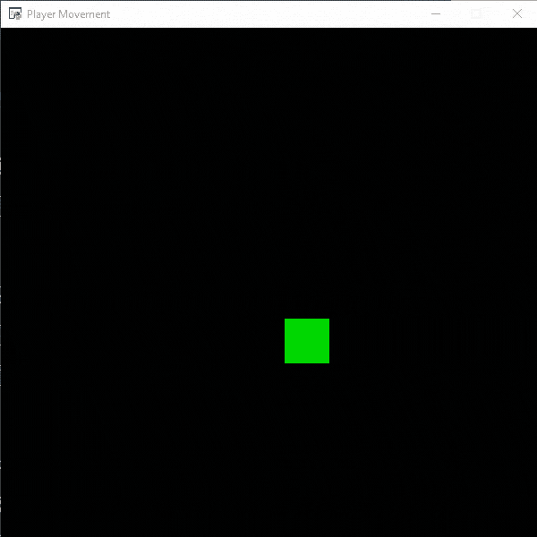
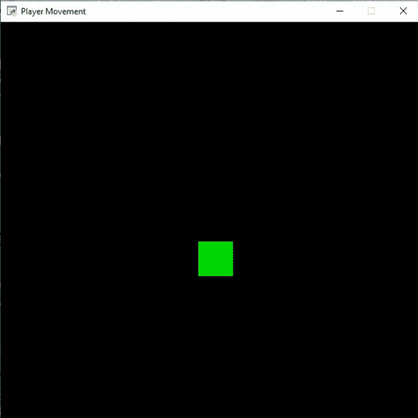

# 蟒蛇街机–玩家移动

> 原文:[https://www . geesforgeks . org/python-arcade-player-movement/](https://www.geeksforgeeks.org/python-arcade-player-movement/)

在本文中，我们将讨论如何在 Python 中使用街机来移动玩家。

## 自动移动

我们可以很容易地在街机中向任何特定方向移动我们的玩家。为此，我们将使用 draw_rectangle_filled()方法绘制一个矩形，然后我们将更改该矩形的 x 坐标。

> **语法:**arcade . draw _ rectangle _ filled(x，y，宽度，高度，颜色，角度)
> 
> **参数:**
> 
> *   x:矩形中心的 x 坐标
> *   y:矩形中心的 y 坐标
> *   宽度:矩形的宽度
> *   高度:矩形的高度
> *   颜色:矩形的颜色
> *   角度:矩形的旋转。

**下面是实现:**

## 蟒蛇 3

```py
# Importing arcade module
import arcade

# Creating MainGame class       
class MainGame(arcade.Window):
    def __init__(self):
        super().__init__(600, 600, title="Player Movement")

        # Initializing the initial x and y coordinated
        self.x = 250 
        self.y = 250

        # Initializing a variable to store
        # the velocity of the player
        self.vel = 300

    # Creating on_draw() function to draw on the screen
    def on_draw(self):
        arcade.start_render()

        # Drawing the rectangle using
        # draw_rectangle_filled function
        arcade.draw_rectangle_filled(self.x, self.y,50, 50,
                                     arcade.color.GREEN )
    # Creating on_update function to
    # update the x coordinate
    def on_update(self,delta_time):
        self.x += self.vel * delta_time

        # Changing the direction of
        # movement if player crosses the screen
        if self.x>=550 or self.x<=50:
            self.vel *= -1

# Calling MainGame class       
MainGame()
arcade.run()
```

**输出:**



## 使用键盘输入的玩家移动

在街机中，我们可以接受用户的输入来移动我们的玩家。为此，我们将使用 on_key_press()和 on_key_release()函数。

> **语法:**
> 
> *   on_key_press(符号、修饰符)
> *   on_key_release)符号，修饰符)
> 
> **参数:**
> 
> *   **符号:**被击中的键
> *   **修饰符:**在此事件期间按下的所有修饰符(shift、ctrl、num lock)的按位“与”

**下面是实现:**

## 蟒蛇 3

```py
# Importing arcade module
import arcade

# Creating MainGame class       
class MainGame(arcade.Window):
    def __init__(self):
        super().__init__(600, 600, title="Player Movement")

        # Initializing the initial x and y coordinated
        self.x = 250 
        self.y = 250

        # Initializing a variable to store
        # the velocity of the player
        self.vel_x = 0
        self.vel_y = 0

    # Creating on_draw() function to draw on the screen
    def on_draw(self):
        arcade.start_render()

        # Drawing the rectangle using
        # draw_rectangle_filled function
        arcade.draw_rectangle_filled(self.x, self.y,50, 50,
                                     arcade.color.GREEN )
    # Creating on_update function to
    # update the x coordinate
    def on_update(self,delta_time):
        self.x += self.vel_x * delta_time
        self.y += self.vel_y * delta_time

    # Creating function to change the velocity
    # when button is pressed
    def on_key_press(self, symbol,modifier):

        # Checking the button pressed
        # and changing the value of velocity
        if symbol == arcade.key.UP:
            self.vel_y = 300
        elif symbol == arcade.key.DOWN:
            self.vel_y = -300
        elif symbol == arcade.key.LEFT:
            self.vel_x = -300
        elif symbol == arcade.key.RIGHT:
            self.vel_x = 300

    # Creating function to change the velocity
    # when button is released
    def on_key_release(self, symbol, modifier):

        # Checking the button released
        # and changing the value of velocity
        if symbol == arcade.key.UP:
            self.vel_y = 0
        elif symbol == arcade.key.DOWN:
            self.vel_y = 0
        elif symbol == arcade.key.LEFT:
            self.vel_x = 0
        elif symbol == arcade.key.RIGHT:
            self.vel_x = 0

# Calling MainGame class       
MainGame()
arcade.run()
```

**输出:**

