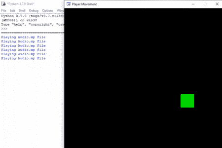

# Python 街机–播放音频文件

> 原文:[https://www . geesforgeks . org/python-街机-播放-音频-文件/](https://www.geeksforgeeks.org/python-arcade-playing-audio-file/)

在本文中，我们将学习如何使用 Python 在街机游戏中播放或添加音频。

## 播放音频文件

在本例中，我们希望在播放器触摸屏幕左端或右端时播放音频。为此，我们将使用街机模块的 2 个功能。

*   **arcade.load_sound():** 我们将使用此功能加载我们的音频文件。

> **语法:** arcade.load_sound(file_path，streaming)
> 
> **参数:**
> 
> **文件 _ 路径:**要加载的声音文件的名称。
> 
> **流式传输:**布尔值，用于确定我们是流式传输声音还是将其全部加载到内存中。
> 
> **返回:**play _ Sound()函数可以使用的声音对象。

*   **arcade.play_sound():** 我们将使用这个功能来播放我们的音频。

> **语法:** arcade.play_sound(声音、音量、声相、循环)
> 
> **参数:**
> 
> *   **声音:**load _ Sound 加载的声音()
> *   **音量:**声音的音量
> *   **平移:**您想从哪个部分开始音频(-1=左，0=中，1=右)

在下面的例子中，我们将创建一个 MainGame()类。在这个类中，首先，我们要初始化一些变量，比如玩家的速度、x 和 y 坐标，然后我们将在这个类中创建 2 个函数。

*   **on_draw():** 在这个函数里面，我们将绘制我们的玩家，并开始渲染。
*   **on_update():** 在这个函数中，我们将通过添加速度来更新玩家精灵的 x 坐标。之后，如果玩家越过屏幕边界，那么我们将改变移动方向，并使用 play_sound()功能播放音频。

下面是实现:

## 蟒蛇 3

```py
# Importing arcade module
import arcade

# Creating MainGame class       
class MainGame(arcade.Window):
    def __init__(self):
        super().__init__(600, 600, title="Player Movement")

        # Initializing the initial x and y coordinated
        self.x = 250 
        self.y = 250

        # Initializing a variable to store
        # the velocity of the player
        self.vel = 300

    # Creating on_draw() function to draw on the screen
    def on_draw(self):
        arcade.start_render()

        # Drawing the rectangle using
        # draw_rectangle_filled function
        arcade.draw_rectangle_filled(self.x, self.y,50, 50,
                                     arcade.color.GREEN )
    # Creating on_update function to
    # update the x coordinate
    def on_update(self,delta_time):
        self.x += self.vel * delta_time

        # Changing the direction of
        # movement if player crosses the screen
        if self.x>=550 or self.x<=50:
            self.vel *= -1

            # Loading the audio file
            audio = arcade.load_sound('Audio.mp3',False)

            # Printing "Playing Audio"
            print("Playing Audio.mp File")

            # Playing the audio
            arcade.play_sound(audio,1.0,-1,False)

# Calling MainGame class       
MainGame()
arcade.run()
```

**输出:**

