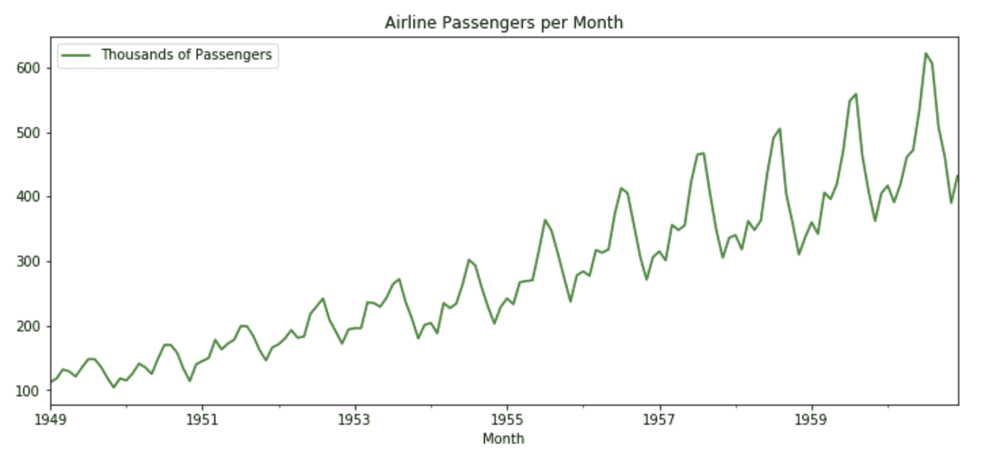
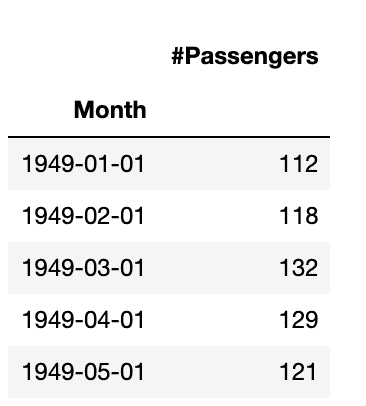
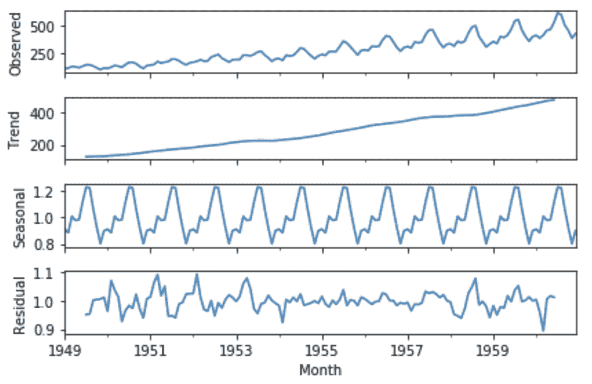
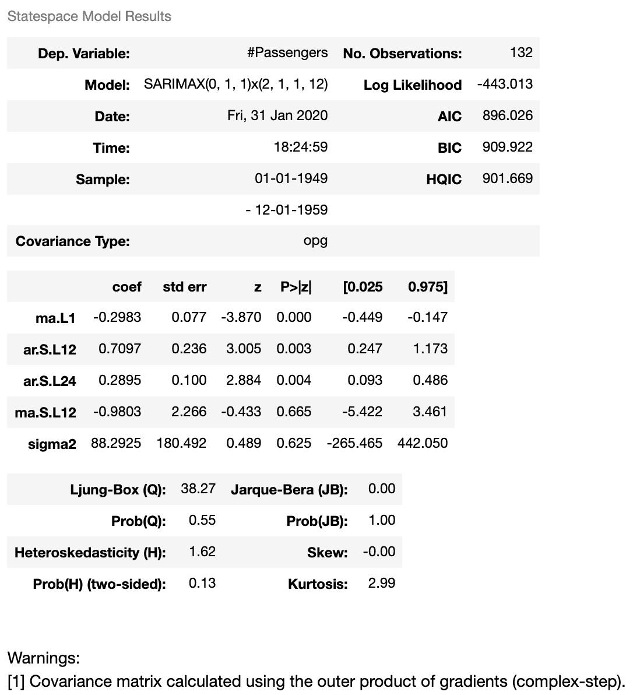
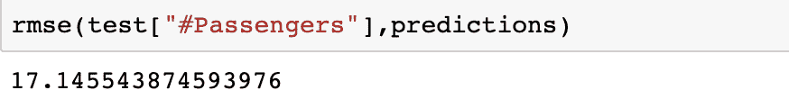
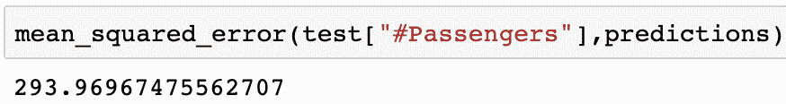
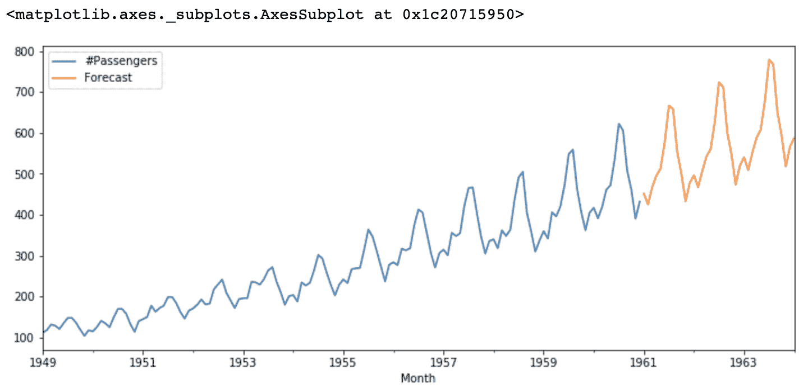

# 时间序列预测的 Python | ARIMA 模型

> 原文:[https://www . geesforgeks . org/python-ARIMA-时间序列预测模型/](https://www.geeksforgeeks.org/python-arima-model-for-time-series-forecasting/)

A **时间序列**定义为按时间顺序索引的一系列数据点。时间顺序可以是每天、每月甚至每年。下面给出了一个时间序列的例子，说明了从 1949 年到 1960 年，一家航空公司每月的乘客数量。



**时间序列预测**
时间序列预测是根据过去的结果，使用统计模型预测时间序列未来值的过程。

**一些用例**

*   预测即将到来的或混乱的顾客数量。*   解释销售的季节性模式。*   发现异常事件并估计其影响的程度。*   To Estimate the effect of a newly launched product on number of sold units.

    **时间序列的组成部分:**

    *   **趋势:**趋势表示时间序列数据在较长时间内的大致方向。趋势可以是上升的(向上的)、下降的(向下的)或水平的(静止的)。
    *   **季节性:**季节性成分表现出在时间、方向和幅度方面重复的趋势。一些例子包括由于炎热的天气条件导致夏季用水量的增加，或者每年假期期间航空乘客数量的增加。
    *   **周期成分:**这些是在特定时间段内没有固定重复的趋势。一个周期是指一个时间序列的起伏、繁荣和贫民窟的时期，多见于商业周期。这些周期不表现出季节变化，但通常发生在 3 至 12 年的时间内，这取决于时间序列的性质。
    *   **不规则变化:**这些是时间序列数据中的波动，当趋势和周期性变化被移除时，这些波动变得明显。这些变化是不可预测的、不稳定的，可能是随机的，也可能不是随机的。
    *   **ETS Decomposition**
        ETS Decomposition is used to separate different components of a time series. The term ETS stands for Error, Trend, and Seasonality.

        **代码:航线旅客 ETS 分解数据集:**

        ```
        # Importing required libraries
        import numpy as np
        import pandas as pd
        import matplotlib.pylot as plt
        from statsmodels.tsa.seasonal import seasonal_decompose

        # Read the AirPassengers dataset
        airline = pd.read_csv('AirPassengers.csv',
                               index_col ='Month',
                               parse_dates = True)

        # Print the first five rows of the dataset
        airline.head()

        # ETS Decomposition
        result = seasonal_decompose(airline['# Passengers'], 
                                    model ='multiplicative')

        # ETS plot 
        result.plot()
        ```

        **输出:**

        

        

        **ARIMA 时间序列预测模型**
        ARIMA 代表自回归综合移动平均模型，由三个序参量指定: *(p，d，q)。*

    *   **AR( *p* )自回归**–一种利用当前观测值和前一时期观测值之间的依赖关系的回归模型。自回归( *AR(p)* )成分是指在时间序列的回归方程中使用过去的值。
    *   **I( *d* )积分**–使用观测值的差分(从上一个时间步长的观测值中减去一个观测值)，以使时间序列平稳。差分包括将一个序列的当前值与其先前值相减 d 次。
    *   **MA(*q*) Moving Average** – a model that uses the dependency between an observation and a residual error from a moving average model applied to lagged observations. A moving average component depicts the error of the model as a combination of previous error terms. The order *q* represents the number of terms to be included in the model.

        **ARIMA 车型类型**

    *   **ARIMA:** 非季节性自回归综合移动平均线
    *   **沙丽玛:**季节性 ARIMA
    *   **SARIMAX:**Seasonal ARIMA with exogenous variables

        **自干金字塔**

        **“pmdarima”**库中的**“auto _ arima”**函数帮助我们确定 arima 模型的最佳参数，并返回拟合的 ARIMA 模型。

        **代码:ARIMA 模型的参数分析**

        ```
        # To install the library
        pip install pmdarima

        # Import the library
        from pmdarima import auto_arima

        # Ignore harmless warnings
        import warnings
        warnings.filterwarnings("ignore")

        # Fit auto_arima function to AirPassengers dataset
        stepwise_fit = auto_arima(airline['# Passengers'], start_p = 1, start_q = 1,
                                  max_p = 3, max_q = 3, m = 12,
                                  start_P = 0, seasonal = True,
                                  d = None, D = 1, trace = True,
                                  error_action ='ignore',   # we don't want to know if an order does not work
                                  suppress_warnings = True,  # we don't want convergence warnings
                                  stepwise = True)           # set to stepwise

        # To print the summary
        stepwise_fit.summary()
        ```

        **输出:**
        

        **代码:将 ARIMA 模型拟合到航空乘客数据集**

        ```
        # Split data into train / test sets
        train = airline.iloc[:len(airline)-12]
        test = airline.iloc[len(airline)-12:] # set one year(12 months) for testing

        # Fit a SARIMAX(0, 1, 1)x(2, 1, 1, 12) on the training set
        from statsmodels.tsa.statespace.sarimax import SARIMAX

        model = SARIMAX(train['# Passengers'], 
                        order = (0, 1, 1), 
                        seasonal_order =(2, 1, 1, 12))

        result = model.fit()
        result.summary()
        ```

        **输出:**
        

        **代码:ARIMA 模型对测试集的预测**

        ```
        start = len(train)
        end = len(train) + len(test) - 1

        # Predictions for one-year against the test set
        predictions = result.predict(start, end,
                                     typ = 'levels').rename("Predictions")

        # plot predictions and actual values
        predictions.plot(legend = True)
        test['# Passengers'].plot(legend = True)
        ```

        **输出:**

        

        **代码:使用 MSE 和 RMSE** 评估模型

        ```
        # Load specific evaluation tools
        from sklearn.metrics import mean_squared_error
        from statsmodels.tools.eval_measures import rmse

        # Calculate root mean squared error
        rmse(test["# Passengers"], predictions)

        # Calculate mean squared error
        mean_squared_error(test["# Passengers"], predictions)
        ```

        **输出:**
        

        

        **代码:预测使用 ARIMA 模型**

        ```
        # Train the model on the full dataset
        model = model = SARIMAX(airline['# Passengers'], 
                                order = (0, 1, 1), 
                                seasonal_order =(2, 1, 1, 12))
        result = model.fit()

        # Forecast for the next 3 years
        forecast = result.predict(start = len(airline), 
                                  end = (len(airline)-1) + 3 * 12, 
                                  typ = 'levels').rename('Forecast')

        # Plot the forecast values
        airline['# Passengers'].plot(figsize = (12, 5), legend = True)
        forecast.plot(legend = True)
        ```

         ****输出:**

        **