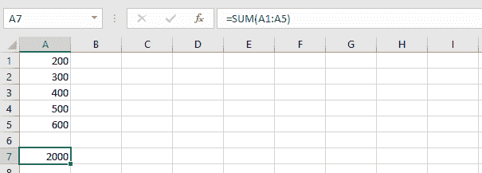
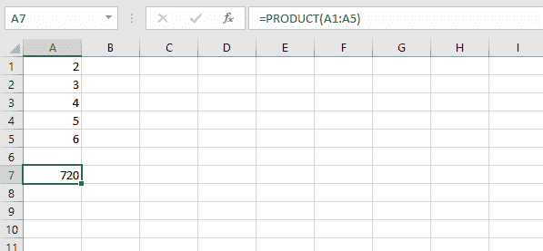
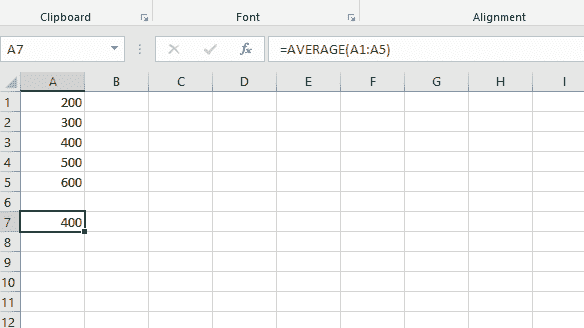
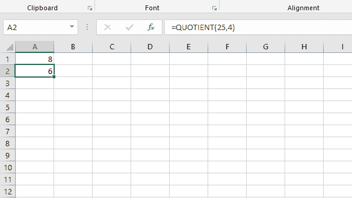
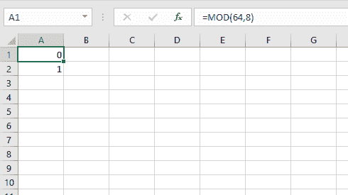
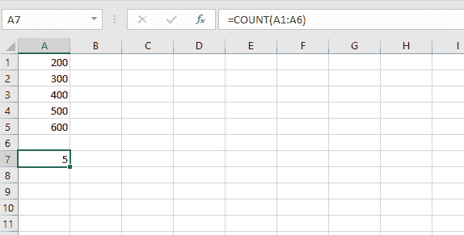

# Python |使用 openpyxl 在 excel 文件中进行算术运算

> 原文:[https://www . geesforgeks . org/python-算术-运算-in-excel-file-use-openpyxl/](https://www.geeksforgeeks.org/python-arithmetic-operations-in-excel-file-using-openpyxl/)

**先决条件:** [读取](https://www.geeksforgeeks.org/python-reading-excel-file-using-openpyxl-module/) & [使用 openpyxl
**将**](https://www.geeksforgeeks.org/python-writing-excel-file-using-openpyxl-module/)写入 excel 工作表 Openpyxl 是一个 Python 库，使用它可以对 excel 文件执行读取、写入、算术运算和绘制图形等多种操作。让我们看看如何使用 openpyxl 执行不同的算术运算。

*   **=SUM(cell1:cell2) :** 将单元格范围内的所有数字相加。

## 蟒蛇 3

```
# import openpyxl module
import openpyxl

# Call a Workbook() function of openpyxl
# to create a new blank Workbook object
wb = openpyxl.Workbook()

# Get workbook active sheet 
# from the active attribute.
sheet = wb.active

# writing to the cell of an excel sheet
sheet['A1'] = 200
sheet['A2'] = 300
sheet['A3'] = 400
sheet['A4'] = 500
sheet['A5'] = 600

# The value in cell A7 is set to a formula
# that sums the values in A1, A2, A3, A4, A5 .
sheet['A7'] = '= SUM(A1:A5)'

# save the file
wb.save("sum.xlsx")
```

*   **输出:**



*   **=PRODUCT(单元格 1:单元格 2) :** 将单元格范围内的所有数字相乘。

## 蟒蛇 3

```
import openpyxl

wb = openpyxl.Workbook()
sheet = wb.active

sheet['A1'] = 2
sheet['A2'] = 3
sheet['A3'] = 4
sheet['A4'] = 5
sheet['A5'] = 6

# The value in cell A7 is set to a formula
# that multiplies the values in A1, A2, A3, A4, A5 .
sheet['A7'] = '= PRODUCT(A1:A5)'

wb.save("product.xlsx")
```

*   **输出:**



*   **=AVERAGE(cell1:cell2) :** 给出给定单元格范围内所有数字的平均值(算术平均值)。

## 蟒蛇 3

```
import openpyxl

wb = openpyxl.Workbook()
sheet = wb.active

sheet['A1'] = 200
sheet['A2'] = 300
sheet['A3'] = 400
sheet['A4'] = 500
sheet['A5'] = 600

# The value in cell A7 is set to a formula
# that return average of the values in A1, A2, A3, A4, A5 .
sheet['A7'] = '= AVERAGE(A1:A5)'

wb.save("average.xlsx")
```

*   **输出:**



*   **=商数(num1，num2) :** 返回除法的整数部分。

## 蟒蛇 3

```
import openpyxl

wb = openpyxl.Workbook()
sheet = wb.active

# The value in cell is set to a formula
# that gives quotient value .
sheet['A1'] = '= QUOTIENT(64, 8)'
sheet['A2'] = '= QUOTIENT(25, 4)'

wb.save("quotient.xlsx")
```

*   **输出:**



*   **=MOD(num1，num2) :** 返回一个数除以除数后的余数。

## 蟒蛇 3

```
import openpyxl

wb = openpyxl.Workbook()
sheet = wb.active

# The value in cell is set to a formula
# that gives remainder or modulus value.
sheet['A1'] = '= MOD(64, 8)'
sheet['A2'] = '= MOD(25, 4)'

wb.save("modulus.xlsx")
```

*   **输出:**



*   **=COUNT(cell1:cell2) :** 它计算包含该数字的范围内的单元格数。

## 蟒蛇 3

```
import openpyxl

wb = openpyxl.Workbook()
sheet = wb.active

sheet['A1'] = 200
sheet['A2'] = 300
sheet['A3'] = 400
sheet['A4'] = 500
sheet['A5'] = 600

# The value in cell A7 is set to a formula
# that gives counting of number present in the cells.
sheet['A7'] = '= COUNT(A1:A6)'

wb.save("count.xlsx")
```

*   **输出:**

